## BC Data Catalogue {.unnumbered}

The British Columbia Data Catalogue is a central hub provided by the Government of British Columbia (BC). Its primary purpose is to provide public access to thousands of datasets managed by the provincial government and its partners. Essentially, it is a digital library designed to make government information transparent and usable for citizens, researchers, and developers.

```{r bc1, echo=FALSE, cache=TRUE, out.width = '90%', fig.align='center'}
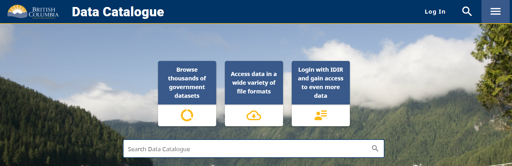
```

::: column-margin
[British Columbia Data Catalogue](https://catalogue.data.gov.bc.ca/)
:::

### Search for Data

To search for data, you can use the search bar on the BC Data Catalogue homepage. For example, if you are interested in finding data on "cancer", you can enter that term in the search bar and click the search icon. 

::: column-margin
[Search Data Catalogue](https://catalogue.data.gov.bc.ca/datasets)
:::

```{r bc2, echo=FALSE, cache=TRUE, out.width = '90%', fig.align='center'}
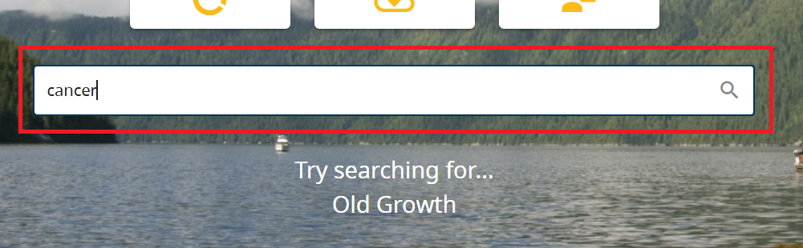
```

```{r bc3, echo=FALSE, cache=TRUE, out.width = '100%', fig.align='center'}
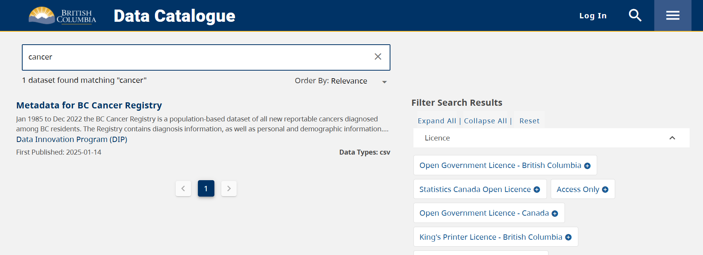
```

Similarly, say we are interested in "COVID-19" and want to find open data related to that topic. We can enter "covid" into the search bar:

```{r bc4, echo=FALSE, cache=TRUE, out.width = '100%', fig.align='center'}
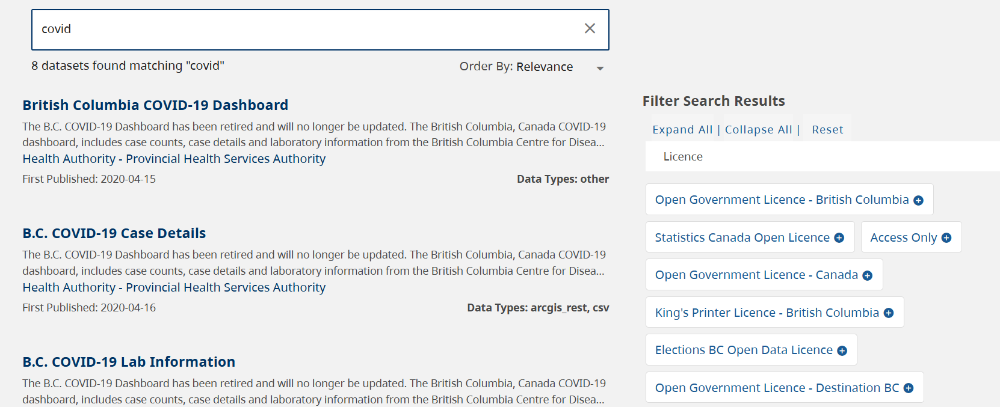
```

You can filter your search by license, format, group, and so on:

```{r bc5, echo=FALSE, cache=TRUE, out.width = '100%', fig.align='center'}
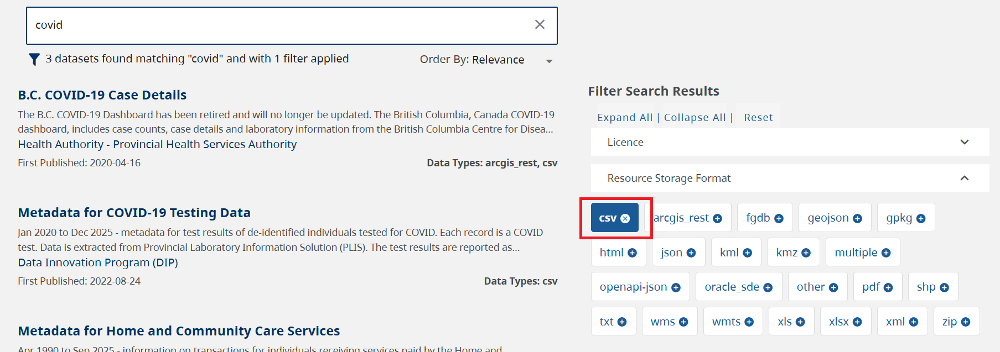
```

Let's explore the "COVID-19 Case Details" dataset. To do that, we can click the dataset title. This will take us to a page with more information about the dataset, including its description and related links. 

```{r bc6, echo=FALSE, cache=TRUE, out.width = '100%', fig.align='center'}
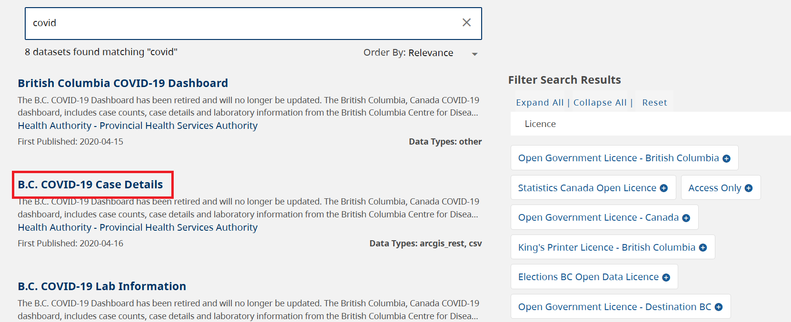
```

You will find information on COVID-19 case details as well as a link to download the data:

```{r bc7, echo=FALSE, cache=TRUE, out.width = '100%', fig.align='center'}
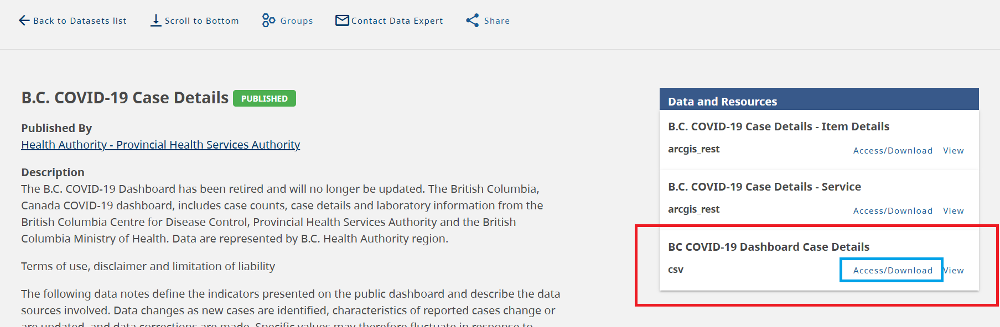
```

To download the dataset, right-click on the `Access/Download` link and select `Save link as...`. This will allow you to save the dataset to your computer.

```{r bc8, echo=FALSE, cache=TRUE, out.width = '100%', fig.align='center'}
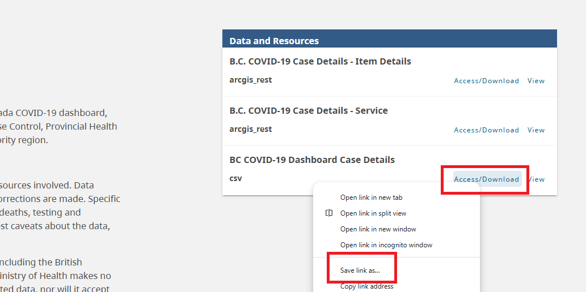
```

```{r bc9, echo=FALSE, cache=TRUE, out.width = '90%', fig.align='center'}
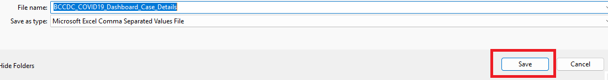
```

After downloading, you can open the data in Excel, Google Sheets, or any statistical software. The data is structured in a tabular format, with each row representing an individual case and each column representing different variables. 

```{r bc10, echo=FALSE, cache=TRUE, out.width = '90%', fig.align='center'}
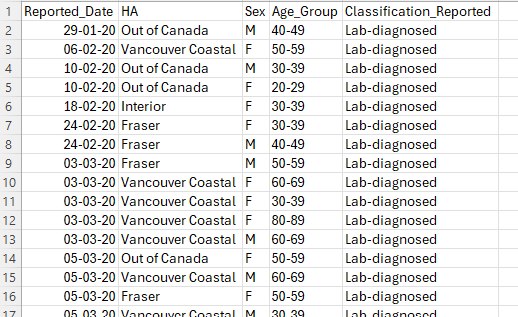
```

To learn more about BC Data Catalogue, click on the three bars on the right side of the page:

```{r bc11, echo=FALSE, cache=TRUE, out.width = '80%', fig.align='center'}
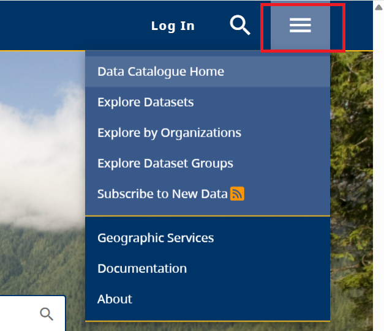
```
