## Data Source: BRFSS {.unnumbered}

The Behavioral Risk Factor Surveillance System (BRFSS) is a cross-sectional survey conducted by the US Centers for Disease Control (CDC). The survey collects information on health-related risk behaviors, chronic health conditions, and use of preventive services among US adults. BRFSS completes more than 400,000 adult interviews each year, making it the largest continuously conducted health survey system in the world.

```{r BRFSS1, echo=FALSE, cache=TRUE, out.width = '90%', fig.align='center'}
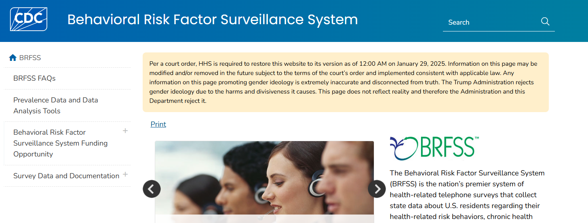
```

::: column-margin
[CDC website for BRFSS](https://www.cdc.gov/brfss/index.html)
:::

### About BRFSS

You can find more information about the BRFSS survey by clicking on [BRFSS FAQs](https://www.cdc.gov/brfss/about/brfss_faq.htm):

```{r BRFSS2, echo=FALSE, cache=TRUE, out.width = '90%', fig.align='center'}
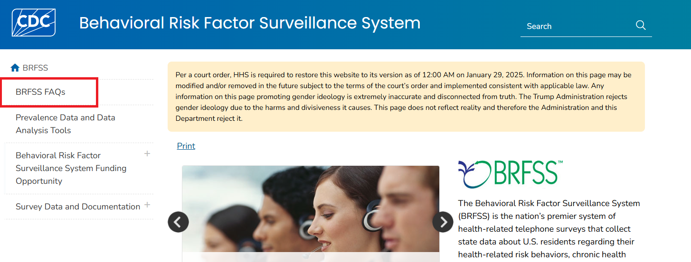
```

On the `BRFSS FAQs` page, you will find information about the BRFSS survey, including what the survey collects, how the survey is conducted, and how to use the data. 

### Survey Data & Documentation

If you click on `Survey Data & Documentation` link, you will find information about the BRFSS questionnaires, datasets, and documentation:

```{r BRFSS3, echo=FALSE, cache=TRUE, out.width = '90%', fig.align='center'}
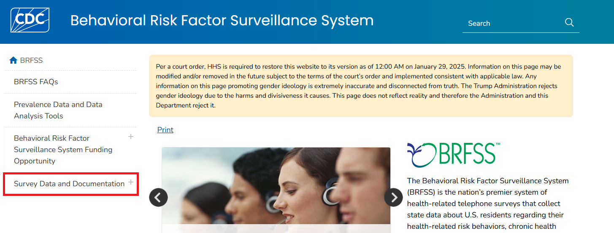
```

::: column-margin
[BRFSS Survey Data & Documentation](https://www.cdc.gov/brfss/data_documentation/index.htm)
:::

There are four types of data files available for download: 1) annual data, 2) asthma call-back data, 3) GIS map data, and 4) SMART data. The annual data files include information on health-related risk behaviors, chronic health conditions, and use of preventive services among US adults. The asthma call-back data files include information on asthma-related health outcomes and healthcare utilization among adults with asthma. The GIS map data files include information on the geographic distribution of the data. The SMART (Selected Metropolitan/Micropolitan Area Risk Trends) data provide prevalence rates for selected conditions and behaviors for cities and their surrounding counties.

```{r BRFSS4, echo=FALSE, cache=TRUE, out.width = '90%', fig.align='center'}
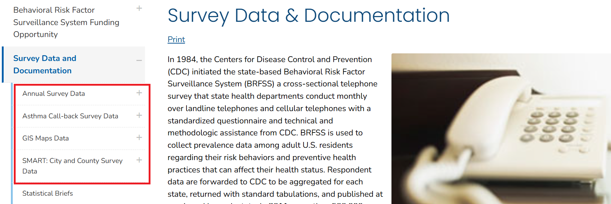
```

For the annual data, you can click on the `Annual Survey Data` link to find information about the annual data files, including how to access the data, how to use the data, and how to analyze the data. There are two types of annual data files available for download: 1) the raw data files and 2) the prevalence and trends database. 

```{r BRFSS5, echo=FALSE, cache=TRUE, out.width = '90%', fig.align='center'}
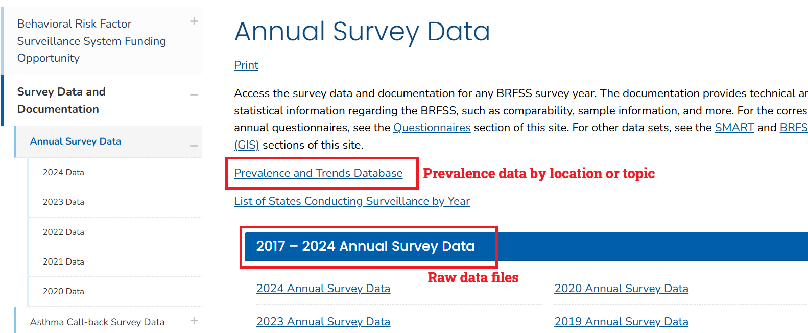
```

### Annual Survey Data

There are separate links for each year of data, and you can click on each link to find information about the data for that year. For example, if you click on the `2023 Annual Survey Data` link, you will find information about the 2023 annual data files, including how to access the data, how to use the data, and how to analyze the data. 

::: column-margin
[Annual Survey Data](https://www.cdc.gov/brfss/annual_data/annual_data.htm)
:::

```{r BRFSS6, echo=FALSE, cache=TRUE, out.width = '90%', fig.align='center'}
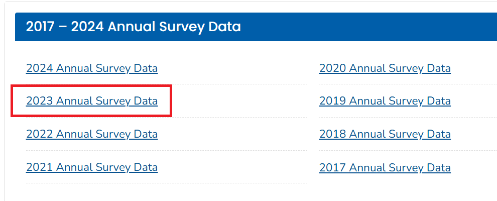
```

```{r BRFSS7, echo=FALSE, cache=TRUE, out.width = '90%', fig.align='center'}
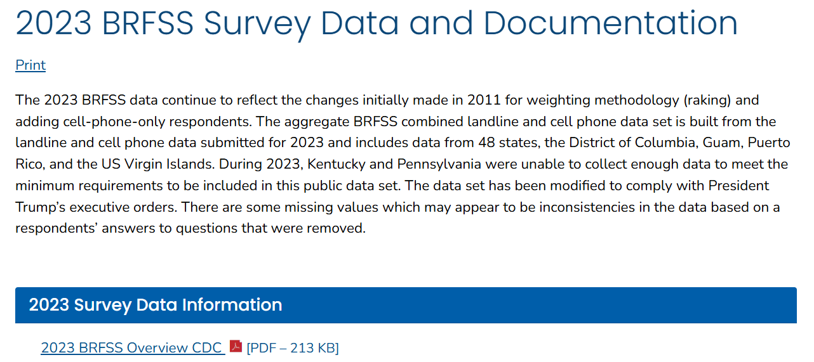
```

The `2023 BRFSS Survey Data and Documentation` page provides information about three resources: 1) data information such as the codebook and sampling weights, 2) data files in ASCII and SAS XPT transport formats, and 3) SAS resources. To download/save the data files, click the specific format you want. For example, if you click on the `2023 BRFSS Data (SAS Transport Format)` link, the annual survey data for 2023 will be downloaded in a ZIP file that contains the dataset in a `.XPT` format. 

```{r BRFSS8, echo=FALSE, cache=TRUE, out.width = '90%', fig.align='center'}
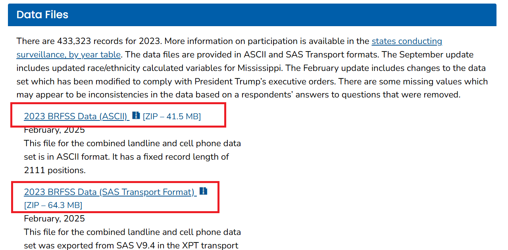
```

You need to unzip the file to extract the data file in `.XPT` format. However, opening the data file in Excel or Google Sheets is a bit tricky. The SAS XPT (or ASCII) data file needs to be converted/formatted appropriately before it can be opened in Excel or Google Sheets. Many statistical software packages, such as R, SAS, or STATA, can read the data file in `.XPT` format. Below is the data file, where the column names are the variable names, and the rows are the observations (i.e., survey respondents):

```{r BRFSS9, echo=FALSE, cache=TRUE, out.width = '90%', fig.align='center'}
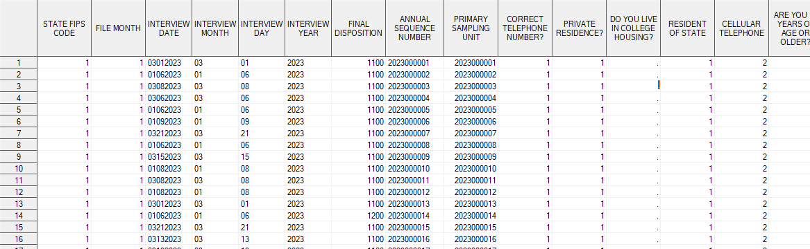
```

To understand the variables in the dataset, you can refer to the codebook: 

```{r BRFSS10, echo=FALSE, cache=TRUE, out.width = '90%', fig.align='center'}
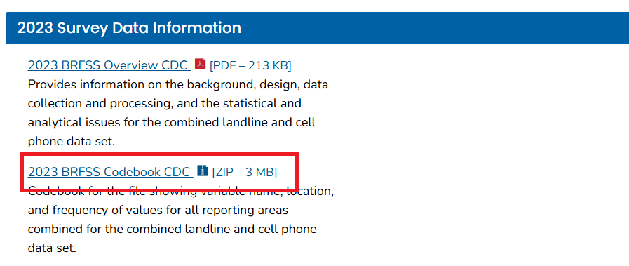
```

You need to unzip the file to extract the codebook in HTML format. The codebook provides information about the variable names, labels, and values. For example, if you want to understand the variable `Drinking and Driving`, you can find the variable name, label, and values in the codebook:

```{r BRFSS11, echo=FALSE, cache=TRUE, out.width = '90%', fig.align='center'}
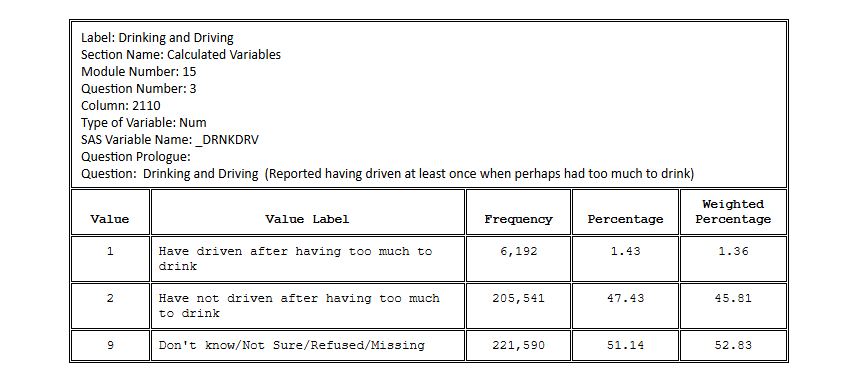
```

You can similarly download the asthma call-back, GIS map, and SMART datasets. To understand the variables in those datasets, you can refer to the codebook for each dataset. 

::: column-margin
[Asthma Call-back Data](https://www.cdc.gov/brfss/acbs/index.htm)

[GIS Data](https://www.cdc.gov/brfss/gis/gis_maps.htm)

[SMART Data](https://www.cdc.gov/brfss/smart/Smart_data.htm)
:::

### Prevalence and Trends Database

The BRFSS prevalence and trends tool allows users to view and download prevalence estimates through charts, graphs, and maps. You can explore the estimates by selecting the topic or location. For example, if you select `by topic`, e.g., for alcohol consumption for Alabama for the year 2024, you need to select the options from the dropdown menu and click on the `View Results` button to see the results: 

::: column-margin
[Prevalence and Trends Database](https://www.cdc.gov/brfss/brfssprevalence/index.html)
:::

```{r BRFSS12, echo=FALSE, cache=TRUE, out.width = '90%', fig.align='center'}
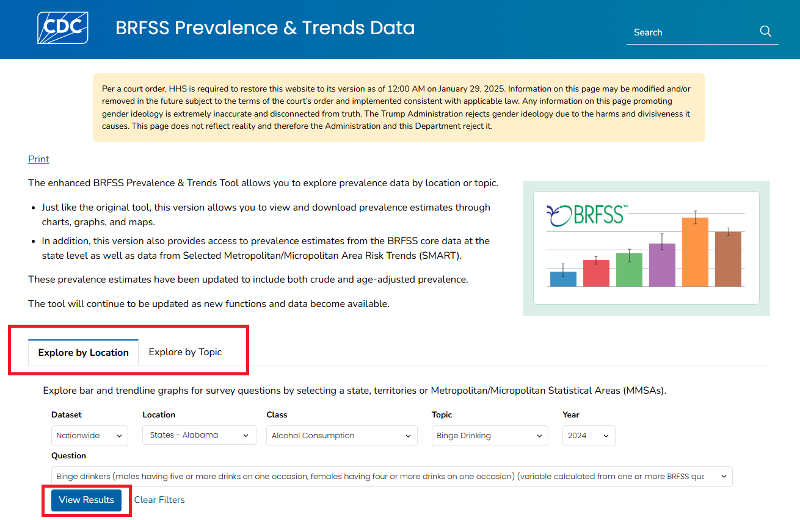
```

The results will show the (i) prevalence estimates for alcohol consumption in Alabama for the year 2024, and (ii) the trend of alcohol consumption in Alabama over time.

```{r BRFSS13, echo=FALSE, cache=TRUE, out.width = '90%', fig.align='center'}
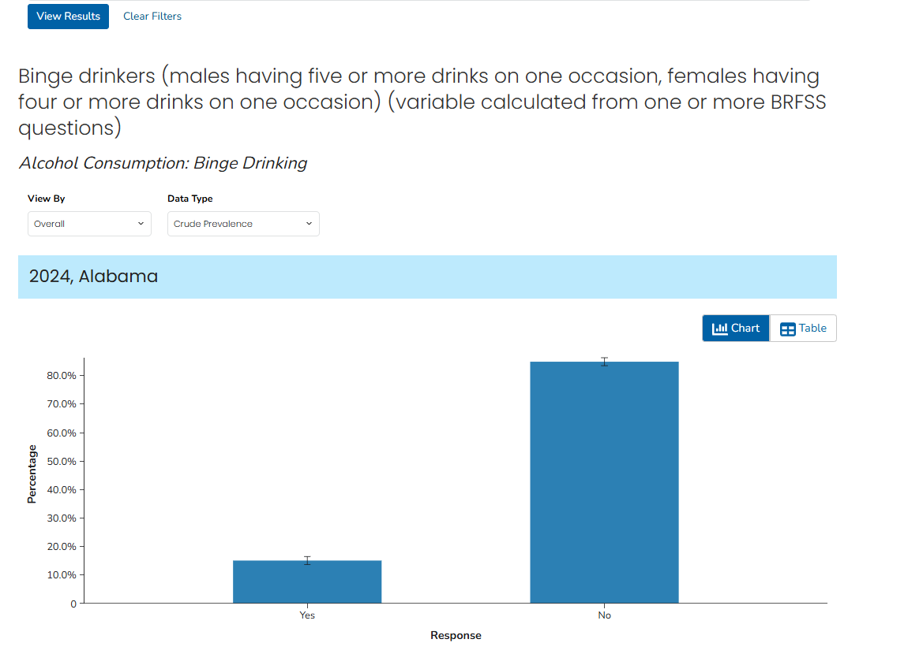
```

```{r BRFSS14, echo=FALSE, cache=TRUE, out.width = '90%', fig.align='center'}
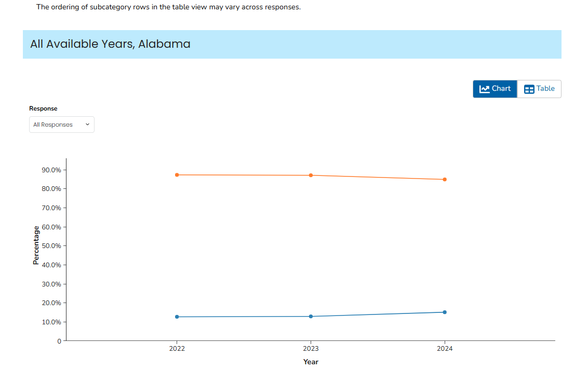
```
