## CADS {.unnumbered}

The Canadian Alcohol and Drugs Survey (CADS) is a national survey conducted by Statistics Canada that collects data on the use of substances, such as alcohol, cannabis and other drugs. The study was conducted by Statistics Canada in 2019 with the cooperation and support of Health Canada. The target population for the survey was all persons aged 15 years and over living in Canada, excluding residents of the Yukon, Northwest Territories, and Nunavut, full-time residents of institutions, and residents of Native reserves. 

```{r cads1, echo=FALSE, cache=TRUE, out.width = '90%', fig.align='center'}
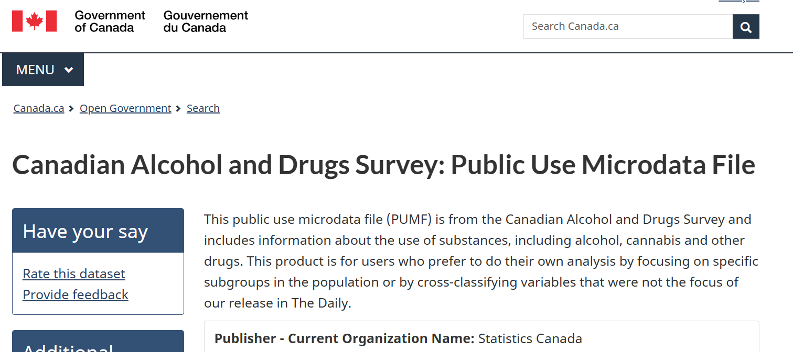
```

::: column-margin
[Health Canada website for CADS](https://ouvert.canada.ca/data/dataset/5c1d47e4-d2be-49d9-9a23-c38f79490fad)
:::

::: column-margin
[CADS 2019 summary of results](https://www.canada.ca/en/health-canada/services/canadian-alcohol-drugs-survey/2019-summary.html)
:::

### Open Licence

Similar to the [Canadian Cannabis Survey](https://open.canada.ca/data/dataset/2abe0796-c3e6-443b-a5c5-74e770e9fbe0), the CADS is also licensed under the [Open Government Licence - Canada](https://open.canada.ca/en/open-government-licence-canada). This means that the data can be freely used, modified, and shared by anyone for any purpose, as long as they provide proper attribution to the source of the data.

```{r cads2, echo=FALSE, cache=TRUE, out.width = '90%', fig.align='center'}
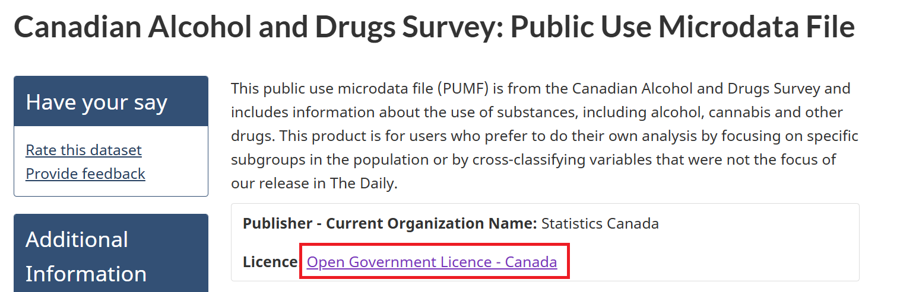
```

```{r cads3, echo=FALSE, cache=TRUE, out.width = '90%', fig.align='center'}
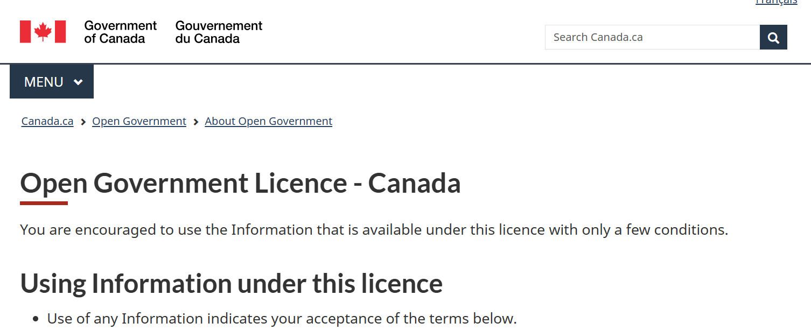
```

### Data and Resources

The `Data and Resources` tab provides access to the public use data, user guides, and the data dictionary. 

```{r cads4, echo=FALSE, cache=TRUE, out.width = '90%', fig.align='center'}
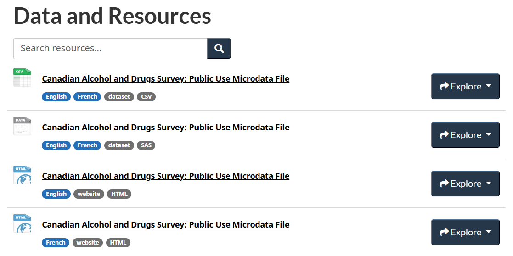
```

The public use data file is available in a ZIP format. You need to open the `Canadian Alcohol and Drugs Survey: Public Use Microdata File` link, and click on `Go to resource`to download the ZIP file.

```{r cads5, echo=FALSE, cache=TRUE, out.width = '90%', fig.align='center'}
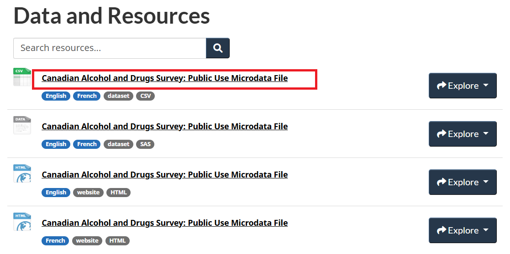
```

```{r cads6, echo=FALSE, cache=TRUE, out.width = '90%', fig.align='center'}
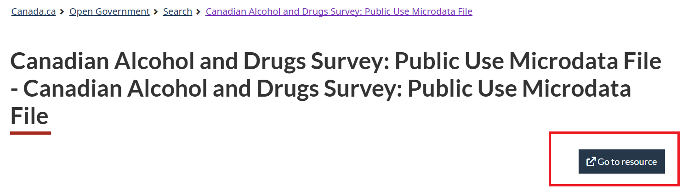
```

The ZIP file contains the following files: an instruction on how to cite CADS 2019, data documentation, and the dataset in CSV format. 

```{r cads7, echo=FALSE, cache=TRUE, out.width = '90%', fig.align='center'}
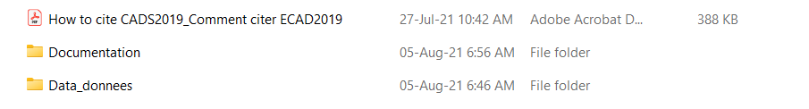
```

### Data Documentation

The data documentation folder includes three sub-folders: `Codebook_Livre des codes`, `Guide`, and `Questionnaires`. 

```{r cads8, echo=FALSE, cache=TRUE, out.width = '90%', fig.align='center'}
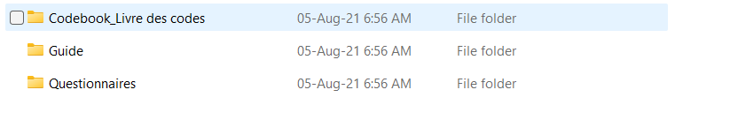
```

The `Guide` folder contains user guides (in English and French) that provide an overview of the survey, including the methodology, data collection process, data processing, data quality, and sampling weights.

```{r cads9, echo=FALSE, cache=TRUE, out.width = '90%', fig.align='center'}
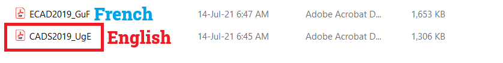
```

The `Codebook_Livre des codes` folder contains codebooks (in English and French) that provide detailed information about the variables in the dataset, including variable names, labels, and values. There are two types of codebooks: those with and those without variable frequencies. But both codebooks provide the same information about the variables in the dataset.

```{r cads10, echo=FALSE, cache=TRUE, out.width = '90%', fig.align='center'}
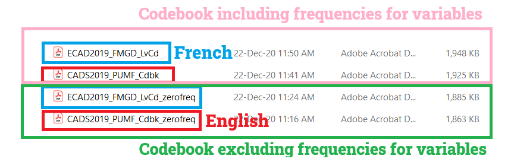
```

The `Questionnaires` folder contains the survey questionnaires (in English and French) that were used to collect the data.

### Data

The `Data_donnees` folder contains the dataset in CSV format. You can open the dataset in Excel or any statistical software to explore the data. The row represents the respondent, and the column represents the variable:

```{r cads11, echo=FALSE, cache=TRUE, out.width = '90%', fig.align='center'}
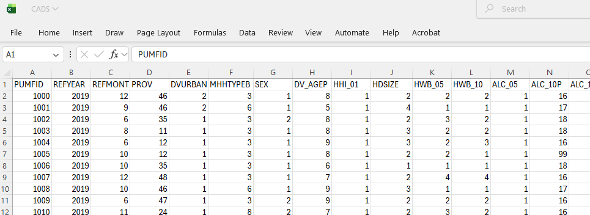
```

You can refer to the codebook to understand the variables that you are interested in for your analysis. For example, if you are interested in the variable `DVURBAN`, you can refer to the codebook to find out that the variable (e.g., for the English version of the codebook with frequencies): 

```{r cads12, echo=FALSE, cache=TRUE, out.width = '90%', fig.align='center'}
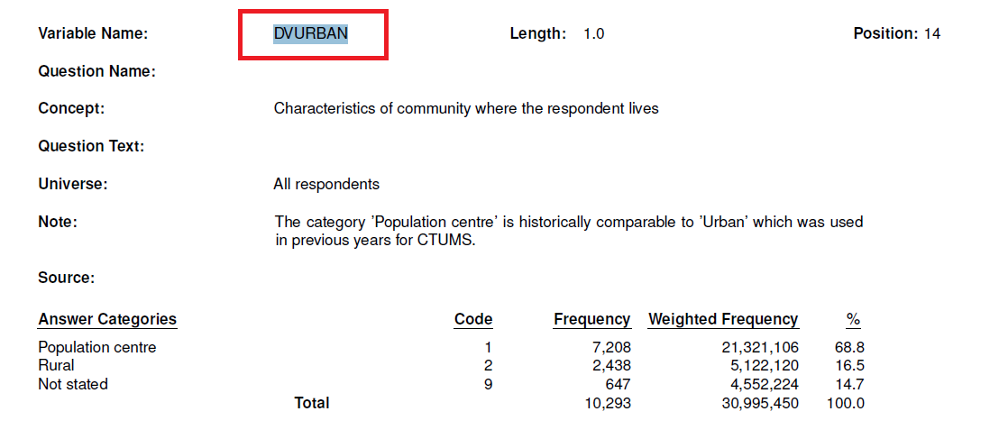
```
