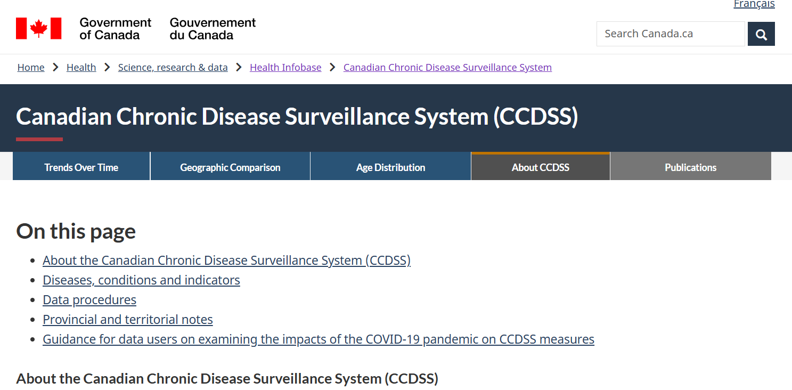
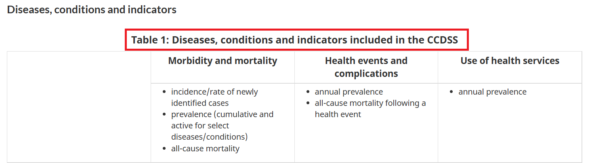
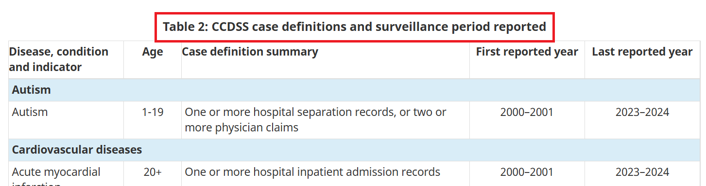
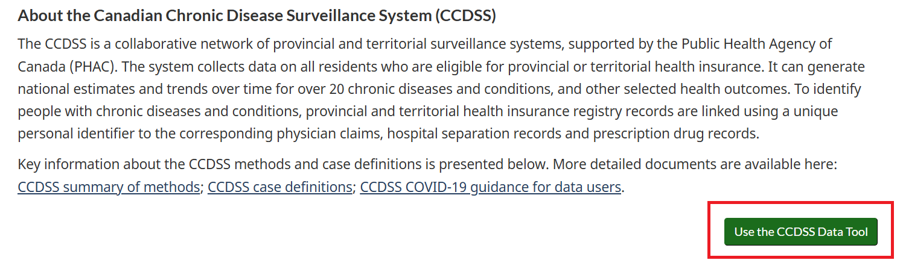
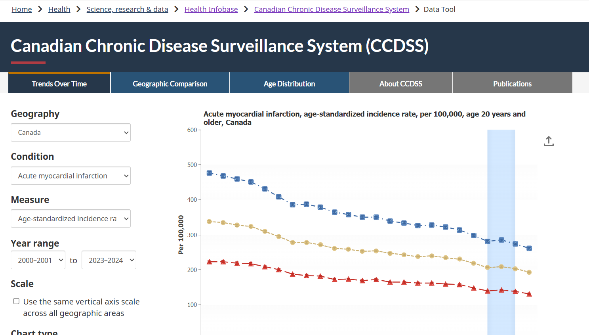
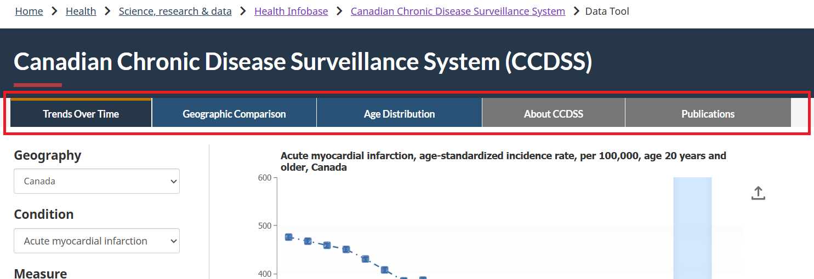
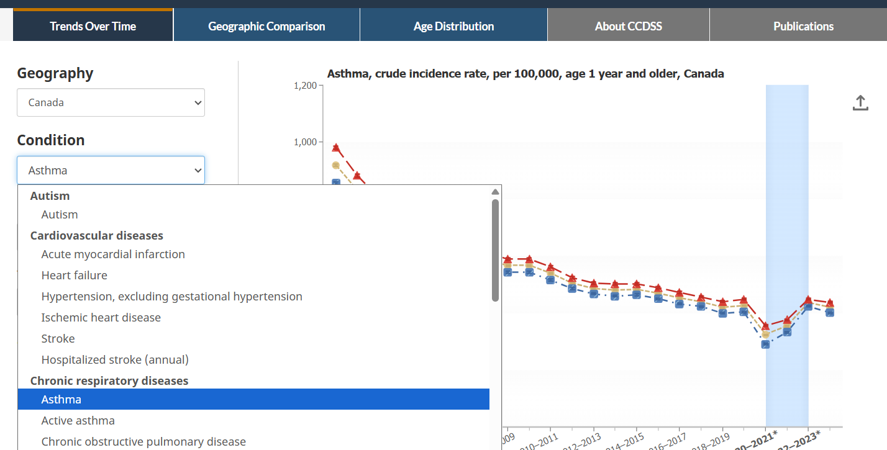
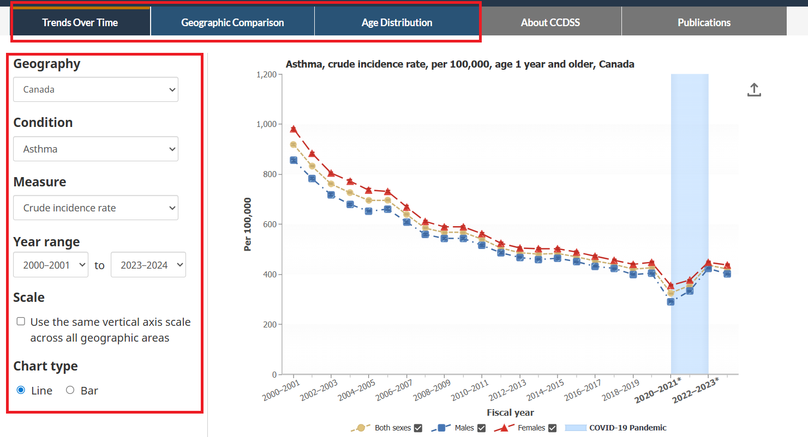
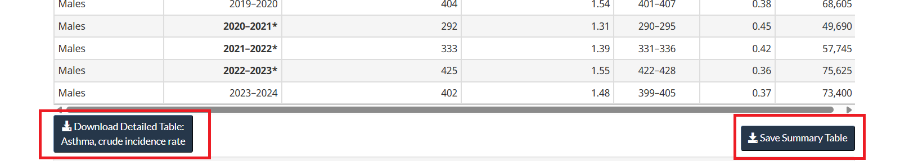
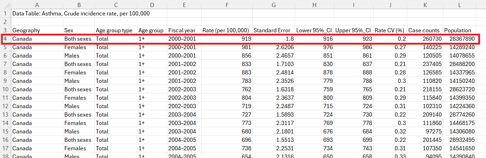

## Data Source: CCDSS {.unnumbered}

The Canadian Chronic Disease Surveillance System (CCDSS) is a collaborative network of provincial and territorial chronic disease surveillance systems in Canada. The CCDSS is supported by the Public Health Agency of Canada (PHAC) and provincial/territorial governments. The CCDSS was established to provide the estimates of the prevalence and incidence of chronic diseases in Canada, as well as to monitor trends over time for more than 20 chronic diseases to help inform health policies and resource planning. The CCDSS is part of the PHAC Health Infobase that we covered in the previous tutorial on [Health Infobase](data8.html). The CCDSS uses health administrative data, such as hospital discharge records, physician billing claims, and prescription drug data.

```{r ccdss1, echo=FALSE, cache=TRUE, out.width = '90%', fig.align='center'}

```

::: column-margin
[CCDSS website](https://health-infobase.canada.ca/ccdss/)
:::

### Key Indicator Categories

The CCDSS website provides a variety of indicators related to chronic diseases, such as autism, cardiovascular diseases, chronic respiratory diseases, diabetes, mental health disorders, musculoskeletal disorders, neurological disorders, and multimorbidity. 

```{r ccdss2, echo=FALSE, cache=TRUE, out.width = '90%', fig.align='center'}

```

```{r ccdss3, echo=FALSE, cache=TRUE, out.width = '90%', fig.align='center'}

```

### Data Tool

The CCDSS website provides a data tool that allows users to explore and visualize the data on chronic diseases in Canada. The data tool provides interactive charts and tables that allow users to explore the data by province/territory. 

```{r ccdss4, echo=FALSE, cache=TRUE, out.width = '90%', fig.align='center'}

```

::: column-margin
[CCDSS Data Tool](https://health-infobase.canada.ca/ccdss/data-tool/Index)
:::

Users can use the data tool to explore the prevalence and incidence of cases, mortality rates, and health service utilization, and to track individuals living with two or more chronic conditions. 

```{r ccdss5, echo=FALSE, cache=TRUE, out.width = '90%', fig.align='center'}

```

Users can explore trends over time, compare data across provinces/territories, and view the distribution of cases by age group. Under the `Publication` tab, you can find information on the repository for data-driven insights, fact sheets, peer-reviewed publications, and reports. 

```{r ccdss6, echo=FALSE, cache=TRUE, out.width = '90%', fig.align='center'}

```

### Interactive chart example

Consider `Asthma` under `Chronic respiratory diseases` as an example. 

```{r ccdss7, echo=FALSE, cache=TRUE, out.width = '90%', fig.align='center'}

```

You can explore different summary measures by filtering by geography, measure, and year. Again, you can further explore trends over time, compare data across provinces/territories, and view the distribution of cases by age group.

```{r ccdss8, echo=FALSE, cache=TRUE, out.width = '90%', fig.align='center'}

```

You can also download the summary data in CSV format for further analysis. To do that, you need to scroll down to the bottom of the `Summary Table`, and click on the `Download` button.

```{r ccdss9, echo=FALSE, cache=TRUE, out.width = '90%', fig.align='center'}

```

Once you open the CSV file in Excel or other software, you will find that the data is not at the individual or person level. Instead, the data are aggregated at the country and province/territory levels, and summary measures are provided for both sexes and for years. For example, see row 4. The `Geography` column says _Canada_ and the `Rate (per 100,000)` column says _919_. This is an example of aggregate data. 

```{r ccdss10, echo=FALSE, cache=TRUE, out.width = '90%', fig.align='center'}

```

Because this data is not at the person-level, and the summary measures are aggregated, you do not need a codebook to translate columns. However, you cannot use this data to calculate the prevalence or incidence of asthma in Canada because it is already aggregated. You can only use this data to explore the trends over time, compare data across provinces/territories, and view the distribution of cases by age group and sex. The individual patients have already been erased to protect their privacy.

