## CCS {.unnumbered}

The Canadian Cannabis Survey (CCS) is an annual survey conducted by Health Canada to gather information on cannabis use among people aged 16 years and older living in all Canadian provinces and territories. The survey collects data on various aspects of cannabis consumption, including their knowledge, attitudes and behaviours towards cannabis use. 

```{r ccs1, echo=FALSE, cache=TRUE, out.width = '90%', fig.align='center'}
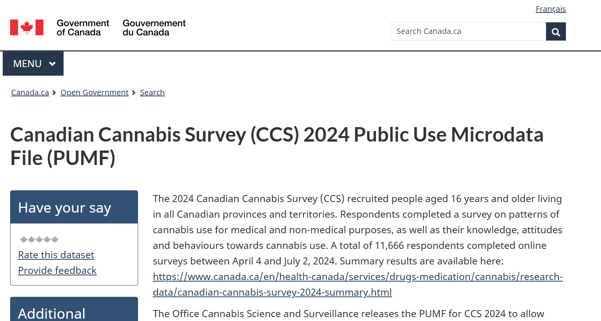
```

::: column-margin
[Health Canada website for CCS](https://open.canada.ca/data/dataset/2abe0796-c3e6-443b-a5c5-74e770e9fbe0)
:::

More than 11,000 respondents participated in the 2024 survey. The study provides valuable insights into cannabis use patterns, the cannabis market, and issues of public safety. The survey results are published on Health Canada's website: 

```{r ccs2, echo=FALSE, cache=TRUE, out.width = '90%', fig.align='center'}
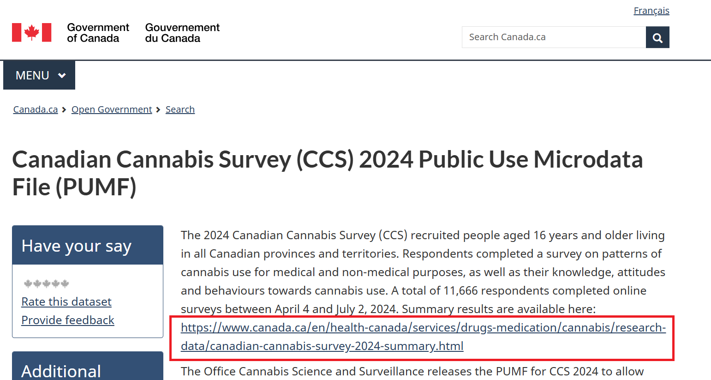
```

```{r ccs3, echo=FALSE, cache=TRUE, out.width = '90%', fig.align='center'}
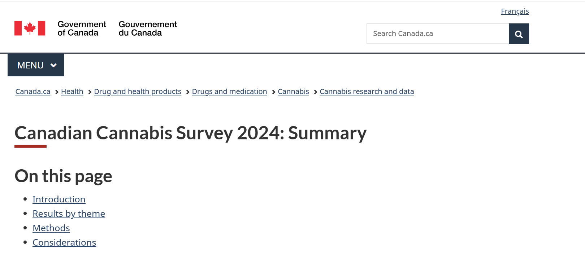
```

### Open Licence

The data from the Canadian Cannabis Survey is available under the Open Government Licence - Canada (OGL-Canada). This licence allows users to freely use, modify, and distribute the data, provided that they attribute the source of the data and do not use it for commercial purposes. The OGL-Canada promotes transparency and encourages the use of government data for research, analysis, and public benefit. You can follow the `Open Government Licence - Canada` link for more information on the terms and conditions of the licence.

::: column-margin
[Open Licence](https://open.canada.ca/en/open-government-licence-canada)
:::

```{r ccs4, echo=FALSE, cache=TRUE, out.width = '90%', fig.align='center'}
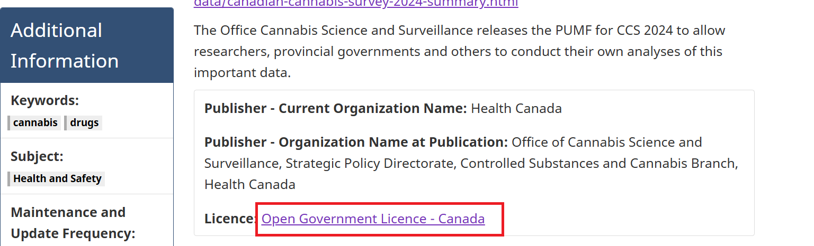
```

```{r ccs5, echo=FALSE, cache=TRUE, out.width = '90%', fig.align='center'}
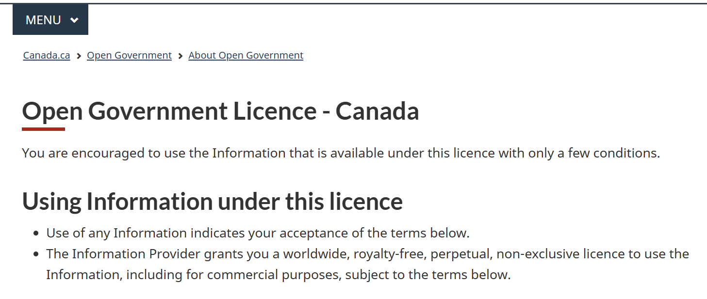
```

### Data and Resources

The `Data and Resources` tab on the Health Canada website provides access to the public use data, user guides, and the data dictionary. 

```{r ccs6, echo=FALSE, cache=TRUE, out.width = '90%', fig.align='center'}
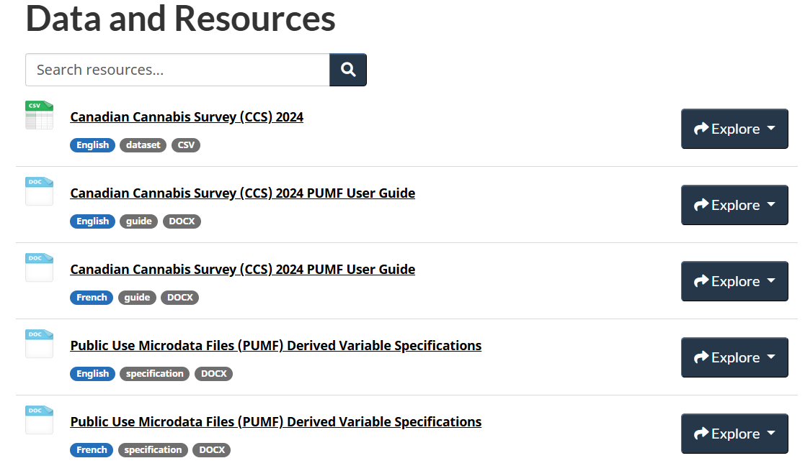
```

The CCS 2024 data is available to download in various formats, including CSV, TSV, JSON, and XML. The data can be accessed through the Health Canada website, where you can choose the format that best suits your needs. You need to open the data link (say, in a new tab in your browser) and select the desired format to download the data.

```{r ccs7, echo=FALSE, cache=TRUE, out.width = '90%', fig.align='center'}
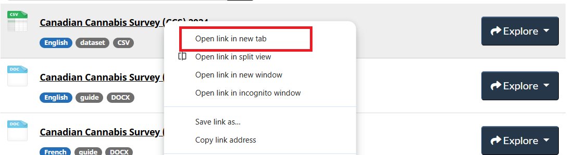
```

Under the `Download` tab, you can find the data in different formats. For example, you can download the data in CSV format by clicking on the `CSV` link:

```{r ccs8, echo=FALSE, cache=TRUE, out.width = '90%', fig.align='center'}
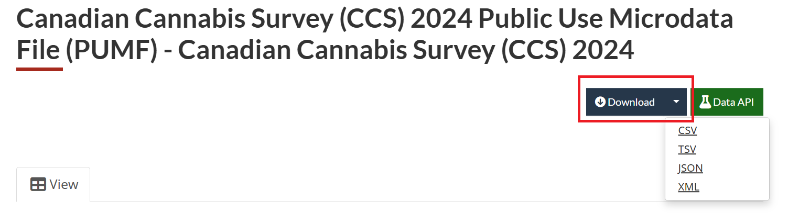
```

After downloading, you can open the data in Excel, Google Sheets, or any statistical software. The data is structured in a tabular format, with each row representing an individual respondent and each column representing different variables:

```{r ccs9, echo=FALSE, cache=TRUE, out.width = '90%', fig.align='center'}
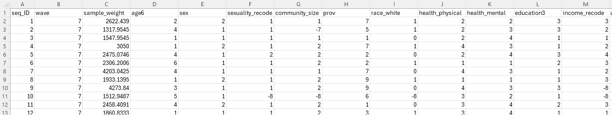
```

The `Canadian Cannabis Survey (CCS) 2024 PUMF User Guide` gives detailed information on the survey methodology, data collection process, and how to use the public use microdata file (PUMF). You can also find the variable names and their descriptions in this file.

::: column-margin
[2024 Public Use Microdata File](https://open.canada.ca/data/dataset/2abe0796-c3e6-443b-a5c5-74e770e9fbe0/resource/0629eaec-7ba7-492d-9322-d20dc80e55d8)
:::

```{r ccs10, echo=FALSE, cache=TRUE, out.width = '90%', fig.align='center'}
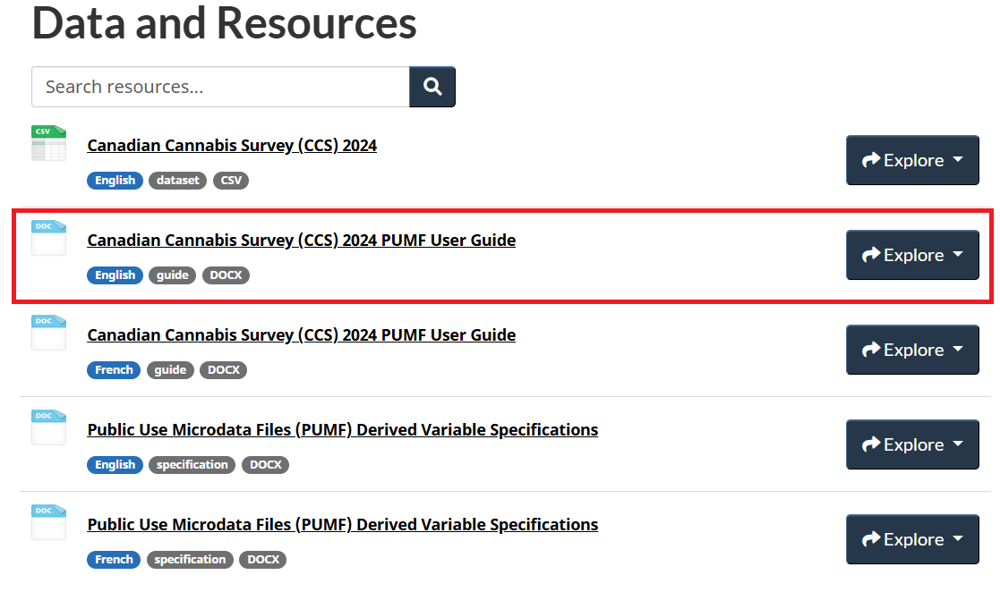
```

Let's find a variable (`access_ease_legal`) in the Excel file and check its description in the data dictionary. You can use the `Find` function in Excel (`Ctrl + F`) to search for the variable name: 

```{r ccs11, echo=FALSE, cache=TRUE, out.width = '90%', fig.align='center'}
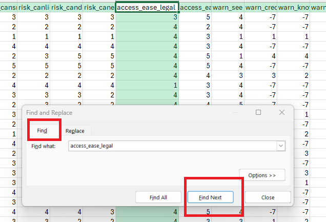
```

Then you can see the description of the variable in the `Canadian Cannabis Survey (CCS) 2024 PUMF User Guide`, which provides information on what the variable represents and how it was coded:

```{r ccs12, echo=FALSE, cache=TRUE, out.width = '90%', fig.align='center'}
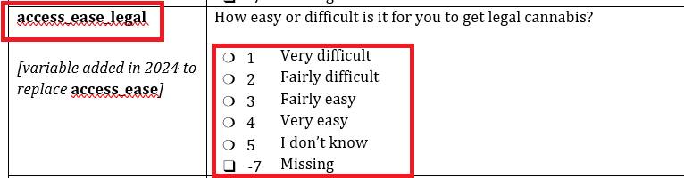
```

In this dataset, `-7` generally represents missing. Always check the data dictionary for the specific coding of missing values, "don't know," or "refused" responses, as they can vary between datasets. 
