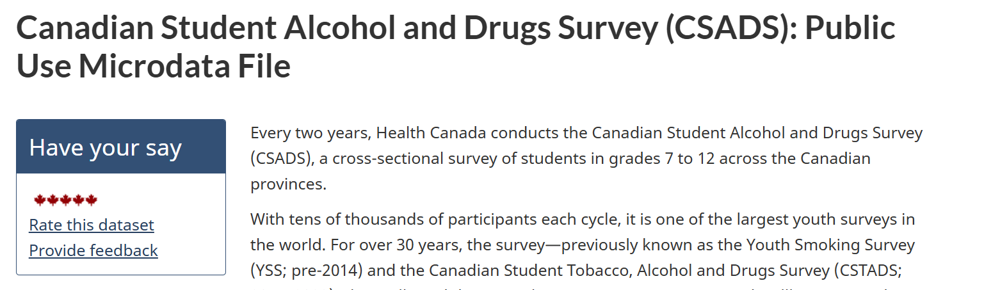
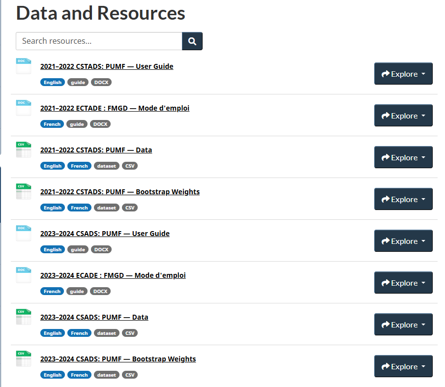
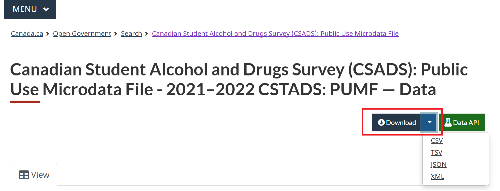
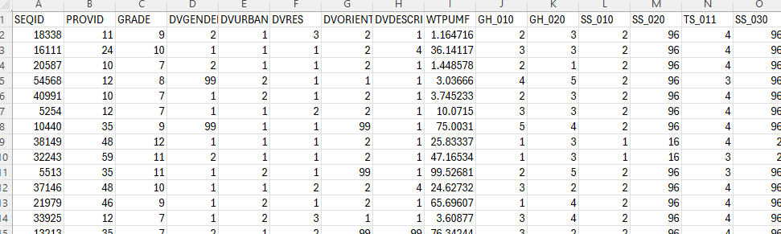
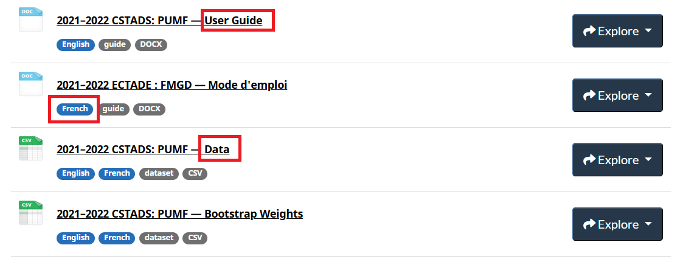
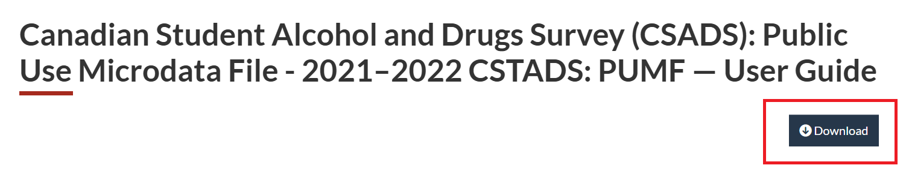
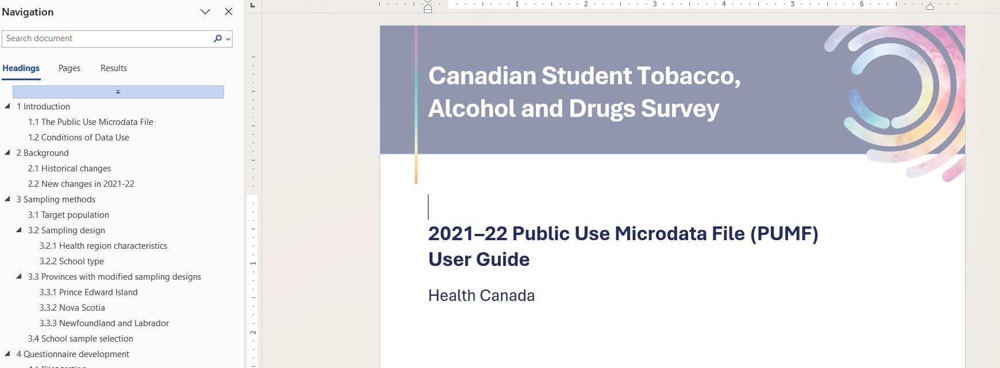
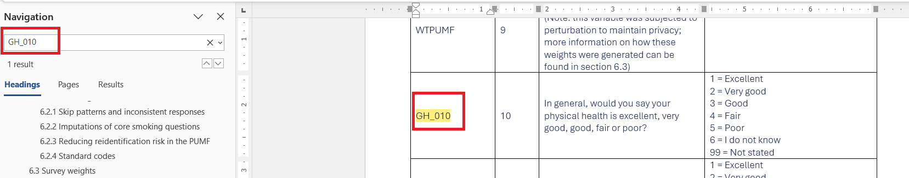

## CSADS {.unnumbered}

The Canadian Student Alcohol and Drugs Survey (CSADS) is a national survey that collects data on the alcohol and drug use patterns of Canadian students in grades 7 to 12. The survey is conducted every two years and provides valuable insights into the prevalence and trends of substance use among Canadian youth.

```{r csads1, echo=FALSE, cache=TRUE, out.width = '90%', fig.align='center'}

```

::: column-margin
[Health Canada website for CTNS](https://open.canada.ca/data/en/dataset/7147c035-4418-499c-9623-a0584debfcb1)
:::

::: column-margin
[CSADS summary of results](https://www.canada.ca/en/health-canada/services/canadian-student-tobacco-alcohol-drugs-survey.html)
:::

### Open Licence

The CTNS is licensed under the [Open Government Licence - Canada](https://open.canada.ca/en/open-government-licence-canada). This means that the data can be freely used, modified, and shared by anyone for any purpose, as long as they provide proper attribution to the source of the data.

### Data and Resources

The `Data and Resources` tab provides access to the public use data, user guides, the data dictionary, and information on bootstrap weights.

```{r csads2, echo=FALSE, cache=TRUE, out.width = '90%', fig.align='center'}

```

To download the 2021–2022 CSTADS, you can click on the `2021–2022 CSTADS: PUMF — Dataset in CSV format` link. The data is available to download in various formats. Under the `Download` tab, you can find the formats. For example, you can download the data in CSV format by clicking on the `CSV` link:

```{r csads3, echo=FALSE, cache=TRUE, out.width = '90%', fig.align='center'}

```

After downloading, you can open the data in Excel, Google Sheets, or any statistical software. The data is structured in a tabular format, with each row representing an individual respondent and each column representing different variables:

```{r csads4, echo=FALSE, cache=TRUE, out.width = '90%', fig.align='center'}

```

The user guide gives detailed information on the survey methodology, data collection process, and how to use the public use microdata file (PUMF). You can also find the variable names and their descriptions in this `DOCX` file.

```{r csads5, echo=FALSE, cache=TRUE, out.width = '90%', fig.align='center'}

```

```{r csads6, echo=FALSE, cache=TRUE, out.width = '90%', fig.align='center'}

```

```{r csads7, echo=FALSE, cache=TRUE, out.width = '90%', fig.align='center'}

```

To find a variable description, you are referred to the `User Guide`. For example, the variable `GH_010` is described as follows:

```{r csads8, echo=FALSE, cache=TRUE, out.width = '90%', fig.align='center'}

```
