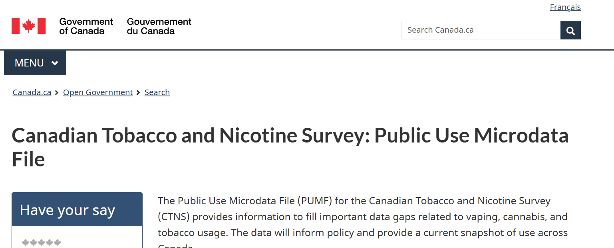
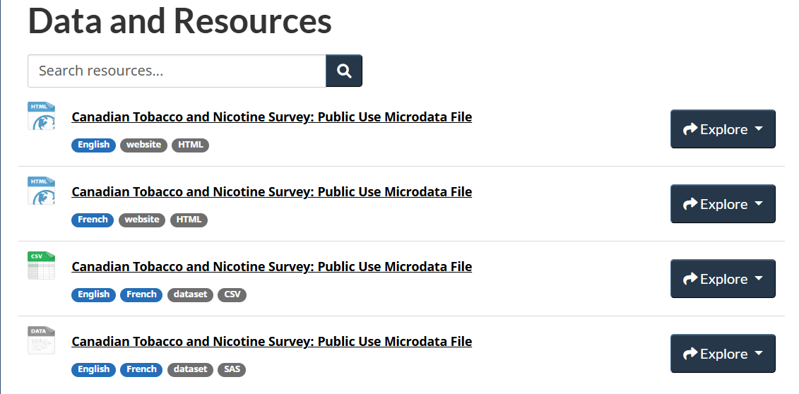
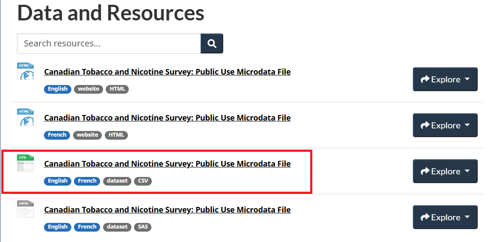
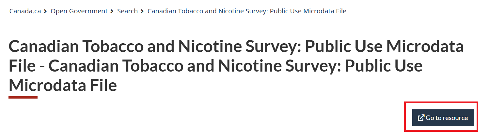

## CTNS {.unnumbered}

The Canadian Tobacco and Nicotine Survey (CTNS) is a cross-sectional survey that collects information on tobacco and nicotine use among Canadians aged 15 years and older. The survey is conducted by Statistics Canada on behalf of Health Canada and provides valuable insights into the prevalence of cigarette smoking, vaping, cannabis, and alcohol use. 

```{r ctns1, echo=FALSE, cache=TRUE, out.width = '90%', fig.align='center'}

```

::: column-margin
[Health Canada website for CTNS](https://open.canada.ca/data/en/dataset/7147c035-4418-499c-9623-a0584debfcb1)
:::

::: column-margin
[CTNS 2022 summary of results](https://www.canada.ca/en/health-canada/services/canadian-tobacco-nicotine-survey/2022-summary.html)
:::


### Open Licence

The CTNS is licensed under the [Open Government Licence - Canada](https://open.canada.ca/en/open-government-licence-canada). This means that the data can be freely used, modified, and shared by anyone for any purpose, as long as they provide proper attribution to the source of the data.

### Data and Resources

The `Data and Resources` tab provides access to the public use data, user guides, and the data dictionary. 

```{r ctns2, echo=FALSE, cache=TRUE, out.width = '90%', fig.align='center'}

```

The public use data file is available in a ZIP format. You can click on the `Canadian Tobacco and Nicotine Survey: Public Use Microdata File` link, followed by `Go to resource` link to download the ZIP file.

```{r ctns3, echo=FALSE, cache=TRUE, out.width = '90%', fig.align='center'}

```

```{r ctns4, echo=FALSE, cache=TRUE, out.width = '90%', fig.align='center'}

```

Similar to the [Canadian Alcohol and Drugs Survey (CADS)](data5.html) tutorial, the ZIP file for CTNS contains the following files: citation instructions, data documentation, and the dataset in CSV format. The data documentation, questionnaire, and codebook are also the same as those for CADS. The only difference is that the data documentation and questionnaire for CTNS are labelled `CTNS` rather than `CADS`.
