## Data Source: GHO {.unnumbered}

The Global Health Observatory (GHO) is the World Health Organization's (WHO) main health statistics repository. The GHO provides data on a wide range of health topics, such as mortality, morbidity, risk factors, health systems, and health equity. The GHO collects data from member states, international organizations, and other sources to provide a comprehensive picture of global health. The GHO is a valuable resource for researchers, policymakers, and public health professionals who are interested in understanding global health trends and disparities. The GHO provides various ways to interact with its data, including interactive maps and downloadable CSV files.

```{r gho1, echo=FALSE, cache=TRUE, out.width = '90%', fig.align='center'}
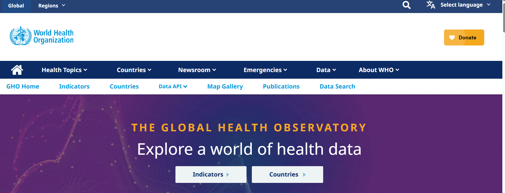
```

::: column-margin
[WHO Global Health Observatory](https://www.who.int/data/gho)
:::

### World Health Data

You can browse information by broader health indicators or by specific countries.

```{r gho2, echo=FALSE, cache=TRUE, out.width = '90%', fig.align='center'}
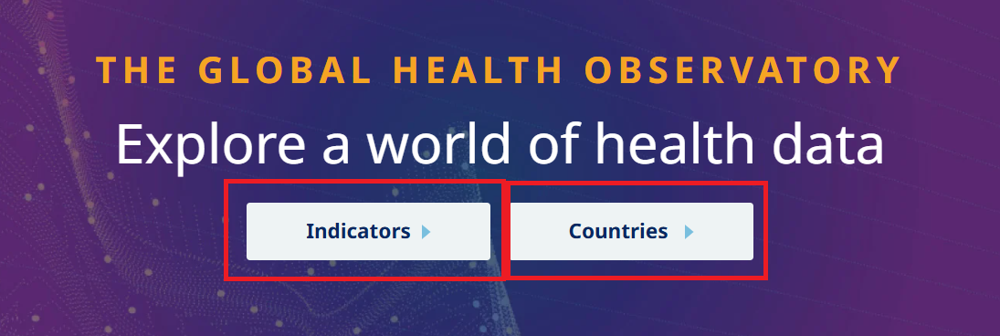
```

To explore the data by indicators, click on the `Indicators` tab. You can find a list of indicators across categories such as `Hepatitis`, `Nutrition`, `Mental health`, and so on. 

```{r gho3, echo=FALSE, cache=TRUE, out.width = '90%', fig.align='center'}
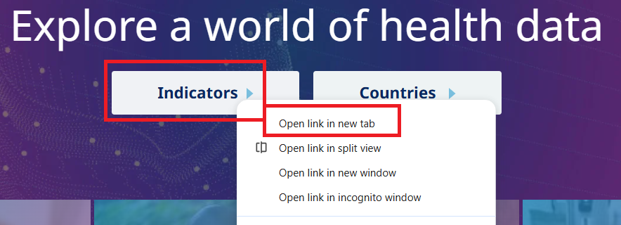
```

```{r gho4, echo=FALSE, cache=TRUE, out.width = '90%', fig.align='center'}
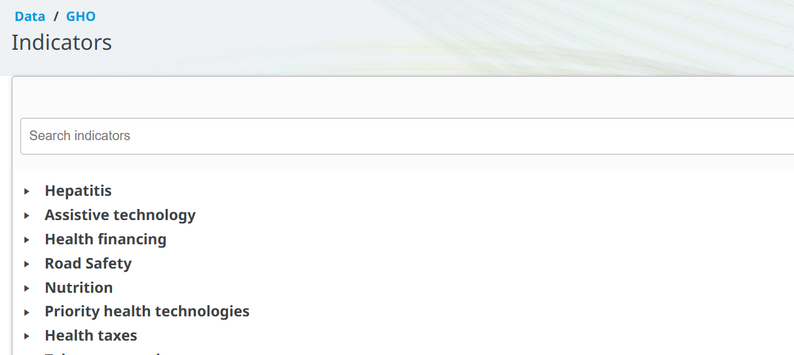
```

You can also use the search bar to search for specific indicators. For example, if you search for `Life expectancy at birth`, you will find a list of indicators related to life expectancy, such as `Life expectancy at birth (years)`. 

```{r gho5, echo=FALSE, cache=TRUE, out.width = '90%', fig.align='center'}
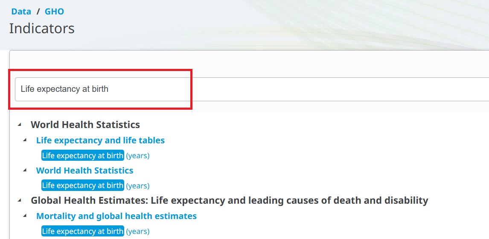
```

To explore the data by country, click on the `Countries` tab. You can find a list of countries and regions. You can click the country name to see the data for that country. 

```{r gho6, echo=FALSE, cache=TRUE, out.width = '90%', fig.align='center'}
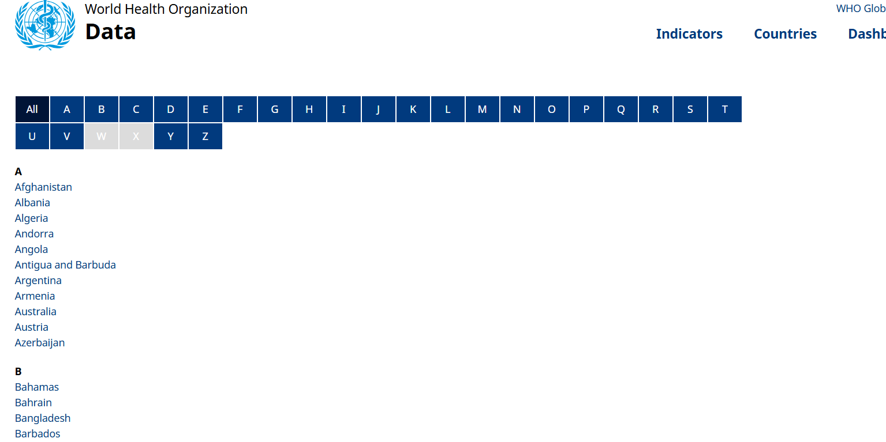
```

```{r gho7, echo=FALSE, cache=TRUE, out.width = '90%', fig.align='center'}
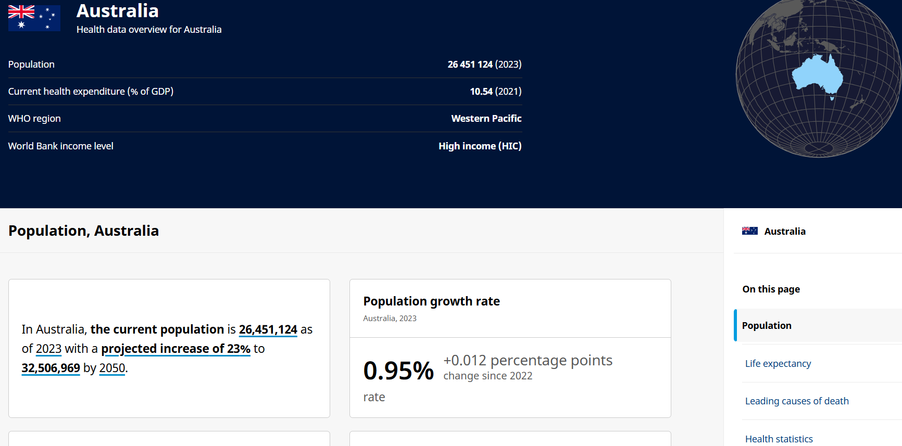
```

### Data by indicator example

Let's click on the `Life expectancy at birth (years)` indicator to see the details:

```{r gho8, echo=FALSE, cache=TRUE, out.width = '90%', fig.align='center'}
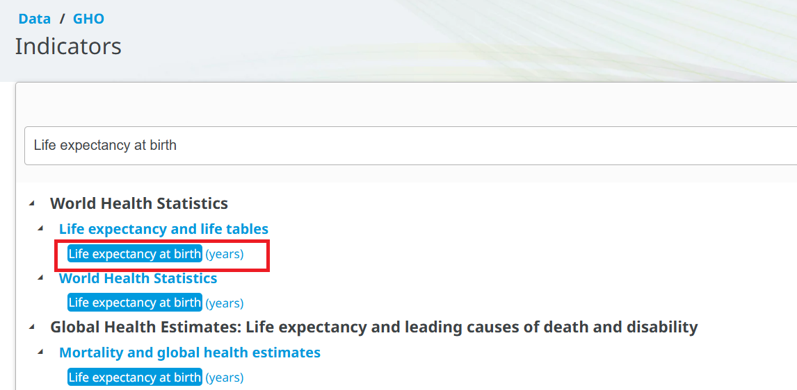
```

::: column-margin
[GHO Indicators](https://www.who.int/data/gho/data/indicators)
:::

You can find different visualization options, such as charts and maps. You can also download the chart and map to your computer.

```{r gho9, echo=FALSE, cache=TRUE, out.width = '100%', fig.align='center'}
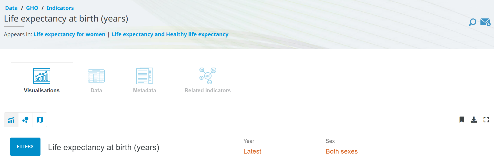
```

```{r gho10, echo=FALSE, cache=TRUE, out.width = '100%', fig.align='center'}
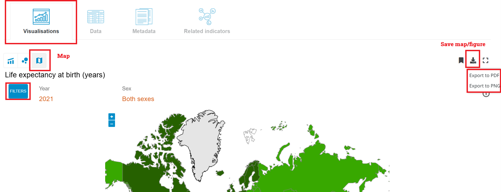
```

To see the data table, you can check the `Data` section. You can also download the data in CSV format for further analysis. To do that, you need to click on the `Download` button at the top right corner of the data table.

```{r gho11, echo=FALSE, cache=TRUE, out.width = '100%', fig.align='center'}
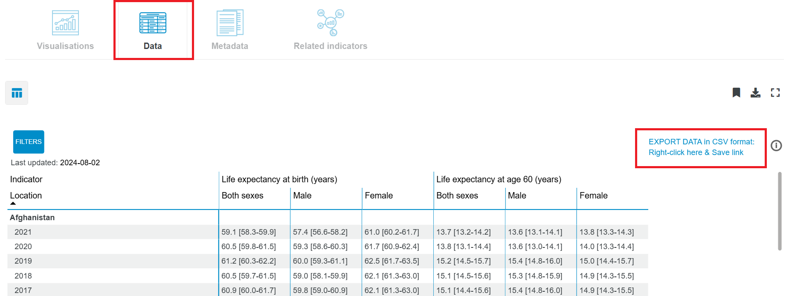
```

Similar to the [Canadian Chronic Disease Surveillance System (CCDSS) database](data9.html), the life expectancy data is also at an aggregated level, which means that the data is summarized at the country level, and does not contain individual-level data:

```{r gho12, echo=FALSE, cache=TRUE, out.width = '100%', fig.align='center'}
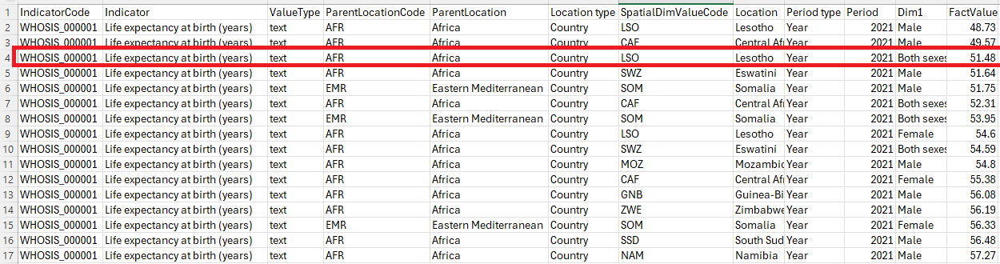
```

The data on the website, as well as the downloaded data in CSV format, both provide the point estimate with 95\% confidence interval:

```{r gho13, echo=FALSE, cache=TRUE, out.width = '100%', fig.align='center'}
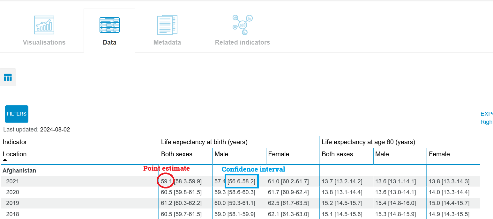
```

### Data by country example

Let's click on `Canada` to explore the data for Canada. 

```{r gho14, echo=FALSE, cache=TRUE, out.width = '90%', fig.align='center'}
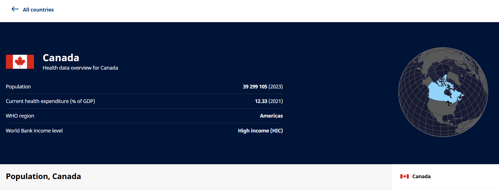
```

::: column-margin
[GHO Data by Country](https://data.who.int/countries)
:::

You can explore different indicators for Canada. You can also download all indicators as a ZIP file by clicking `Reference data`.

```{r gho15, echo=FALSE, cache=TRUE, out.width = '75%', fig.align='center'}
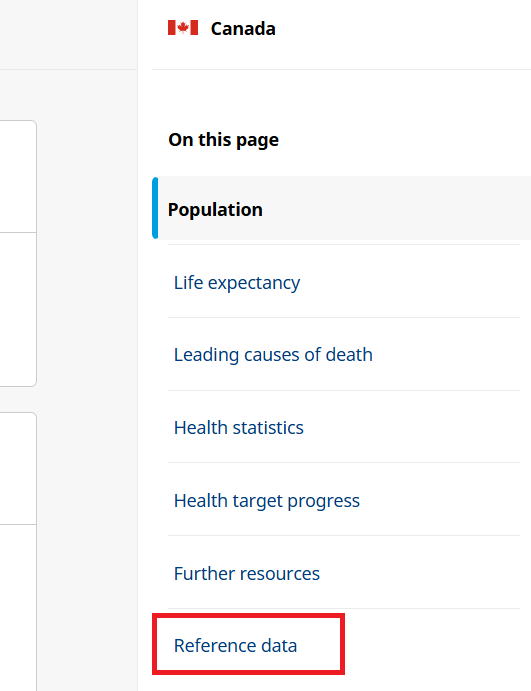
```

```{r gho16, echo=FALSE, cache=TRUE, out.width = '60%', fig.align='center'}
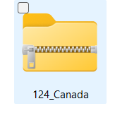
```

Once you unzip the folder, you will find several folders. Each folder contains a codelist, data, a data dictionary, along with a license and terms of use for different indicators. 

```{r gho17, echo=FALSE, cache=TRUE, out.width = '90%', fig.align='center'}
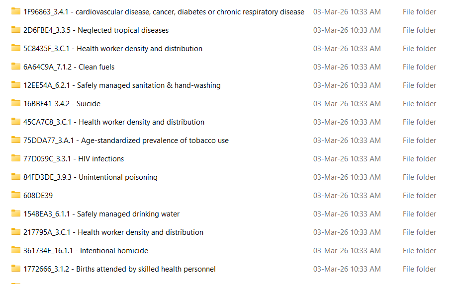
```

For example, the `77D059C_3.3.1 - HIV infections` folder contains the following files:

```{r gho18, echo=FALSE, cache=TRUE, out.width = '90%', fig.align='center'}
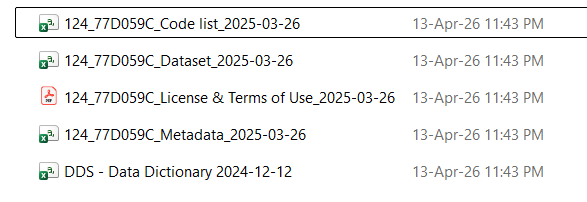
```

### Metadata

The GHO provides metadata for each indicator, providing important context for understanding the data and its limitations. For example, the metadata for the `Hepatitis - new infections` indicator includes information on the definition of the indicator, the methods used to calculate the indicator, data sources, and other relevant information. 

::: column-margin
[Indicator Metadata Registry List](https://www.who.int/data/gho/indicator-metadata-registry)
:::

```{r gho19, echo=FALSE, cache=TRUE, out.width = '100%', fig.align='center'}
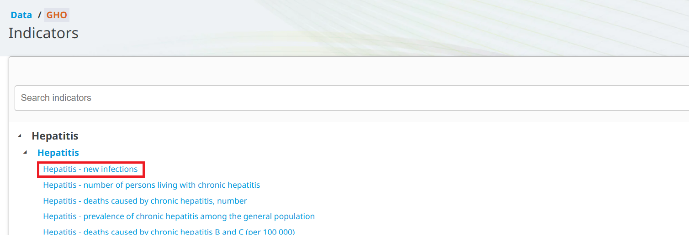
```

```{r gho20, echo=FALSE, cache=TRUE, out.width = '100%', fig.align='center'}
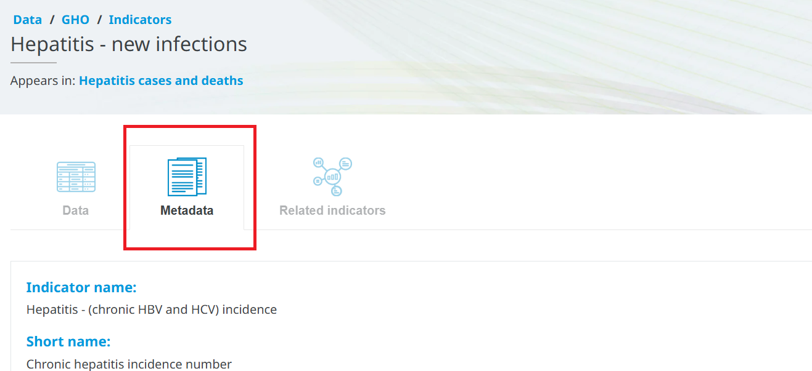
```

