## NHANES {.unnumbered}

The National Health and Nutrition Examination Survey (NHANES) is a cross-sectional survey conducted by the US Centers for Disease Control (CDC). The survey collects information on the health and nutritional status of the US population. The survey includes interviews, physical examinations, and laboratory tests.

```{r nhanes1, echo=FALSE, cache=TRUE, out.width = '90%', fig.align='center'}
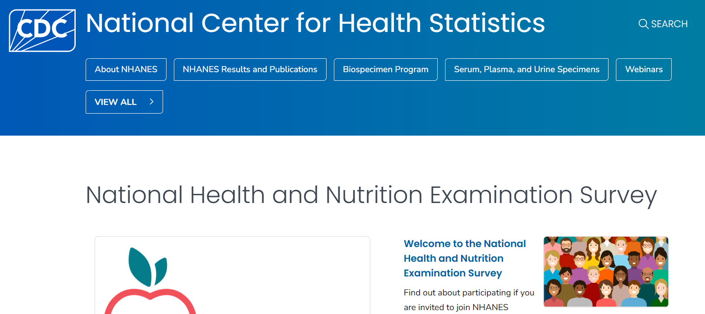
```

::: column-margin
[CDC website for NHANES](https://wwwn.cdc.gov/nchs/nhanes/Default.aspx)
:::

### About NHANES

You can find more information about the NHANES survey by clicking on [About NHANES](https://www.cdc.gov/nchs/nhanes/about/):

```{r nhanes2, echo=FALSE, cache=TRUE, out.width = '90%', fig.align='center'}
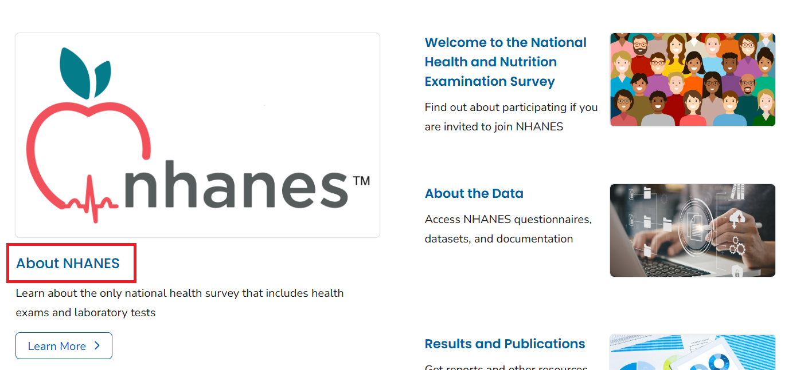
```

```{r nhanes3, echo=FALSE, cache=TRUE, out.width = '90%', fig.align='center'}
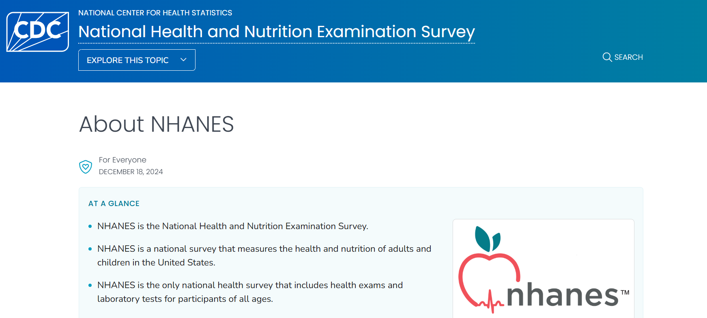
```

On the `About NHANES` page, you will find information about what the survey collects, data and documentation, the instructions on how to use the data, and information on related NHANES surveys. 

```{r nhanes4, echo=FALSE, cache=TRUE, out.width = '90%', fig.align='center'}
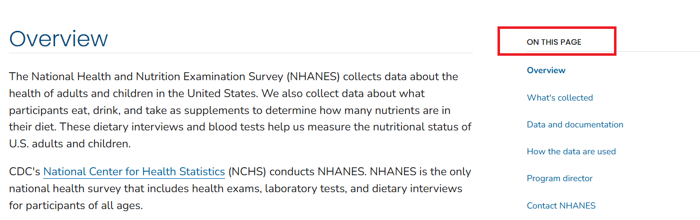
```

You can click on each of the links or scroll down to find information on each of these topics one by one. For example, if we click on the `Data and documentation` link, we will find information as follows:

```{r nhanes5, echo=FALSE, cache=TRUE, out.width = '90%', fig.align='center'}
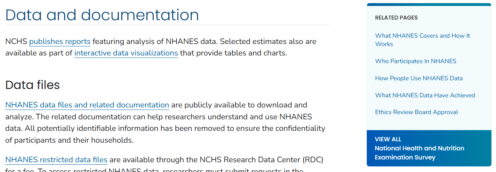
```

### Survey Methods and Analytic Guidelines

If you click on `NHANES data files and related documentation` link, you will find information about the NHANES questionnaires, datasets, and documentation:

```{r nhanes6, echo=FALSE, cache=TRUE, out.width = '90%', fig.align='center'}
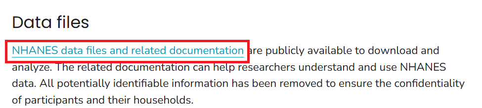
```

```{r nhanes7, echo=FALSE, cache=TRUE, out.width = '90%', fig.align='center'}
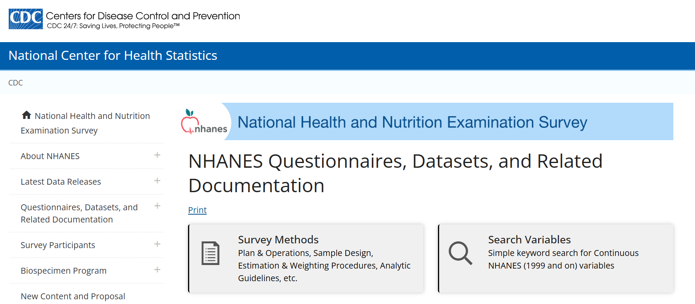
```

::: column-margin
[NHANES data files and related documentation](https://wwwn.cdc.gov/nchs/nhanes/Default.aspx)
:::

You can click `Survey Methods` to find information on survey methods and analytic guidelines. The `Survey Methods and Analytic Guidelines` page provides information about the plan and operation of the NHANES survey, the sampling design, methods for calculating weights and variance estimation, and guidelines for analyzing NHANES data, along with links to related resources.

```{r nhanes8, echo=FALSE, cache=TRUE, out.width = '90%', fig.align='center'}
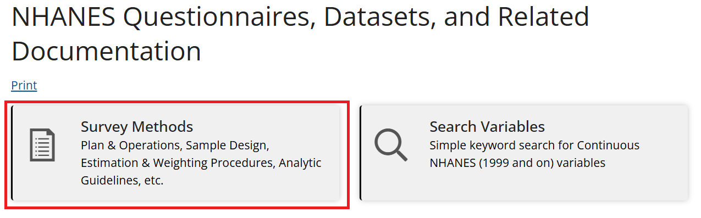
```

### Search Variables

If you click on `Search Variables` link, you will find a search tool to search for variables in the NHANES datasets (1999 and on). 

```{r nhanes9, echo=FALSE, cache=TRUE, out.width = '90%', fig.align='center'}
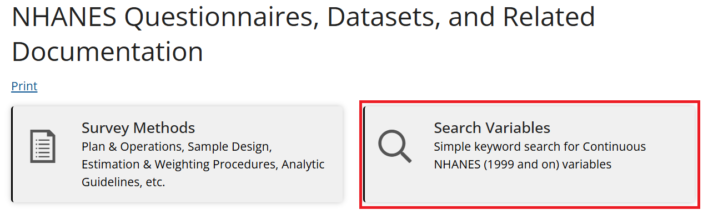
```

You can search for variables by entering keywords in the search box. For example, if you enter `diabetes` in the search box, you will find a list of variables related to diabetes in the NHANES datasets.

```{r nhanes10, echo=FALSE, cache=TRUE, out.width = '90%', fig.align='center'}
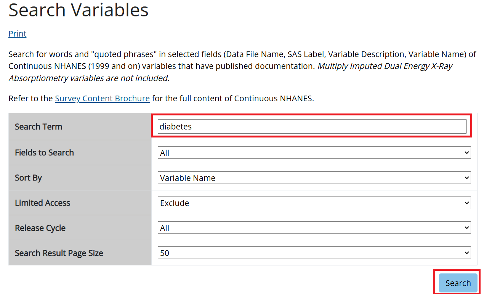
```

```{r nhanes11, echo=FALSE, cache=TRUE, out.width = '90%', fig.align='center'}
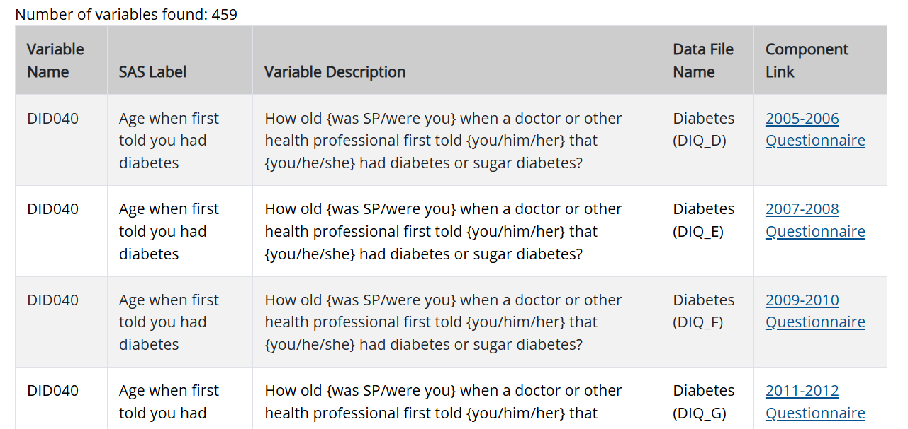
```

You can restrict your search to a specific NHANES cycle by selecting the cycle from the drop-down menu. For example, if you select the `2017-2018` cycle, you will find a list of variables related to diabetes in the 2017-2018 NHANES dataset.

```{r nhanes12, echo=FALSE, cache=TRUE, out.width = '90%', fig.align='center'}
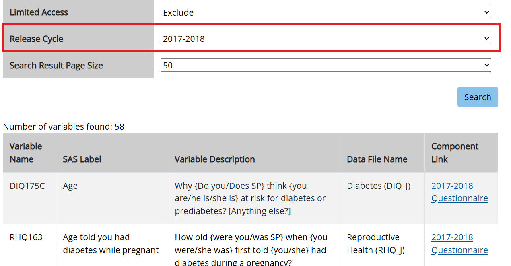
```

### NHANES Questionnaires, Datasets, and Documentation

Let's explore the questionnaires, datasets, and documentation for the 2017-2018 NHANES cycle. You need to click on `NHANES 2017-2018` under the `Continuous NHANES` tab:

```{r nhanes13, echo=FALSE, cache=TRUE, out.width = '90%', fig.align='center'}
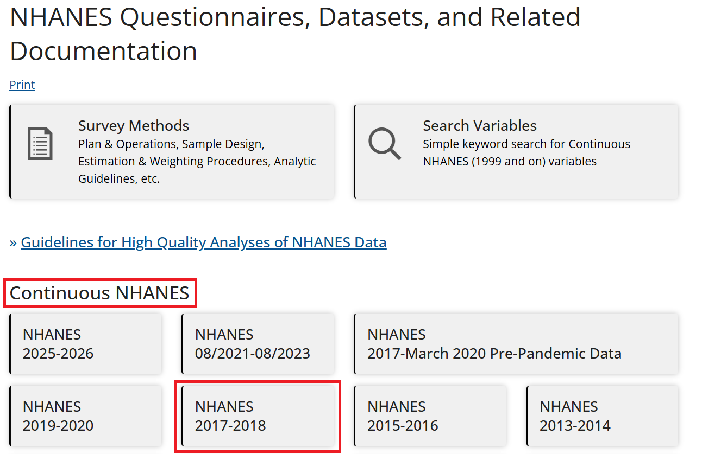
```

This will open the page for the 2017-2018 NHANES cycle, where you can find information on the survey description, questionnaires, datasets, and documentation.

```{r nhanes14, echo=FALSE, cache=TRUE, out.width = '90%', fig.align='center'}
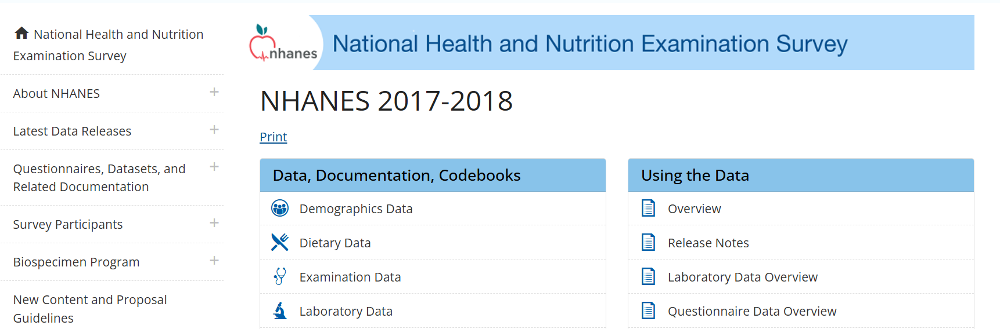
```

::: column-margin
Data are available in 6 categories:

-   Demographics
-   Dietary
-   Examination
-   Laboratory
-   Questionnaire
-   Limited Access
:::

There are six categories of data available for the 2017-2018 NHANES cycle: Demographics, Dietary, Examination, Laboratory, Questionnaire, and Limited Access data. You can click each category to find the datasets and documentation available in that category. For example, if you click on `Demographics Data`, you will find a list of datasets and documentation related to demographics data in the 2017-2018 NHANES cycle. 

```{r nhanes15, echo=FALSE, cache=TRUE, out.width = '90%', fig.align='center'}
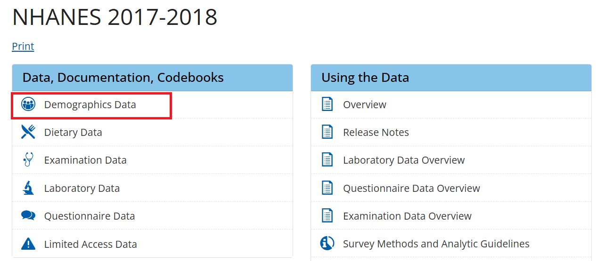
```

```{r nhanes16, echo=FALSE, cache=TRUE, out.width = '90%', fig.align='center'}
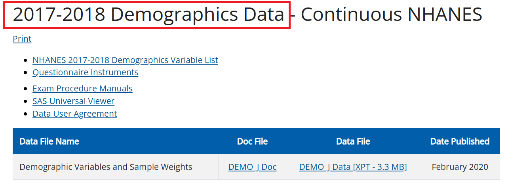
```

There is a `Doc File` available for each dataset that provides information about the dataset, including the variables it contains, their coding, and any special considerations for using it. It is important to read the `Doc` file before using the dataset to understand the data structure and how to use it properly. The `Data File` contains the dataset data in `.XPT` format, which is a SAS Transport file, not a CSV. 

```{r nhanes17, echo=FALSE, cache=TRUE, out.width = '90%', fig.align='center'}
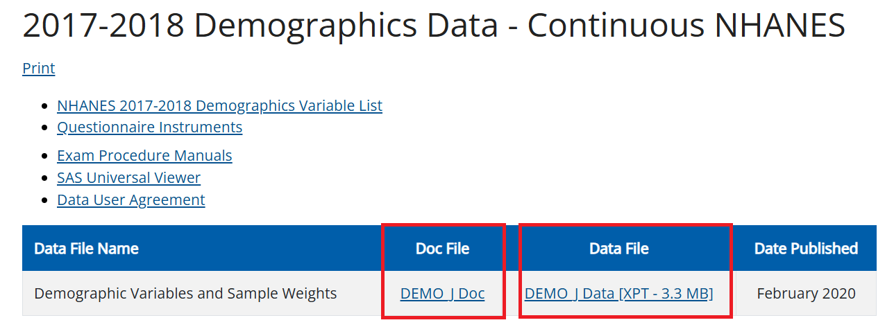
```

### Data

You need to click on the `DEMO_J Data [XPT - 3.3 MB]` link to download the dataset. Note that you cannot easily open an `.XPT` file in Excel or Google Sheets. In the real world, data isn't always in a friendly format. For this week, let's download the `NHANES_Demo_Converted.csv` file from our Canvas page to look at the rows. Later, we will use an AI co-pilot to write R code that reads `.XPT` files automatically. 

Let's open the `NHANES_Demo_Converted.csv` file in Excel and see the first few rows: 

```{r nhanes18, echo=FALSE, cache=TRUE, out.width = '90%', fig.align='center'}
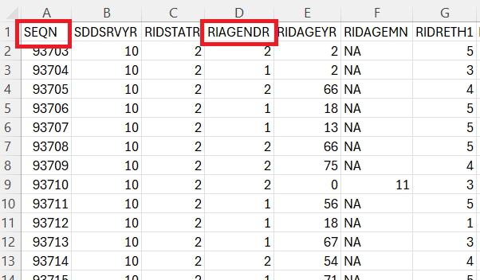
```

-   Each row represents a person.
-   Each column represents a variable.
-   The first row contains the variable names. The remaining rows contain the data for each person.

For example, `SEQN` is the unique identifier for each person in the dataset, and `RIAGENDR` is the variable for gender. 

### Use of the Codebook

To understand the variables in the dataset, you can refer to the codebook. The codebook provides information about the variable names, labels, and values. The `Doc File` explained earlier contains the codebook for the dataset. You need to click on the `DEMO_J Doc` link to open the codebook on a new page. Let's we want to understand the variables `SEQN` and `RIAGENDR`:

```{r nhanes19, echo=FALSE, cache=TRUE, out.width = '90%', fig.align='center'}
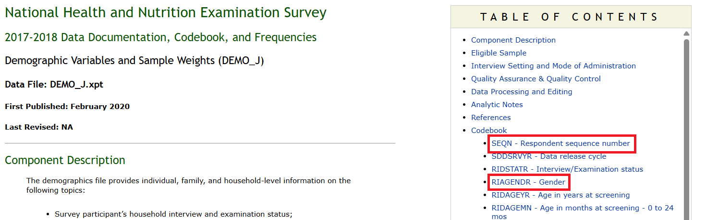
```

You need to click on the `SEQN - Respondent sequence number` link or scroll down to find the information about the `SEQN` variable. 

```{r nhanes20, echo=FALSE, cache=TRUE, out.width = '90%', fig.align='center'}
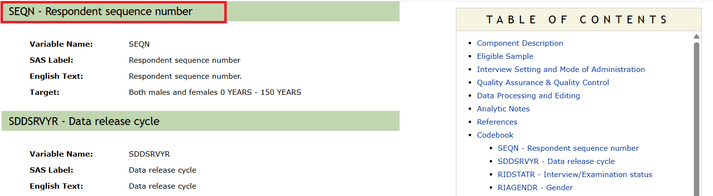
```

Similarly, you can click on the `RIAGENDR - Gender` link or scroll down to find the information about the `RIAGENDR` variable.

```{r nhanes21, echo=FALSE, cache=TRUE, out.width = '90%', fig.align='center'}
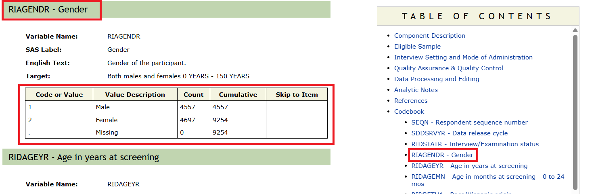
```

As you can see, the `RIAGENDR` variable has two values: 1 for Male and 2 for Female, without any missing values. You can also see the frequency of each value in the dataset. These numbers/frequencies should exactly match the frequencies in your dataset. You can use the codebook to understand other variables in the dataset. Similarly, you can use the other data files (e.g., Dietary) and their codebook to understand the variables in those datasets. Unlike the demographic file, which uses only one dataset and one codebook, the other files use multiple datasets and codebooks. As an example, if you click on the `Questionnaire Data` link, you will find multiple datasets and codebooks for questionnaire data:

```{r nhanes22, echo=FALSE, cache=TRUE, out.width = '90%', fig.align='center'}
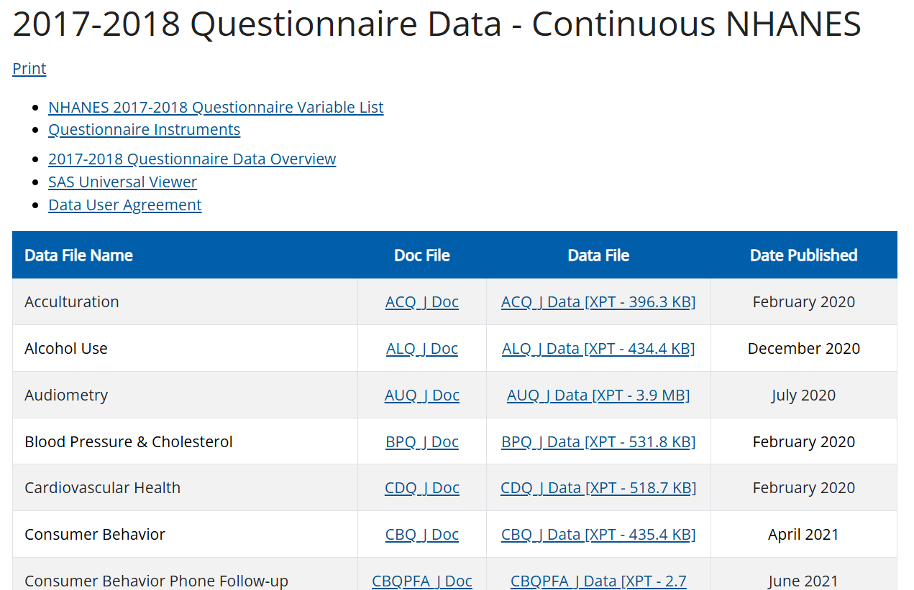
```
