## NHIS {.unnumbered}

The National Health Interview Survey (NHIS) is a cross-sectional household interview survey conducted by the US Centers for Disease Control (CDC). The survey collects information on the health status, health care access, and health behaviors of the US population.

```{r nhis1, echo=FALSE, cache=TRUE, out.width = '90%', fig.align='center'}
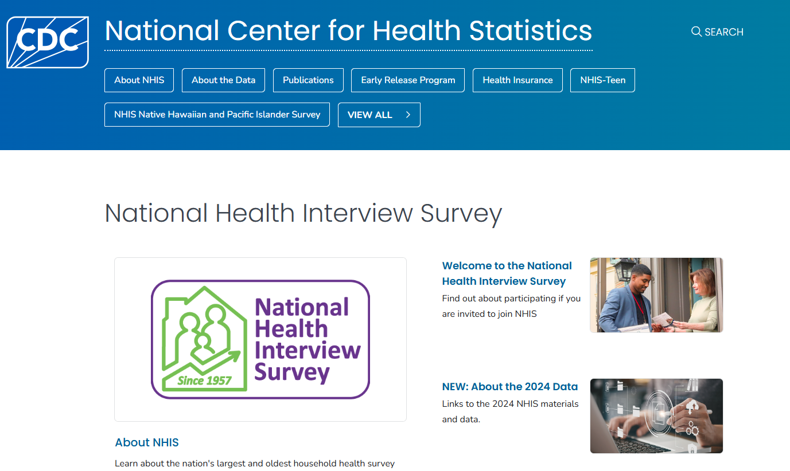
```

::: column-margin
[CDC website for NHIS](https://www.cdc.gov/nchs/nhis/index.html)
:::

### About NHIS

You can find more information about the NHIS survey by clicking on [About NHIS](https://www.cdc.gov/nchs/nhis/about/index.html):

```{r nhis2, echo=FALSE, cache=TRUE, out.width = '90%', fig.align='center'}
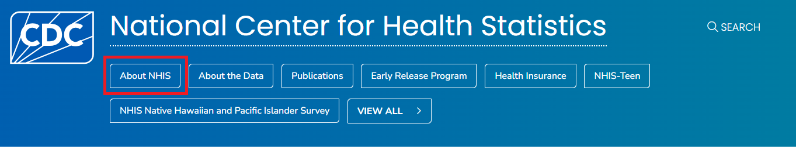
```

```{r nhis3, echo=FALSE, cache=TRUE, out.width = '90%', fig.align='center'}
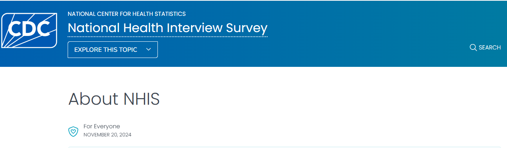
```

On the `About NHIS` page, you will find information about what the survey collects, data and documentation, the instructions on how to use the data, and information on related NHIS surveys.

```{r nhis4, echo=FALSE, cache=TRUE, out.width = '90%', fig.align='center'}
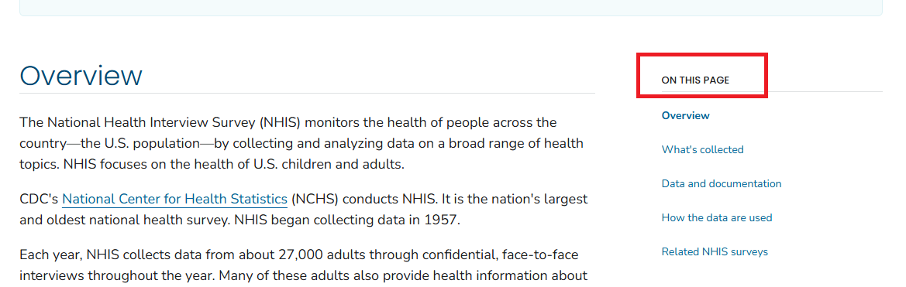
```

You can click on each of the links or scroll down to find information on each of these topics one by one. For example, if we click on the `How the data are used` link, we will find information as follows:

```{r nhis5, echo=FALSE, cache=TRUE, out.width = '90%', fig.align='center'}
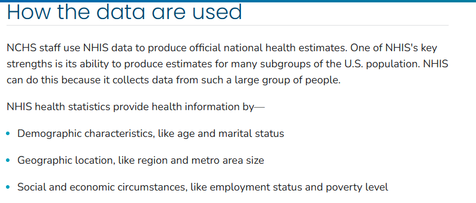
```

### About the Data

If you click on `About the Data` link, you will find information about the NHIS questionnaires, datasets, and documentation:

```{r nhis6, echo=FALSE, cache=TRUE, out.width = '90%', fig.align='center'}
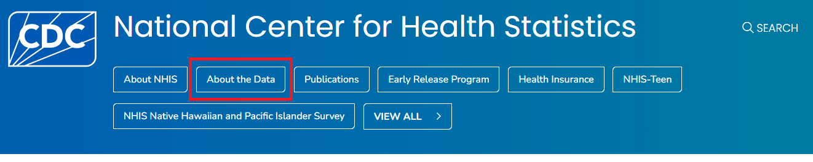
```

::: column-margin
[NHIS Data, Questionnaires and Related Documentation](https://www.cdc.gov/nchs/nhis/documentation/index.html)
:::

Under the `Overview` tab, you will find information about different NHIS cycles and the questionnaires, datasets, and documentation available in each cycle. As an example, let's click on the `2023 NHIS Questionnaires, Datasets, and Documentation` link to see the details for the 2023 NHIS:

```{r nhis7, echo=FALSE, cache=TRUE, out.width = '90%', fig.align='center'}
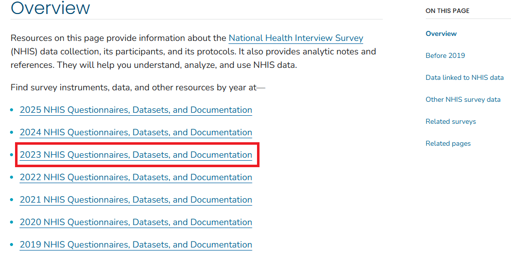
```

### NHIS Questionnaires, Datasets, and Documentation

To view the description of the 2023 NHIS, click on the `Survey description document` link:

```{r nhis8, echo=FALSE, cache=TRUE, out.width = '90%', fig.align='center'}
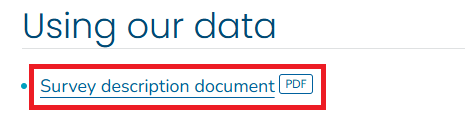
```

This will open the PDF of the 2023 NHIS survey description. Alternatively, you can right-click on the link, click on `Save link as...` and save the PDF file on your computer for future reference.

```{r nhis9, echo=FALSE, cache=TRUE, out.width = '90%', fig.align='center'}
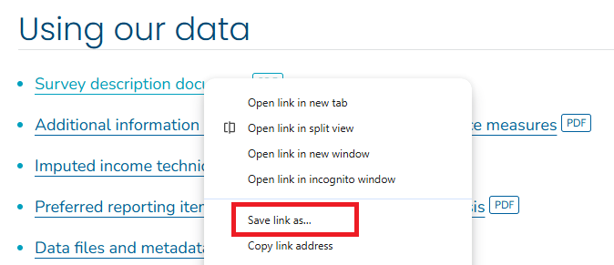
```

Similarly, you can open and save the questionnaires and related materials under the `Questionnaires and survey materials` tab.

::: column-margin
Data are available in 5 categories:

-   Sample adult interview
-   Sample child interview
-   Parent-child pair data
-   Imputed income
-   Paradata
:::

In the recent NHIS, data are available in 5 categories: interview data for adults, interview data for children, data for parent-child pairs, imputed income, and paradata. You can click each link for documentation to see a summary of the data and the codebook.

```{r nhis10, echo=FALSE, cache=TRUE, out.width = '90%', fig.align='center'}
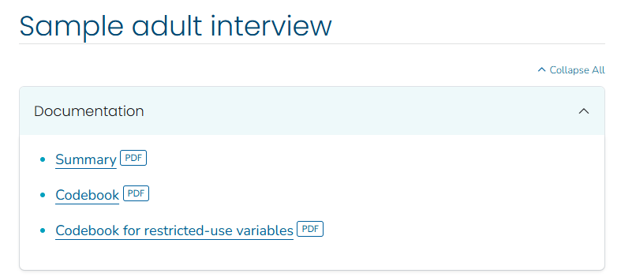
```

### NHIS Data

The data files are stored on the NHIS website in different formats. You can save the dataset in any statistical package that supports these file formats, e.g., ASCII, CSV, SAS. Let us save the `adult` dataset in the CSV format, which is in a zip file.

```{r nhis11, echo=FALSE, cache=TRUE, out.width = '90%', fig.align='center'}
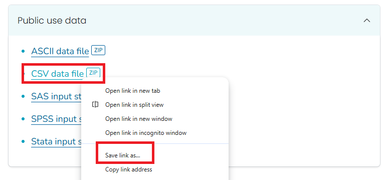
```

```{r nhis12, echo=FALSE, cache=TRUE, out.width = '90%', fig.align='center'}
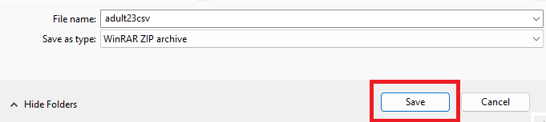
```

The next step is to unzip the file to extract the CSV. Depending on your computer, you can unzip the file with or without software. For example, if you are using Windows, you can right-click the zip file and select `Extract All...` to unzip it.

```{r nhis13, echo=FALSE, cache=TRUE, out.width = '90%', fig.align='center'}
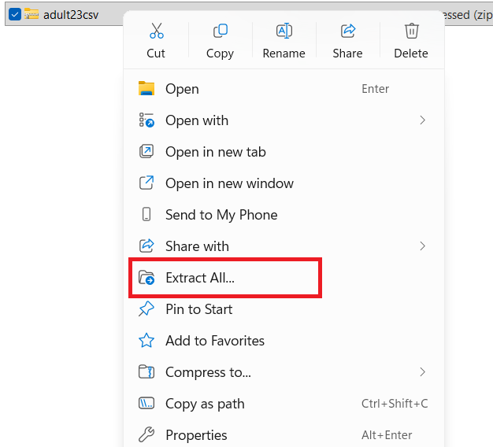
```

Once unzipped, you will find two files: the CSV file for the dataset and a readme file with some instructions. Below is the example for the `adult` dataset:

```{r nhis14, echo=FALSE, cache=TRUE, out.width = '90%', fig.align='center'}
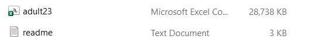
```

To open the datafile in Excel, - you can double click on the CSV file, or - right click on the CSV file and click on `Open`.

Later, you will learn how to open the data file in different statistical software. For Excel, it would take a few seconds/minutes because of the large size of the dataset. Once you open the data file, you will see the data in a tabular format with rows and columns.

```{r nhis15, echo=FALSE, cache=TRUE, out.width = '90%', fig.align='center'}
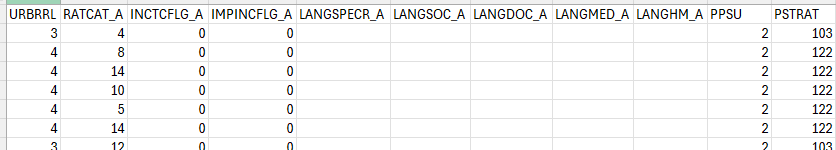
```

-   Each row represents a person.
-   Each column represents a variable.
-   The first row contains the variable names. The remaining rows contain the data for each person.

### Use of the codebook

To understand the variables in the dataset, you can refer to the codebook. The codebook provides information about the variable names, labels, and values. For example, we want to understand the variable `SEX_A`:

```{r nhis16, echo=FALSE, cache=TRUE, out.width = '90%', fig.align='center'}
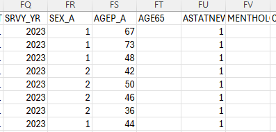
```

We can look for `SEX_A` in the codebook, which will provide us with the variable label and the values for that variable (e.g., 1 for Male, 2 for Female, and so on).

```{r nhis17, echo=FALSE, cache=TRUE, out.width = '90%', fig.align='center'}
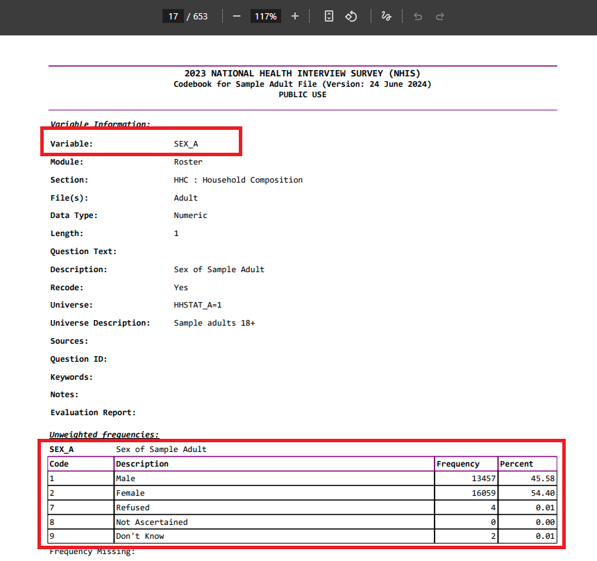
```

There are so many variables in the dataset, and it is not possible to understand all of them at once. You can refer to the codebook to understand the variables that you are interested in for your analysis. For example, the `WTFA_A` variable is the sample adult weight variable used to calculate weighted estimates for the US adult population. Similarly, the `HYPEV_A` variable is the hypertension ever variable, indicating whether a doctor or other health professional has ever told the person they have hypertension. Again, you can refer to the codebook to understand the variables that you are interested in.
