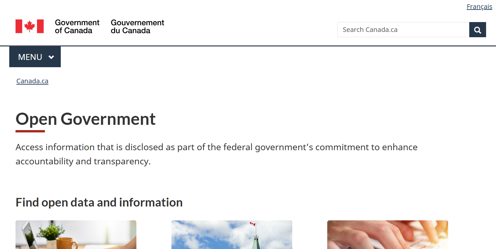
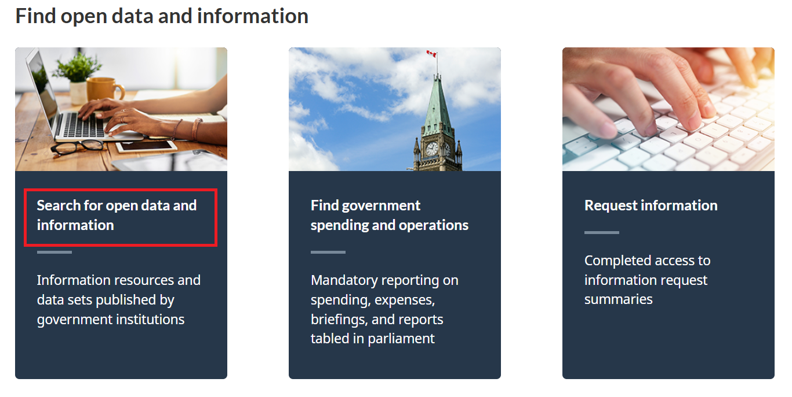
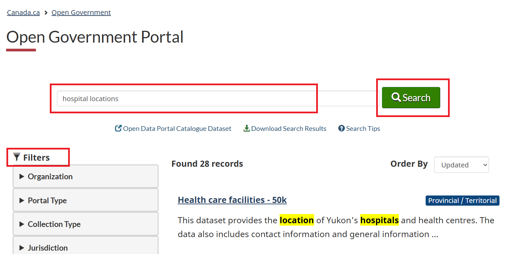
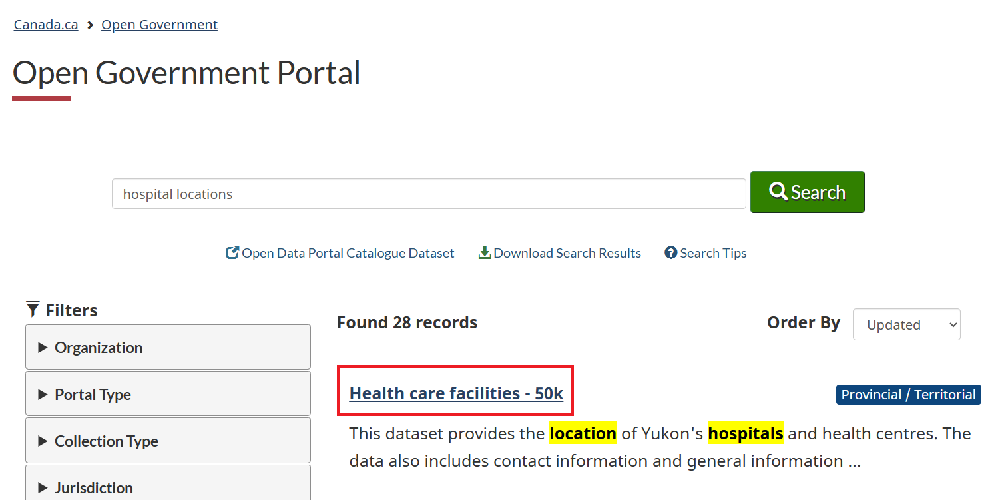
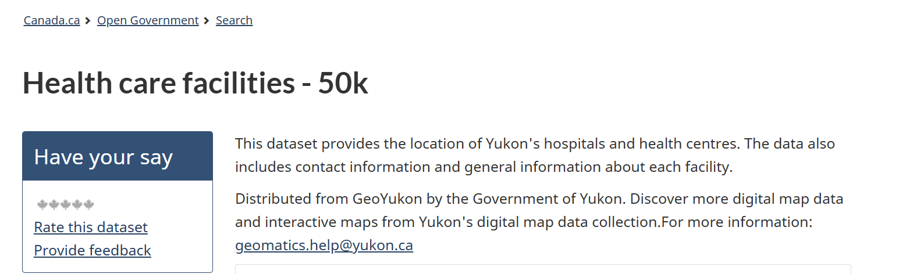
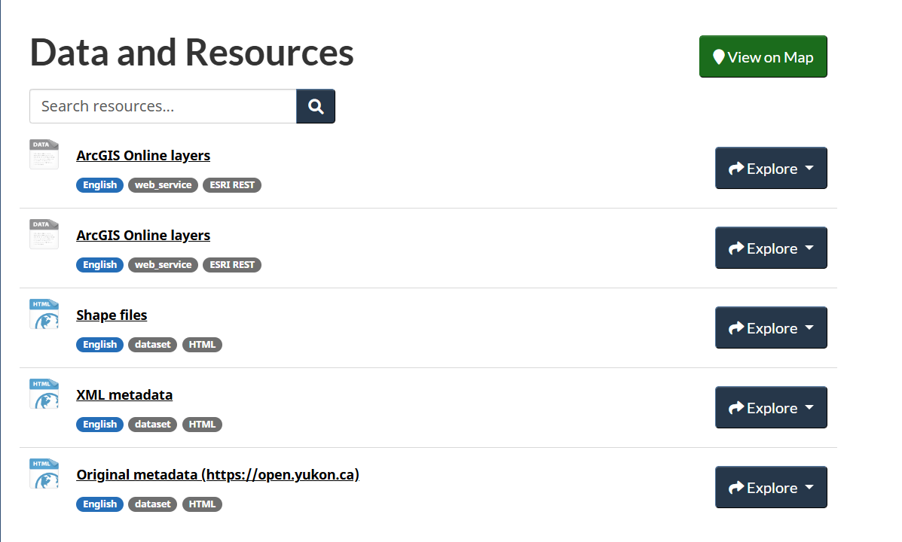
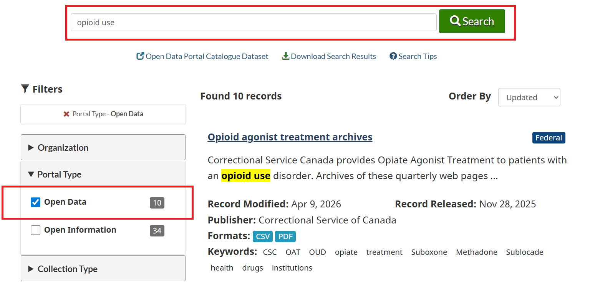
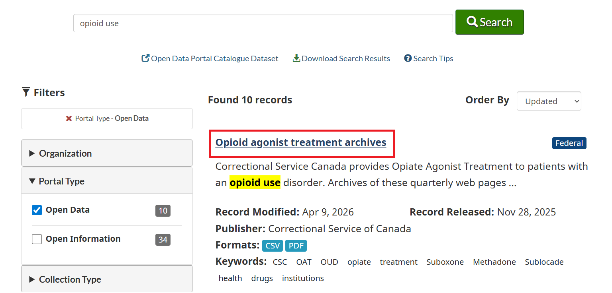
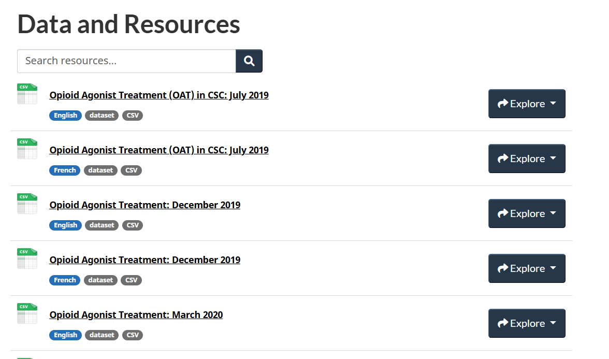

## Data Source: Open Portal {.unnumbered}

Open Government Portal Canada is a platform that provides access to searching for a wide range of public data. Users can explore and download data in different formats under the [Open Government Licence - Canada](https://open.canada.ca/en/open-government-licence-canada). 

```{r open1, echo=FALSE, cache=TRUE, out.width = '90%', fig.align='center'}

```

::: column-margin
[Open Government Portal Canada](https://open.canada.ca/en)
:::

### Search for Open Data

To search for open data, you can use the search bar on the Open Government Portal Canada homepage. For example, if you are interested in finding data on "hospital locations", you can enter that term in the search bar and click the search icon. There are many filter options to narrow your search results, such as format and organization.

```{r open2, echo=FALSE, cache=TRUE, out.width = '90%', fig.align='center'}

```

```{r open3, echo=FALSE, cache=TRUE, out.width = '90%', fig.align='center'}

```

To explore a specific dataset, click its title. This will take you to a page with more information about the dataset, including its description, format options, and download links. For example, if you click on the "Health care facilities - 50k" dataset, you will find detailed information about the location of Yukon's hospitals and health centres.

```{r open4, echo=FALSE, cache=TRUE, out.width = '90%', fig.align='center'}

```

```{r open5, echo=FALSE, cache=TRUE, out.width = '90%', fig.align='center'}

```

Under the ``Data and Resources`` tab, you can find the available formats for downloading the location of Yukon's hospitals and health centres. 

```{r open6, echo=FALSE, cache=TRUE, out.width = '90%', fig.align='center'}

```

Similarly, say we are interested in "opioid use" and want to find open data related to that topic. We can enter "opioid use" into the search bar and filter by `Open data`: 

```{r open7, echo=FALSE, cache=TRUE, out.width = '90%', fig.align='center'}

```

To explore the data on opioid agonist treatment, we can click the dataset title. This will take us to a page with more information about the dataset, including its description, format options, and download links.

```{r open8, echo=FALSE, cache=TRUE, out.width = '90%', fig.align='center'}

```

```{r open9, echo=FALSE, cache=TRUE, out.width = '90%', fig.align='center'}

```
