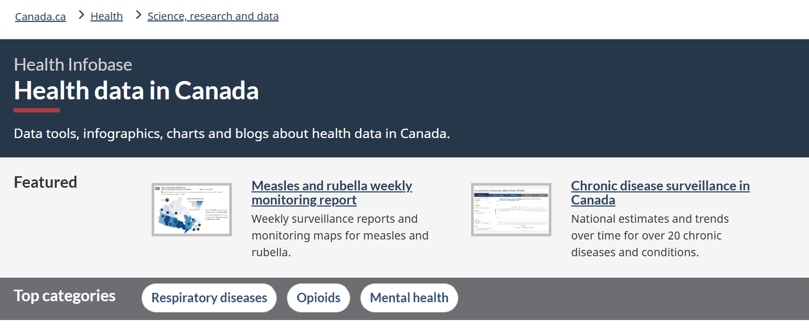
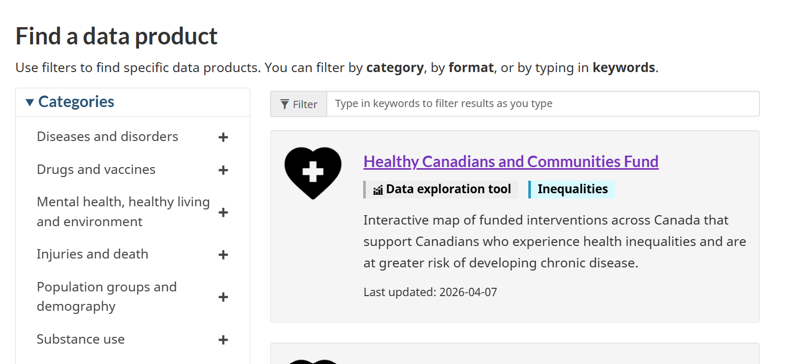
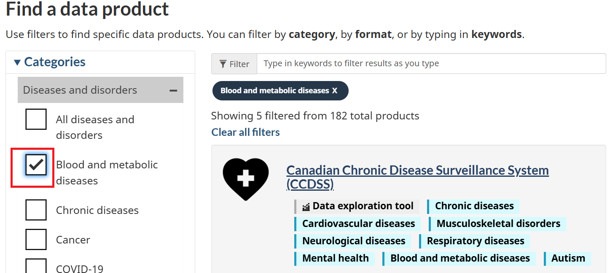
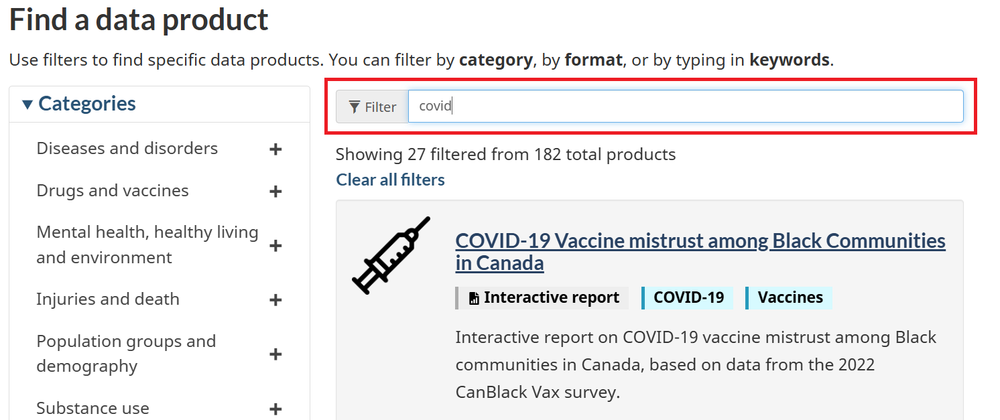
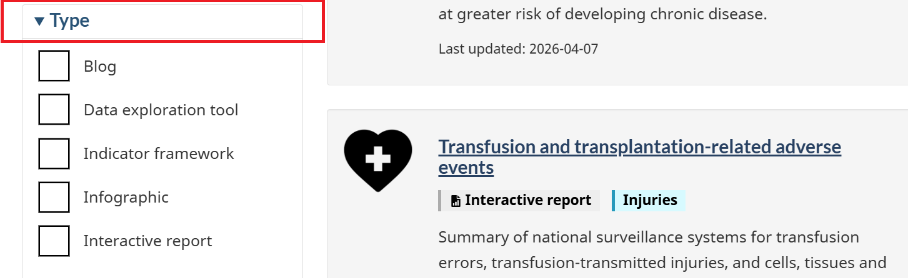
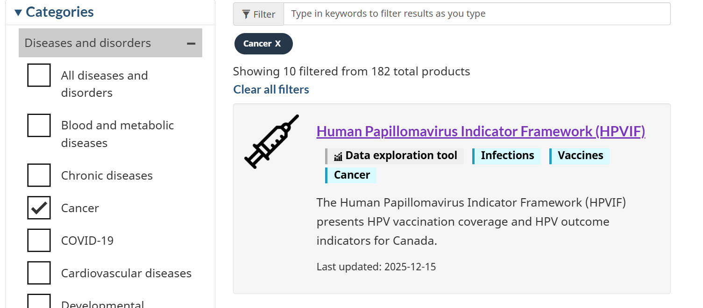
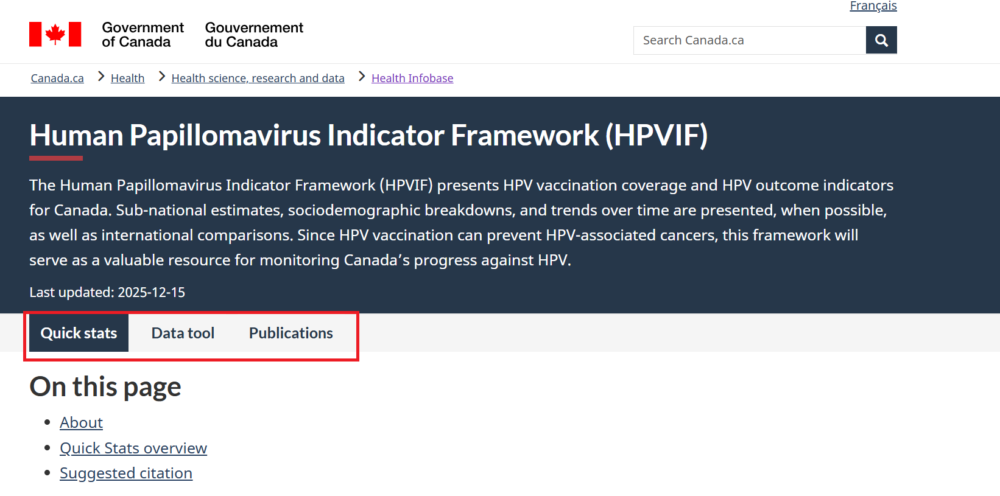
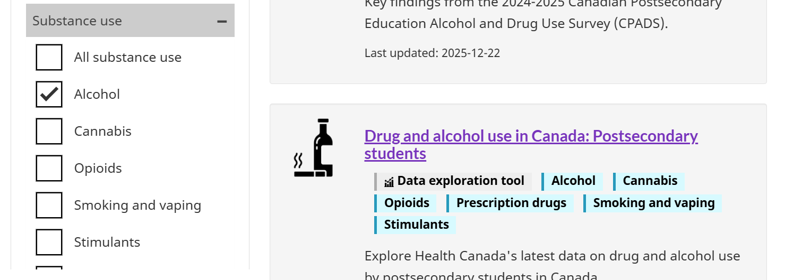
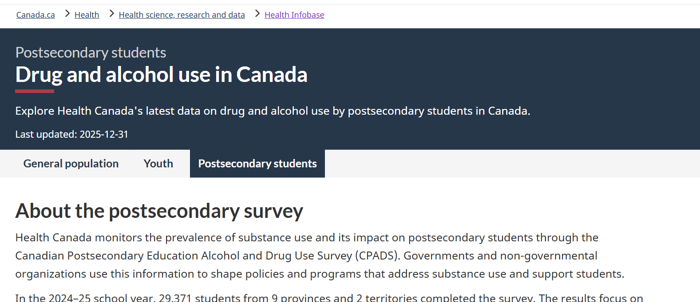
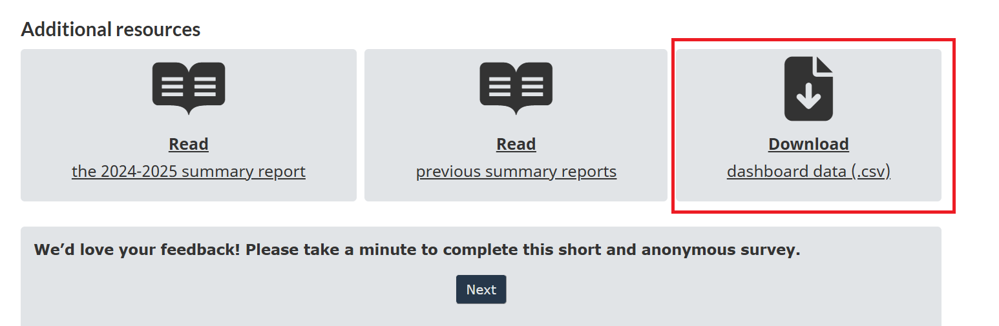

## PHAC Health Infobase {.unnumbered}

The Health Infobase is a comprehensive digital platform maintained by the Public Health Agency of Canada (PHAC). The Infobase provides access to a wide range of health-related data tools, infographics, charts and blogs. There are 182 data sources available on the Infobase. The Health Infobase serves as a central hub for national surveillance data, interactive data tools, and public health reports. The platform is frequently updated with the latest surveillance data.

```{r infobase1, echo=FALSE, cache=TRUE, out.width = '90%', fig.align='center'}

```

::: column-margin
[PHAC Health Infobase](https://health-infobase.canada.ca/)
:::

### Data Categories

The Infobase provides access to health data under six categories:

-   `Diseases and disorders`: Comprehensive tracking of chronic conditions such as cancer, cardiovascular diseases, and COVID-19.

-   `Drugs and vaccines`: Data on prescription drugs, vaccine coverage, and immunization rates across the country. \`

-   `Mental health, healthy living and environment`: Information on mental health indicators, physical activity levels, nutrition, and environmental factors such as wildfires.

-   `Injuries and death`: Data on death, suicide, violence, and drowning across regions.

-   `Population groups and demography`: Data on birth, maternity, children, family, and disabilities.

-   `Substance use`: Data on substance use such as alcohol, cannabis use, opioids, and smoking.

Under each category, users can select the data for specific health topics. The three top categories are `Respiratory diseases`, `Opioids` and `Mental health`.

```{r infobase2, echo=FALSE, cache=TRUE, out.width = '90%', fig.align='center'}

```

```{r infobase3, echo=FALSE, cache=TRUE, out.width = '90%', fig.align='center'}

```

You can filter the data by category, by format, or by typing in keywords.

```{r infobase4, echo=FALSE, cache=TRUE, out.width = '90%', fig.align='center'}

```

You can also filter the data by type, such as blog, infographic, or report.

```{r infobase5, echo=FALSE, cache=TRUE, out.width = '90%', fig.align='center'}

```

### Data Availability

The level of information provided in the data sources varies. For some data sources/products, you can find blogs, infographics, and reports along with individual-level data. However, for some data sources/products, you may only find the summary statistics without individual-level data, i.e., only aggregated-level data. For example, the `Human Papillomavirus Indicator Framework` product provides quick statistics, data tools and a list of publications:

```{r infobase6, echo=FALSE, cache=TRUE, out.width = '90%', fig.align='center'}

```

```{r infobase7, echo=FALSE, cache=TRUE, out.width = '90%', fig.align='center'}

```

The `Drug and alcohol use in Canada: Postsecondary students` product provides summary statistics as well as links to download data in CSV format:

```{r infobase8, echo=FALSE, cache=TRUE, out.width = '90%', fig.align='center'}

```

```{r infobase9, echo=FALSE, cache=TRUE, out.width = '90%', fig.align='center'}

```

```{r infobase10, echo=FALSE, cache=TRUE, out.width = '90%', fig.align='center'}

```
