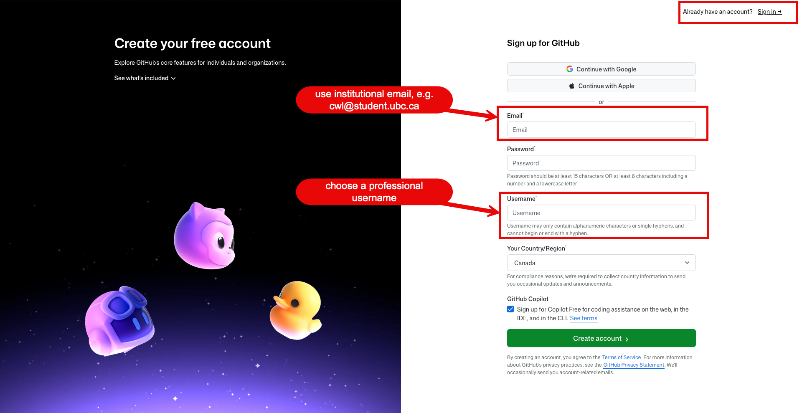
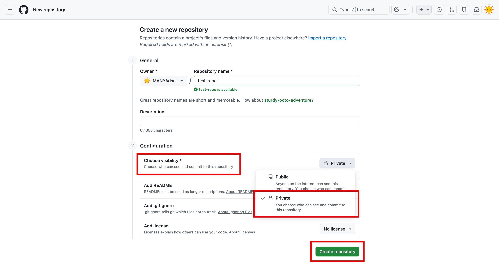
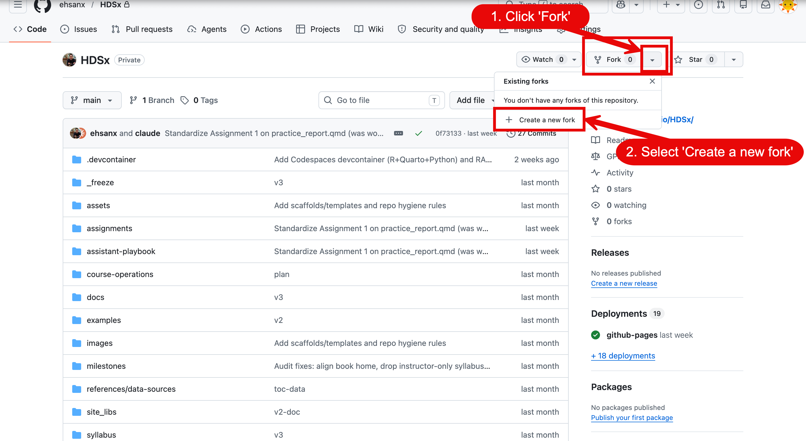
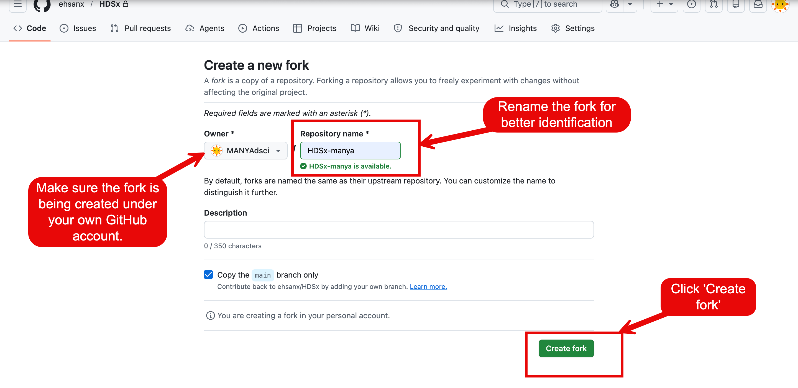
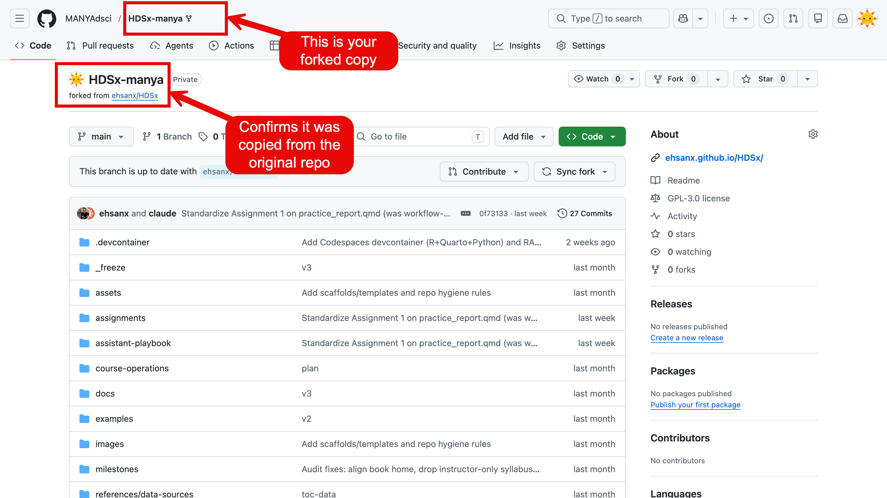
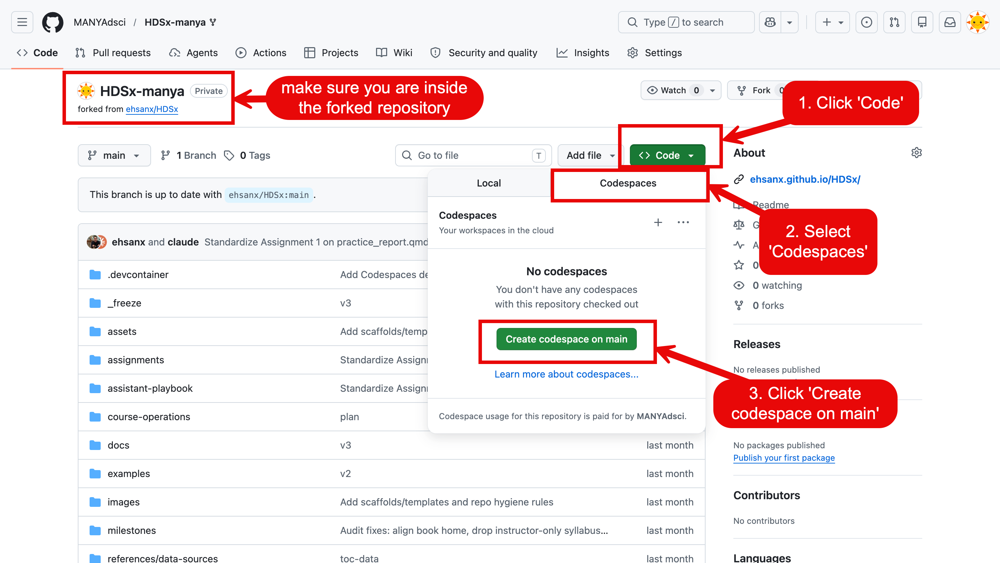

# Week 0: Asynchronous Onboarding {.unnumbered}

## Purpose

Week 0 gets the account setup and orientation work out of the way before the first class. You do not need to install local software for this course. The default workflow uses a personal fork of the course template repository, GitHub Codespaces, Quarto, and Canvas.

<!-- AI-EDIT(2026-06-11): GAP-OLDM-2, MIT-087 — needs review -->

::: {.callout-note title="Four terms you will see all course"}
- **Repository (repo):** a project folder stored on GitHub. It holds all the files for your coursework — think of it as your cloud drive.
- **Codespace:** a ready-to-use computer in the cloud that opens in your browser, with R, Python, and Quarto already installed — think of it as a public computer in the library.
- **IDE (integrated development environment):** the program you write code in. This course uses VS Code, which is what a Codespace opens.
- **Quarto:** the tool that turns a document mixing text and code (a `.qmd` file) into a polished web page or report.

Week 2 walks through each of these step by step — you do not need to master them now.
:::

## Required Tasks

Complete these steps before Week 1:

1.  Log in to Canvas and open the Week 0 module.
2.  Watch the orientation video posted in Canvas.
3.  Complete the pre-course survey posted in Canvas.
4.  Create or confirm access to a GitHub account.
5.  If eligible, apply for GitHub Education / Student Developer Pack, or confirm that you already have access.
6.  Submit the Week 0 Canvas onboarding check with your GitHub username and GitHub Education status.

## GitHub Account

Use a professional GitHub username that you are comfortable sharing in a course setting. If you already have a GitHub account, you may use it. You do not need to create a second account unless your current username or profile is not appropriate for coursework.

{fig-alt="GitHub sign-up form showing the email, password, and username fields, with a professional username example entered"}

Before submitting the onboarding check:

- confirm you can log in to GitHub
- turn on two-factor authentication if GitHub prompts you
- make sure you know which email address is attached to the account
- record your GitHub username exactly as it appears in the profile URL
- use the same GitHub account and username throughout the course

<!-- AI-EDIT(2026-06-11): TF-005, MIT-005, MIT-163, WI-005 — needs review -->

### Username, Password, And Repository Privacy

A professional username usually follows a simple pattern, such as first-last or initials. For example, `maria-chen` or `j-smith-health`. Pick something you would be comfortable putting on a resume.

Protect your account:

- use a long, unique passphrase that you do not reuse on other sites
- consider a password manager so you do not have to memorize it
- turn on two-factor authentication (2FA) and keep it on; 2FA adds a second login step (a code from an app or text message) so your account stays protected even if your password is exposed <!-- AI-EDIT(2026-06-22): REVIEW-row4, TF-005, MIT-005 — replaced vague 'as described above' (2FA was only named in one earlier bullet) with a brief student-friendly description of 2FA -->

<!-- AI-EDIT(2026-06-22): REVIEW-row5, TF-005, MIT-005 — corrected GitHub fork behavior: a fork of a public repo stays public and you cannot change its visibility while it stays a fork; recommend a private copy via Import/template when privacy is needed -->

Think about repository privacy. A fork of a public repository is itself public, and GitHub does not let you switch a fork to private while it remains connected to its upstream. So if your work may include restricted, sensitive, or course-only materials, do not rely on changing a fork's visibility — instead create a separate private copy (for example with GitHub's **Import repository** option, or by using the template repository's **Use this template** button if the instructor enables it) and choose **Private**. A public repository should only be used when the instructor confirms it is safe. Making your work public is encouraged once the course privacy checklist passes, but it is never required, and there is no penalty for staying private. Follow the workflow Canvas specifies for this offering.

{fig-alt="GitHub new repository form with the Private visibility option selected and the Public option visible below it"}

To learn more about GitHub basics or get help, see GitHub's getting-started guide: <https://docs.github.com/en/get-started>

## GitHub Education Benefits: Apply If Eligible

This course uses GitHub Codespaces every week. Codespaces usage is quota-based, so students are expected to apply for GitHub Education / Student Developer Pack if they are eligible:

<https://education.github.com/pack>

GitHub Education benefits may increase your available developer-tool allowance and provide access to additional student tools. This is helpful because the course uses Codespaces for weekly tutorials, assignments, and project work.

Approval is not required before Week 1. You can begin the course with a regular free GitHub account while your GitHub Education application is pending. Do not delay Week 0 onboarding while waiting for approval.

For the Week 0 Canvas onboarding check, report your GitHub Education status using one of the following options:

- approved
- applied and pending
- already had access
- not eligible / unable to apply
- unsure and need help

### UBC Students

If you are a UBC student, use your UBC student email address when applying, if available. For example, this may be your `@student.ubc.ca` email address or another UBC-issued student email connected to your student record.

Before applying:

- log in to your GitHub account
- add your UBC student email to your GitHub account, if available
- verify the UBC student email address in GitHub
- have proof of current student status ready in case GitHub asks for verification
- continue using the same GitHub username for this course

If you already have a GitHub account with a non-UBC email, you usually do not need to create a second account. Instead, add your UBC student email to the existing account and verify it, if GitHub allows. Use one consistent GitHub username for all course work.

### Students Outside UBC

If you are using this open course book outside UBC, follow the same general process with your own institution's student email address and proof of current enrollment. The exact verification process may differ by institution, country, and GitHub's current requirements.

### Codespaces Usage Reminder

Even with GitHub Education benefits, Codespaces usage is not unlimited. To avoid running out of usage during the term:

- stop your Codespace when you finish working
- reopen an existing Codespace instead of creating a new one each time
- use the default course machine type unless instructed otherwise
- monitor your remaining Codespaces usage in your GitHub billing or settings page
- contact the teaching team before adding personal billing information

## Existing-Account Help

If you already have a GitHub account but cannot access it:

- try GitHub account recovery before creating a new account
- use the email address most likely attached to the account
- check whether your browser is logged into a different personal account
- ask for help through the Canvas course support channel if you are blocked

If you create a new account, use that account consistently for course repositories.

## Course Repository Entry Point

<!-- AI-EDIT(2026-06-11): TF-002, MIT-001, WI-001 — needs review -->

Create your own copy of the course template repository on GitHub. This copy is called a fork. You will make changes in your own fork so that your work does not affect the original course repository.

The current course workflow uses a fork-based setup:

1.  Open the course template repository using the link provided in Canvas. If you do not have Canvas access, use the direct GitHub repository link: <https://github.com/ehsanx/HDSx-workspace>. <!-- AI-EDIT(2026-06-11): TF-003, MIT-002, WI-002 — needs review -->
2.  Click **Fork**.
3.  On the "Create a new fork" page, make sure the **Owner** is set to the GitHub account you submitted in the onboarding check (not another personal account or an organization), then create the fork. <!-- AI-EDIT(2026-06-22): REVIEW-row8, SS-002 — added explicit owner-selection guidance during fork creation -->
4.  Verify the fork landed in the correct account: the repository URL should read `https://github.com/<your-username>/HDSx-workspace`, and the page header should show `forked from ehsanx/HDSx-workspace` under your own username. If the owner is wrong, delete the fork and repeat the step. <!-- AI-EDIT(2026-06-22): REVIEW-row8, SS-002 — added how-to-verify-the-fork-was-created-in-the-correct-account check -->
5.  Launch Codespaces from your fork.
6.  Commit and sync changes to your fork.
7.  Submit your fork repository link on Canvas.

<!-- AI-EDIT(2026-06-11): SS-002, TF-006, MIT-006 — figure placeholder, RA to capture -->

<!-- TODO-SCREENSHOT: uncomment when the asset exists:-->

{fig-alt="GitHub repository page with the Fork button highlighted near the top-right corner"}

<!-- AI-EDIT(2026-06-22): REVIEW-row8, SS-002 — RA referenced SS-002-01 (fork-creation) and SS-002-02 (fork-confirmation), but no matching image files exist under assets/images/week00/ (the directory itself is absent). NEEDS-RA-SCREENSHOT: add the files, then uncomment references like:-->

{fig-alt="GitHub Create a new fork page with the Owner dropdown set to the student's own account"} {fig-alt="GitHub repository page showing forked from ehsanx/HDSx-workspace beneath the student's username"}

<!-- AI-EDIT(2026-06-11): SS-003 — figure placeholder, RA to capture -->

<!-- TODO-SCREENSHOT: uncomment when the asset exists:-->

{fig-alt="GitHub Code menu open on a personal fork, showing the Codespaces tab and the Create codespace button"}

If a future offering uses an instructor-managed repository system, Canvas will say so explicitly. For this course book, the fork-based workflow is the default student route.

## Support Path

Use the Canvas course support channel for setup problems. Include:

- your GitHub username
- your GitHub Education status, if relevant
- the step where you got stuck
- the exact error message or screenshot
- whether you are using GitHub, Codespaces, or Canvas

Do not post passwords, tokens, private account recovery details, or billing information.

## What To Bring To Week 1

Bring:

- a working Canvas login
- a working GitHub login
- your GitHub username
- your GitHub Education status, if available
- a laptop or access plan for in-class work
- one question about health data, public data, AI, or reproducibility

## Definition Of Done

<!-- AI-EDIT(2026-06-11): MIT-004, WI-004 — needs review -->

Before Week 1, make sure you have created a GitHub account, chosen a professional username, confirmed you can log in, watched the Canvas orientation video, completed the pre-course survey, and submitted the onboarding check. Week 0 is done when all of these are complete and you have either applied for GitHub Education if eligible or indicated your GitHub Education status in Canvas.