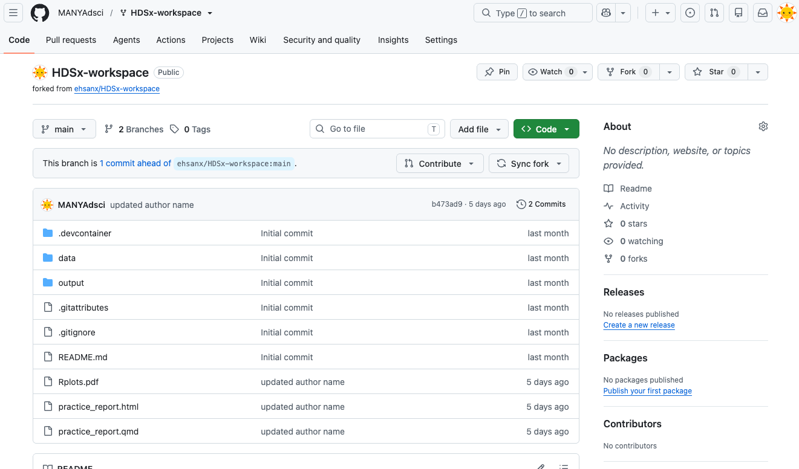

# The Analogy: Public Computer vs Cloud Drive

To understand the workflow, imagine working in a university computer lab.

## Repository (Cloud Drive)

**Important Distinction:** While GitHub is your "Cloud Drive," it does **NOT** work like Google Drive.

-   **Google Drive:** Auto-saves every keystroke.

-   **GitHub:** Works like **Email**. You can write a draft (save in Codespace), but the cloud never sees it until you hit "Send" (Commit & Push).

-   Stores your files permanently

    

-   Safe if your computer crashes

-   This is your **master copy**

## Codespace (Public Computer)

Codespaces is like a library computer:

-   **Temporary machine** It is a disposable environment. If it breaks, we just delete it and get a new one.

    

-   **Pre-installed software** It comes with R, Python, and Quarto installed, so you don't have to install anything on your own laptop.

-   **The "Two-Save" Rule (Crucial)** Because this is a temporary computer, there are two steps to saving:

    1.  **Ctrl+S (Save):** This saves the file inside the current Codespace.
        The change is still there when that Codespace stops and restarts, but
        it is not yet in your GitHub repository.
    2.  **Commit & Sync:** This sends your work back to the Repository (Cloud
        Drive). It protects the work if the Codespace is later deleted.

**Warning:** Closing the tab does not erase saved changes, but it also does not
sync them to GitHub. Reopen the same Codespace to recover unsynced saved work,
then commit and sync it as soon as possible.

### Check for understanding

Answer:

-   Where are your permanent files stored?
-   What happens if you press `Ctrl+S` but never commit?
