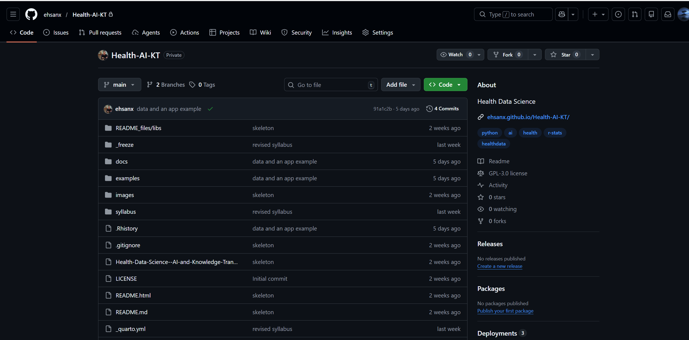
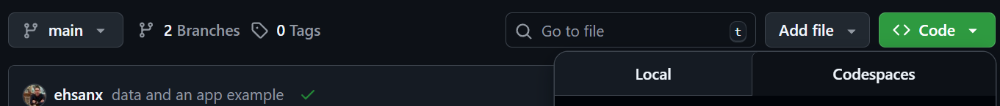
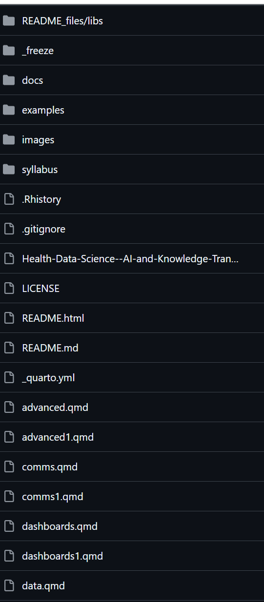

# Tour of the Repository

## Step-by-step

1.  Open your course repository on GitHub\

    

2.  Click the **Code** tab\
    

    -   **Why?** GitHub has many tabs (Issues, Actions, Settings). The **Code** tab is your "Reset" button. If you ever get lost in a menu, click this to go back to your files.

3.  Look at the file list\
    

    -   This shows the **current state** of the project in the Vault.
    -   **Crucial:** If a file is listed here, it is safe. If it is *not* here, it only exists on your temporary "Desk" (Codespace) and is at risk of being lost.

4.  Scroll to read the README

    -   The `README.md` file is displayed automatically at the bottom. Think of it as the "Cover Sheet" or "Instruction Manual" for your project.

## Task

Find this file:

```         
practice_report.qmd
```

**Verification:** If you can see `practice_report.qmd` in this list, it means the file is safely stored in the cloud (The Vault).

If you can see it, it is safely stored in the cloud.
