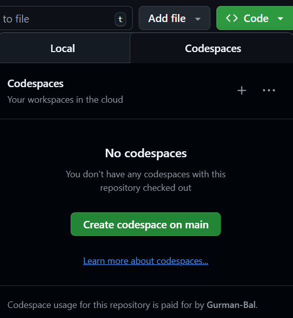
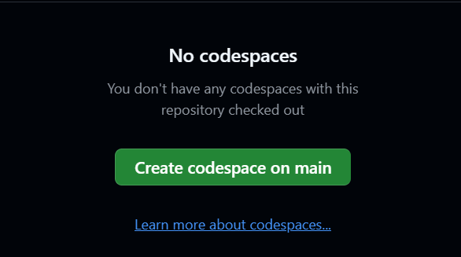

# Opening Your First Codespace

This process is like walking into the library and turning on a computer. Start from your forked repository, then create a fresh, temporary environment in the cloud.

## Steps

1.  Click the green **Code** button

    -   This button is usually for downloading files, but we are using it to launch a computer.

    

2.  Click the **Codespaces** tab

    -   **Crucial Choice:** You will see two tabs: "Local" and "Codespaces."
    -   **Local:** Means downloading to your own messy laptop (Hard mode).
    -   **Codespaces:** Means using the pre-installed cloud computer (Easy mode). Always choose this.

    

3.  Click **Create Codespace on main**

    -   This tells GitHub to build a new computer for you from scratch.

    

## The "Boot Up" Phase

**Wait 2–3 minutes.**

-   **What is happening?** GitHub is silently installing R, Python, Quarto, and all the course libraries for you.
-   **The Analogy:** Think of this as the "ventilation system" starting up in a lab. It takes a moment to get the environment ready.

**Success:** You should see **VS Code** (a dark-themed code editor) appear in your browser window.

<!-- AI-EDIT(2026-06-11): MIT-018 — self-test runs automatically; what to expect and the View Creation Log fallback — needs review -->
::: {.callout-note title="The TOOLCHAIN SELF-TEST"}
The setup runs **automatically** --- you do not need to start anything. Near the end of the build, a block titled **`TOOLCHAIN SELF-TEST`** prints in the terminal. It lists version numbers for R, Quarto, and Python, then runs `quarto check`.

- **If you do not see it (or scrolled past it):** open the Command Palette (`F1`) and run **Codespaces: View Creation Log** to see the full build output.
- **If the self-test shows errors:** do not try to install software yourself. Rebuild the environment instead --- see [Troubleshooting: Rebuild Container](workflows09-troubleshooting.qmd) --- and ask for help if it still fails.
:::

<!-- AI-EDIT(2026-09-01): optional course screencast (YouTube ID: A7LDoku1CrA) — HTML-only so the PDF/DOCX build is unaffected -->
::: {.content-visible when-format="html"}
## Video walkthrough (optional) {.unnumbered}


:::
