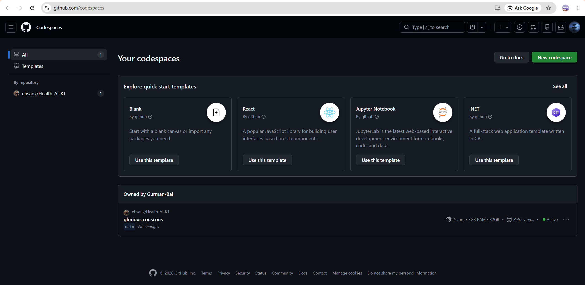
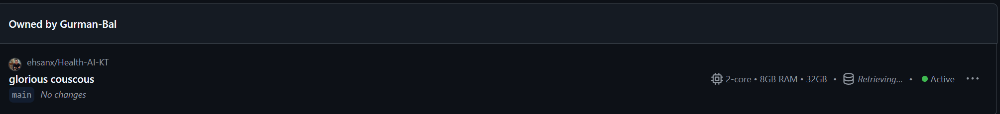

# Reopening a Codespace

**The Rule:** Do not create a new Codespace each time you log in.

-   **Why?** If you click the green "Create" button again, GitHub builds a *second* computer.
-   **The Risk:** If you left uncommitted work (Drafts) on "Computer A" and you start "Computer B," your work will appear lost. It isn't lost: it's just on the other computer.

To resume exactly where you left off:

## Steps

1.  Go to the **Codespace Dashboard**: <https://github.com/codespaces>

    -   Think of this as the "Front Desk" where all your active computers are listed.

2.  Find your Codespace

    -   Look for the box labeled with your course repository name.
    -   **Note:** GitHub gives each Codespace a funny random name (e.g., *literate-computing-machine* or *glorious-couscous*). This is the name of your rented desk.

    

3.  Click the **Name** of the Codespace

    -   Do **not** click the "New codespace" button in the corner. Click the text link of the funny name.

    

4.  Wait for it to resume

    -   **Benefit:** Resuming an existing Codespace is much faster than creating a fresh one because the software is already installed.
