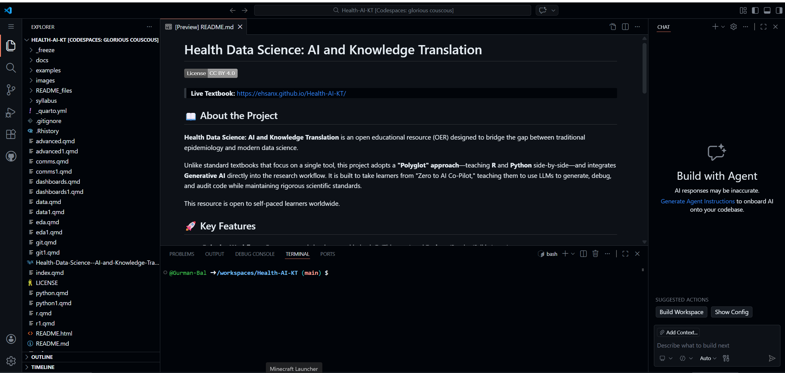
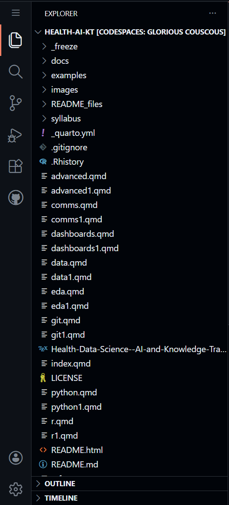
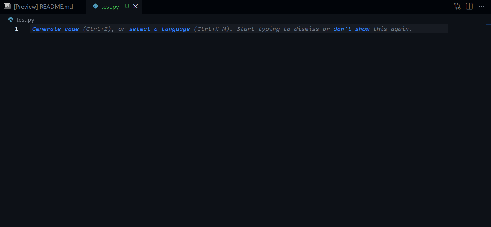
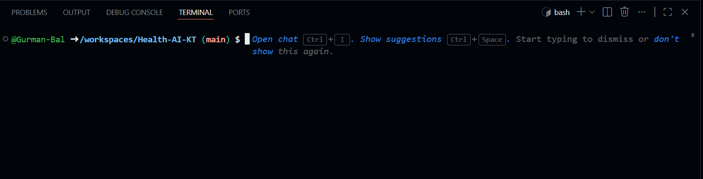

# VS Code Orientation

When you open a Codespace, you are using a version of **VS Code** in your browser. It has the same interface as the desktop version used by professional software engineers at Google and Microsoft.

**Don't Panic:** The interface looks complex because it has hundreds of features. **You only need to know three areas.** You can safely ignore 90% of the buttons you see.

## Explorer (left)

**The "File Cabinet"**

-   This shows your folders (directories) and files.
-   Think of this as your navigation pane. Double-click a file here to open it in the Editor.

## Editor (center)

**The "Notebook"**

-   This is where you do your actual work: typing code and writing text.
-   In this course, you will mostly be editing `.qmd` (Quarto) files here.

## Terminal (bottom)

**The "Engine Room"**

-   This is where R and Python actually run.
-   You will see text scrolling here when you "Render" a document. It looks like "The Matrix," but it is usually just the computer telling you what it is working on.

If the terminal disappears (or you accidentally close it):

**View → Terminal**

### Mini Task

Open and close a few files in the Explorer to get comfortable with the layout.
