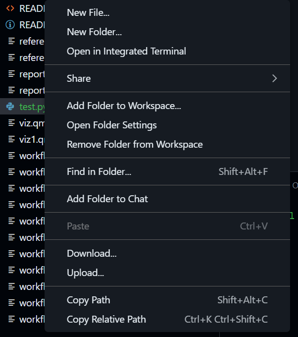

# Files vs Folders

We use a consistent structure to ensure reproducibility. In Data Science, being "organized" isn't just about being neat—it is a requirement for your code to work on someone else's machine.

## The Golden Rule of Health Data

We treat data like a **Crime Scene**—never touch the evidence.

-   **Start:** `data/` (The Crime Scene). **READ ONLY.**
    -   *Rule:* Never open a dataset in Excel and "fix" a typo. That is tampering with evidence.
    -   *Correct Way:* Load the "dirty" data into R/Python and fix the typo using code. This leaves a trail of exactly what you changed.
-   **End:** `output/` (The Evidence). All graphs and cleaned tables go here.
-   **The Detective:** Your code (`.qmd`) moves information from Start to End.

## Files vs. Folders (The Mental Model)

-   **Files (e.g., `report.qmd`):** These are **sheets of paper**. You write on them.
-   **Folders (e.g., `data/`):** These are **labeled boxes**. You store things in them.

## Create a folder

In Explorer:

1.  Right-click anywhere in the blank space of the Explorer pane. 
2.  Select **New Folder**
3.  Name it:

```         
images
```

**Pro Tip:** Always use **lowercase** and **no spaces** for folder names (e.g., `my_data`, not `My Data`). Computers struggle with spaces in file paths.

## Typical structure

Your project should always look like this:

```         
data/      raw data  
output/    generated results  
images/    screenshots  
.qmd       reports  
```

**Remember:** The `data` folder is for *input*. The `output` folder is for *results*. They should never mix.
