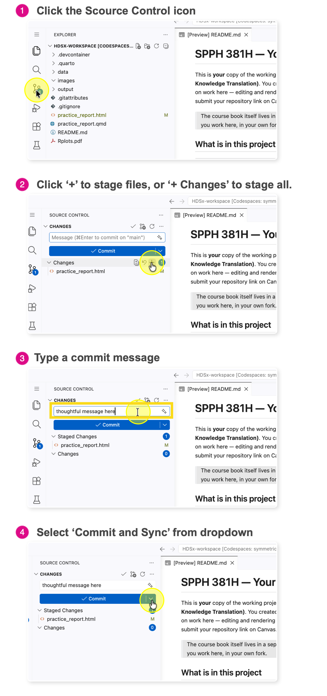

# Commit Your Work

Your work is currently only on the "Rented Desk" (Codespace). It is a **Draft**. To save it permanently to the "Vault" (GitHub), you must **Commit** and **Push** (Send).

**The Analogy:** Think of this like shipping a package. You have packed the box (saved the file), but now you need to put a label on it and hand it to the courier.

<!-- AI-EDIT(2026-06-11): GAP-MBH-9 — compact three-step save summary incl. staging — needs review -->
Think of this as a three-step save process:

1.  **Stage** = choose which changed files to include.
2.  **Commit** = save a snapshot with a message.
3.  **Sync** = upload that snapshot to GitHub so it is safely stored online.

The **Commit and Sync** button used below does steps 2 and 3 together; if nothing is staged, VS Code offers to stage all your changed files for you.

## Steps

1.  Click the **Source Control** icon

    -   It looks like a **blue bubble** or a **connect-the-dots graph** on the far left sidebar.
    -   This opens the "Shipping Department." You will see a list of every file you changed.

2.  Type a **Commit Message**

    -   **The Label:** You cannot ship a package without a label.
    -   **What to write:** Be descriptive but brief. Imagine you are leaving a note for your future self about *what* you did.
    -   *Example:* "Updated author name in practice report".
    -   *Bad Example:* "stuff" or "fix".

3.  Click **Commit and Sync** (or Commit and Push)

    -   This is the **"Send"** button.
    -   **Action:** It wraps up your changes, stamps them with the time and your message, and teleports them to the Cloud Vault.
    -   *Note:* You might be asked to click "Always" or "Yes" to approve the sync.

## Verify (Trust but Verify)

Did it actually work?

1.  Go back to your **GitHub Repository** tab (The Vault).
2.  **Refresh** the page.
3.  Look at the file list. You should see your "Commit Message" displayed next to the file you just edited.
