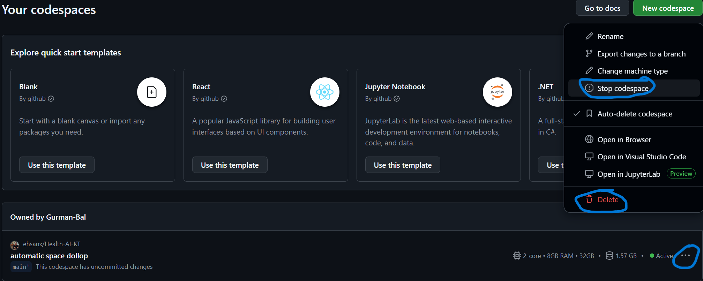

# Stop Your Codespace

Codespaces is not free forever. You have a monthly allowance (approx. 60 hours/month for free accounts).

**The Analogy:** Think of a Codespace like a **Taxi**.

-   **Working:** When you are coding, the meter is running.
-   **The Trap:** If you just close your browser tab, it is like getting out of the taxi but asking the driver to "wait here." **The meter keeps running.**
-   **The Fix:** You must explicitly "end the ride" (Stop the Codespace).

## Correct shutdown

1.  Go to the **Codespace Dashboard**: <https://github.com/codespaces>
    -   This is your command center.
2.  Find your active Codespace
    -   Look for the green text that says "Active".
3.  Click `...` (The "Meatball" Menu)
    -   It is located on the far right side of the Codespace box.
4.  Click **Stop Codespace**
    -   **Stop:** This "pauses" the computer. It saves your installed packages and RAM state so you can resume quickly next time. **(Recommended)**
    -   **Delete:** This destroys the computer. You will have to wait 2-3 minutes for the "Boot Up" phase next time you start.

**Critical Warning:** Closing the browser tab is **NOT** enough.

-   GitHub keeps the machine running for **30 minutes** after you close the tab (in case your internet flickered).

-   **The Cost:** If you just close the tab every day, you will waste \~15 hours of your monthly quota on empty time.

