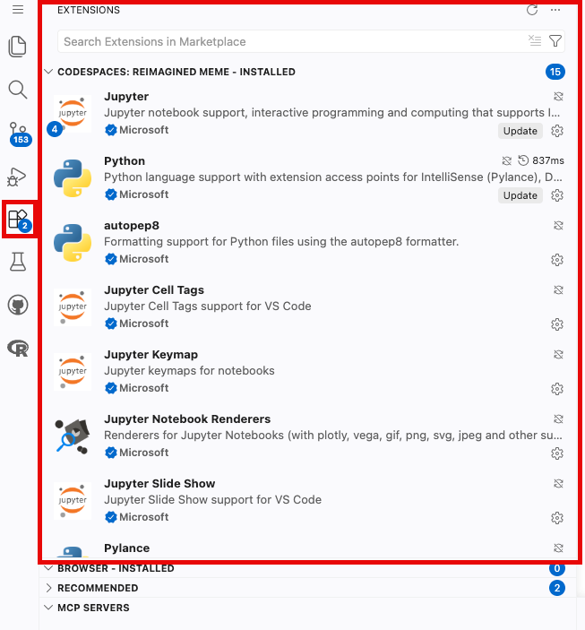

# The Setup (The Cockpit)

Before we start flying, we need to check our instruments in **VS Code**. If your environment isn't set up correctly, your code will not run.

<!-- AI-EDIT(2026-06-11): MIT-030 — needs review -->
A quick orientation: GitHub and Codespaces are the *workspace* --- they store your files and give you a computer in the browser. R is the *tool* you will use inside that workspace to clean, summarize, and visualize health data.

<!-- AI-EDIT(2026-06-11): WI-020 — needs review -->
<!-- AI-EDIT(2026-06-22): WI-020/REVIEW-row91 — added troubleshooting link + TA/instructor fallback (RA: steps were referenced but not explained/linked) -->
The Codespace should open ready to use. If R, Quarto, required packages, or Copilot Chat are missing, do not manually change the environment. Instead, rebuild the container by following [Troubleshooting: Rebuild Container](../week02-modern-workflows/workflows09-troubleshooting.qmd). If it still fails after a rebuild, ask your TA or instructor for help.

## Verify Your AI Extensions
1. Click the **Extensions** icon on the far-left sidebar (it looks like four squares).
2. In the search bar, ensure both **GitHub Copilot Chat** and **R** are installed and active. 


<!-- AI-EDIT(2026-06-22): REVIEW-row91 — RA requests a NEWER screenshot of the Extensions panel showing GitHub Copilot Chat + R installed/active. NEEDS-RA-SCREENSHOT: replace r1.png with an updated image when provided. -->

<!-- AI-EDIT(2026-06-11): MIT-028, MIT-029 — needs review -->
## Pick a Chat Model
1. Open the Copilot Chat sidebar: go to **View → Command Palette** and run **Chat: Open Chat**, or click the chat icon at the top of the VS Code window. *Optional tip:* a keyboard shortcut (such as **Ctrl+Alt+I** on Windows) may also work, but shortcuts vary and can conflict with your browser, so use the menu path if nothing happens.
2. Look for the model selector dropdown at the bottom of the chat window.
<!-- AI-EDIT(2026-06-22): REVIEW-row92 (MIT-028,MIT-029) — RA requests a screenshot showing how to pick a chat model (the model-selector dropdown). NEEDS-RA-SCREENSHOT: add image at ../../assets/images/week3/ once provided. -->
3. **Quota check:** If you see a model marked as *included* or with a **"0x" multiplier**, pick it --- these models do not use up your free student quota. If your picker only shows models marked "1x" or higher, that is okay: pick any available chat model and continue. Exact model names and multipliers change over time, so your list may not match a classmate's screen.
   * *Troubleshooting:* If the Chat asks you to "Sign In" or "Subscribe," your Student Pack is not active. Use your institutional login at `copilot.microsoft.com` or authenticate via your university email at `https://m365.cloud.microsoft/chat/`.
   
<!-- AI-EDIT(2026-06-11): GAP-R345-10 — needs review -->
## Check the Course Package Environment

The personal workspace devcontainer installs the packages required for the
course pathway. Do not initialize `renv`. In each analysis file, load the
packages you use explicitly, and list them in the assignment's dependency note.
If a required package is missing after rebuilding the container, copy the error
message and ask your TA or instructor rather than installing packages at random.

## Interface Review: Where does R actually live?
To learn R, we are going to start in the "sandbox." Here is how your screen is laid out:

* **The Console (Bottom):** Your **Engine Room**. *Start here!* This is where you can type R commands directly next to the `>` prompt and press Enter to see immediate results. If you make a mistake, it will show up here in red text. 
* **The Environment (Top Right):** Your **Work Bench**. Whenever you save a piece of data (like a patient's age), it will appear in a list here so you can verify R actually "remembers" it.
* **The Explorer (Left Sidebar):** Your **File Cabinet**. This is where you find your `data/` folder containing your CSV files.
* **The Editor (Top Center):** Your **Laboratory Notebook**. Typing in the Console is great for testing, but it forgets everything when you close the window. Later in the lesson, we will use the Editor to write and save our permanent code.   

## Interface Review: Working with .qmd and .Rmd files
When you open a `.qmd` (Quarto) or `.Rmd` (RMarkdown) file, you must know where to look. Here is how your coding workflow maps to your screen:

* **The Explorer (Left Sidebar):** Your **File Cabinet**. This is where you find your reports and your `data/` folder. You cannot run code here; you only click files to open them.
* **The Editor (Top Center):** Your **Laboratory Notebook**. This is where you write your text narrative and your R code. 
    * *Note:* R code must be placed inside grey **Code Chunks** (starting with ` ```{r} ` and ending with ` ``` `). To run a chunk, click the small green "Play" triangle in the top right corner of that specific grey box.
* **The Console (Bottom):** Your **Engine Room**. When you click the green "Play" button in the Editor, the code is sent down here to be executed. If there is an error, it will show up here in red. 
    * *Pro Tip:* You can type quick math directly into the console (like `100 / 4`), but it will not be saved in your final report.
* **The Environment (Top Right):** Your **Work Bench**. Whenever you load data or save a calculation, it will appear in a list here so you can verify R actually "remembers" it.
