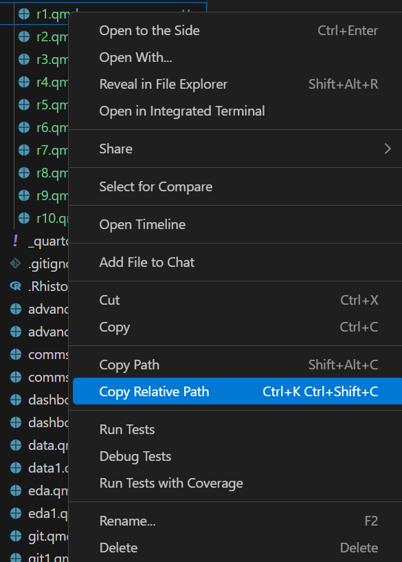

# The Loading Dock (Data Import)

Don't type file paths from memory; you will likely make a typo.

1.  Find a data file in the **Explorer** (left sidebar).

2.  **Right-click** the file → Select **Copy Relative Path**.

    

3.  Ask AI: *"Read the CSV at \[Paste Path Here\] and save it as my_data."*

<!-- AI-EDIT(2026-06-11): MIT-035 — needs review -->
## Mini-Examples: Read In, Write Out

**What to do with this code:** Modify --- swap in your own file names, then run it.

```{r, eval=FALSE}
library(readr)

# Read input: a relative path starts from the project folder,
# so it works in anyone's Codespace.
my_data <- read_csv("data/patients.csv")

# Write output: save your results into the project's output/ folder.
write_csv(my_data, "output/clean_data.csv")
```

If R says the file does not exist, re-copy the relative path from the Explorer (step 2 above). For `write_csv()`, create the `output/` folder first if it does not exist.
