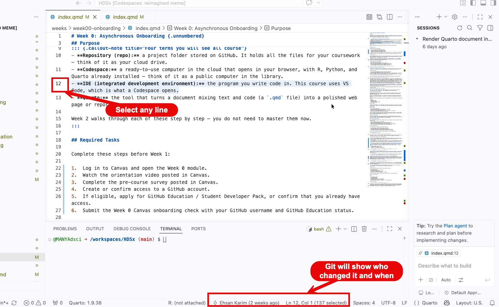
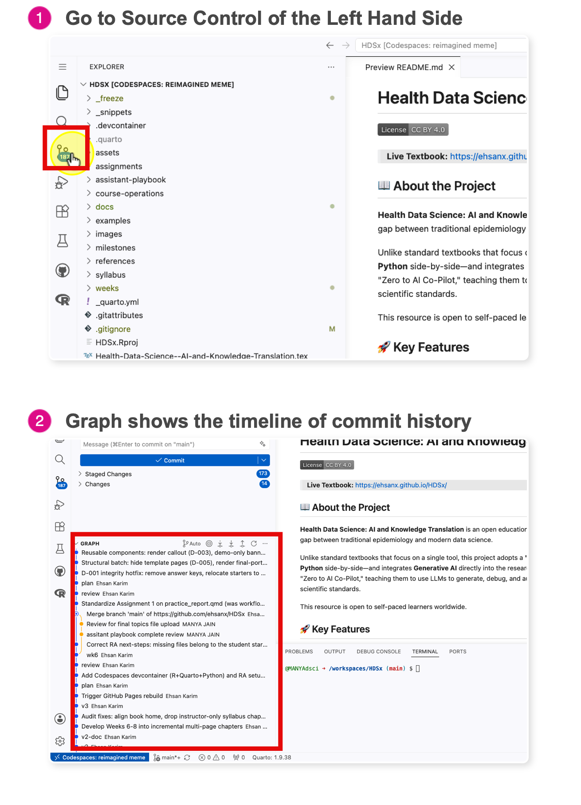

# Git Basics {.unnumbered}

-   **The Audit Trail:** Git records *who* changed *what*.

    

    Selecting any line will show who changed that line and when they did so.

-   **The Timeline:** A sequence of safe checkpoints (commits). This shows the reason behind each change and what was change. These checkpoints can always be reverted back to if the need be.

    

    <!-- AI-EDIT(2026-06-11): MIT-039 — needs review -->
    Where do you find this Timeline? In your Codespace, open any file, then look at the bottom of the **Explorer** panel (the left sidebar) for the **Timeline** section. Click any entry to see what the file looked like at that checkpoint. To undo edits you have not committed yet, use **Discard Changes** in Source Control --- the [Time Travel tutorial](git02-tutorial.qmd) walks through that rescue step. If you ever need to go back to an older commit, ask the teaching team for help rather than experimenting with reset commands.

-   **The Language of Diffs:**

    <!-- AI-EDIT(2026-06-11): GAP-R345-11 — needs review -->
    A diff shows what changed between two versions of a file.

    -   `Red (-)`: Removed lines.

    -   `Green (+)`: Added lines.

        

        Observbing this image, we see that line 11 was replaced, the old data on line 11 is colored red, while the new changes are shown in green.

<!-- AI-EDIT(2026-06-11): WI-022 — needs review -->
> **Key Rule:** Saving writes to disk on your computer. Committing writes to *history*. Commit saves a checkpoint inside your local Codespace. Push or Sync Changes sends that checkpoint back to GitHub so it is visible in the online repository.
