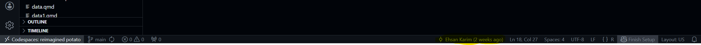
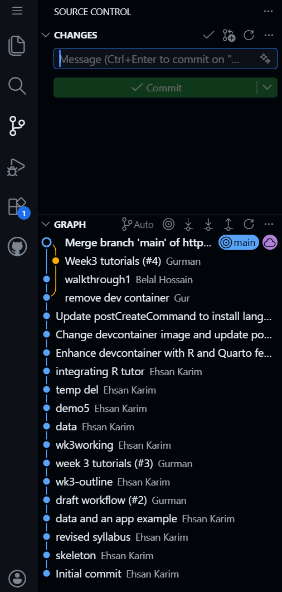
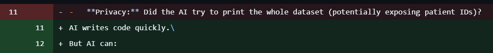

# Git Basics {.unnumbered}

-   **The Audit Trail:** Git records *who* changed *what*.

    

    Selecting any line will show who changed that line and when they did so.

-   **The Timeline:** A sequence of safe checkpoints (commits). This shows the reason behind each change and what was change. These checkpoints can always be reverted back to if the need be.

    

-   **The Language of Diffs:**

    -   `Red (-)`: Removed lines.

    -   `Green (+)`: Added lines.

        

        Observbing this image, we see that line 11 was replaced, the old data on line 11 is colored red, while the new changes are shown in green.

> **Key Rule:** Saving writes to disk on your commuter. Committing and pushing to the repo writes to history.
