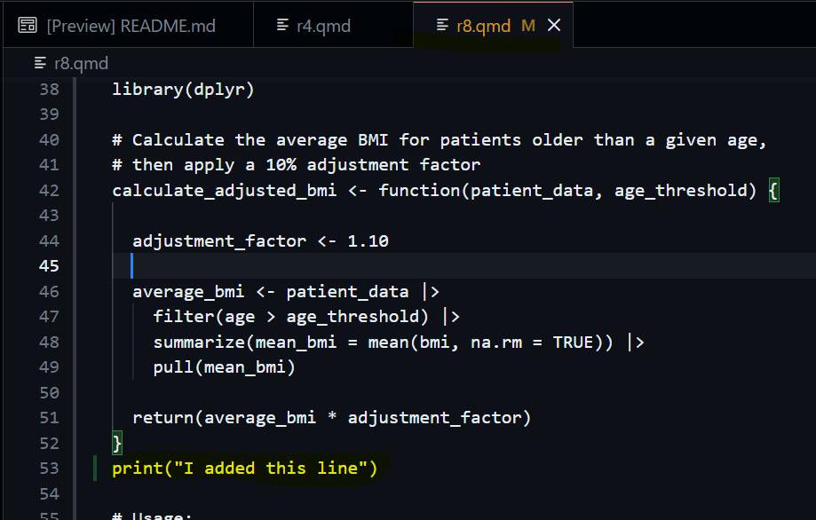
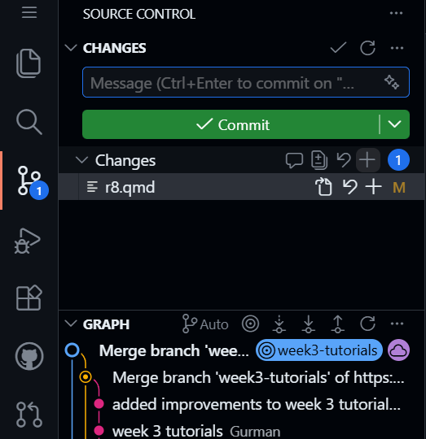
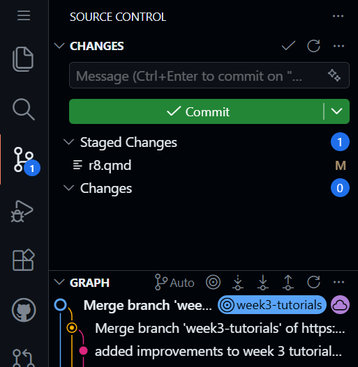
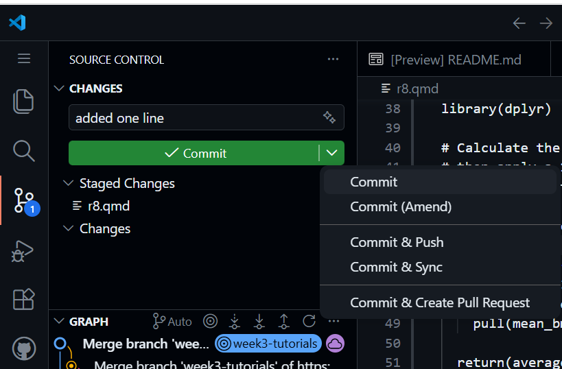
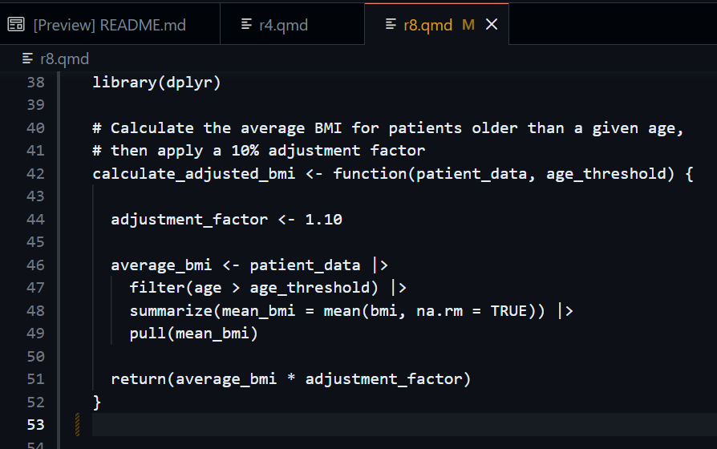
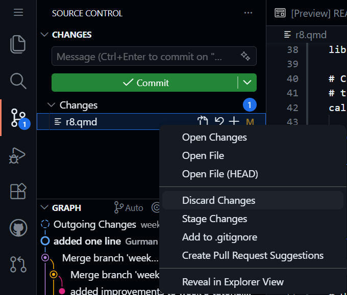

# Tutorial {.unnumbered}

Follow these steps

1.  **Edit:** Make a change to your code, any file in the repo will do, and save the file.

    

    Key things to note are that the open file tab has changed colors, this shows that github has acknowledged that the file has been changed.

2.  **Commit:** Stage and Commit in the Source Control tab.

    As we have seen from the previous tutorial, open up the git tab as indicated by the orange-peach highlight. When a file is changed you will be presented with the screen below.

    **To stage a change, press the + icon.**

    

    Your menu should look like this now;

    

    Then when you are ready to commit, you can click the big green button! You can also click the down arrow on the big green button to see more options, as well as the commit option. We will discuss those other options later.

    

3.  **Break:** Delete the code you just added and save.

    

4.  **Rescue:** Hover over the file in Source Control again, click the **Discard Changes** option.

    

    This will revert the file back to what it was before. This can recover data that your computer potentially cannot, its a very powerful in git and showcases one aspect of how git operates. It is a record of all your work and saved chunks.
