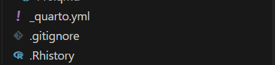
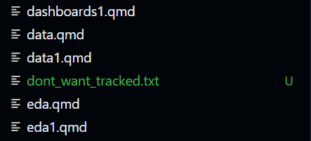
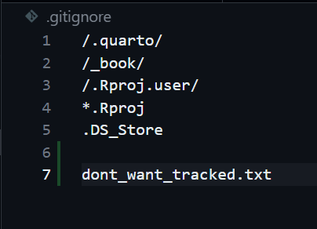
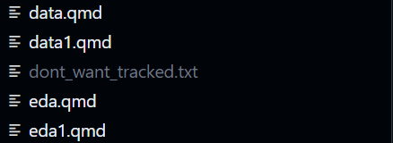

# Repo Hygiene {.unnumbered} 

#### .gitignore

Sometimes there are files you do not want to be tracked by github. This could be anything from files specific to your computer to items like patient data which should not be stored on the cloud unless allowed so by policy.

1.  Create a file named `.gitignore` in your root directory: It has to be this exact spelling for git to recognize it.

    

    You will know its correct when it has its own icon as seen above

2.  Then create a new file, any type will do but for this lesson I will create a text file called dont_want_tracked

    

3.  Then open the gitignore file and add the name of the file you dont want tracked into it.

    

4.  Now you will see the new file, which was green is now grayed out. This shows that github is no longer tracking it and coloring it green (which it does for new files).

    

This is simple enough right? Whenever in doubt, ask AI how to stop a file from being tracked by git and it will offer some advice. Now stage and commit this like we have done in the previous tutorial.

#### Realative Paths

Always use relative paths in your code (e.g., read.csv("data/nhanes.csv")), never absolute paths (e.g., read.csv("/home/user/Documents/nhanes.csv")). This ensures your analysis runs on any machine---including your grader's Codespace.

Reproducibility rule: Your term project must run from start to finish in a fresh Codespace. Absolute paths guarantee failure.
