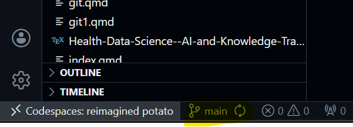
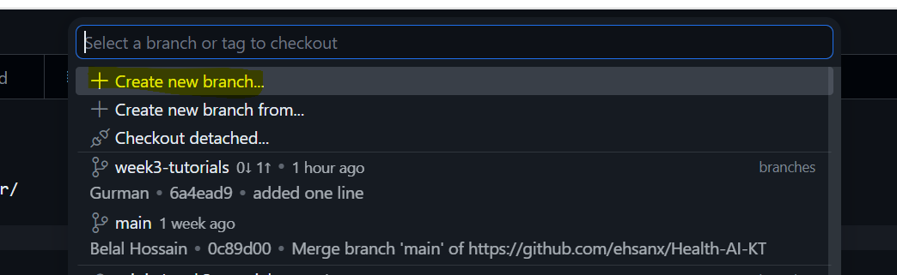
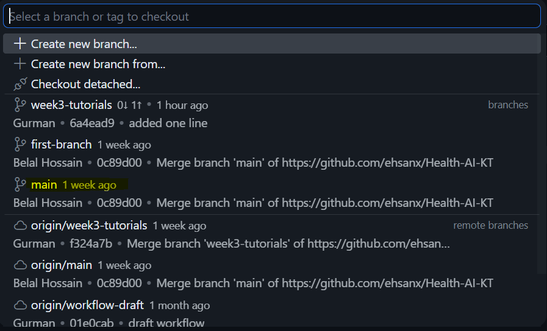

# Branching {.unnumbered}

<!-- AI-EDIT(2026-06-11): WI-021, MIT-043, TF-015, TF-057, MIT-167 — needs review -->
A branch is a safe parallel version of your code. Think of it as a safe parallel universe for your project: you can experiment freely there without touching the stable `main` version. Before creating a new branch, confirm you are currently on main unless the instructions tell you otherwise.

1.  **Create:**

Click branch name (bottom-left).

<!-- AI-EDIT(2026-06-11): MIT-044, MIT-043, TF-015, MIT-167 — needs review -->
**Safety check:** before you go further, read the name shown in that bottom-left corner. It should say `main`. If it shows something else, click it and select `main` first, so your new branch starts from the stable version.

This will pop up a menu where you have the option to `Create new branch`.

Select this and call it first-branch. Note branch names may not have any spaces and limited special characters, the system will let you know if a name is invalid.

<!-- AI-EDIT(2026-06-11): MIT-044, TF-057 — needs review -->
**Safety check:** look at the bottom-left corner again. It should now show `first-branch`. If it still says `main`, the branch was not created --- repeat the step before making any edits.

2.  **Work:** Make changes, like those in the previous tutorial and commit your changes on your branch.

3.  **Switch:** Click the branch button on the bottom left again and once this menu pops up, select `main`. Note that your changes vanish (they are safely in the other branch). If you decide to switch back to your branch, your changes will reappear. This is amazing for multitasking on different features and keeping code clean.

    
