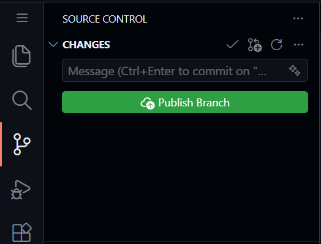
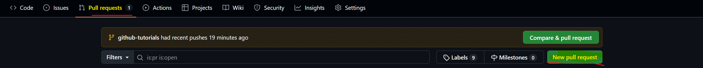
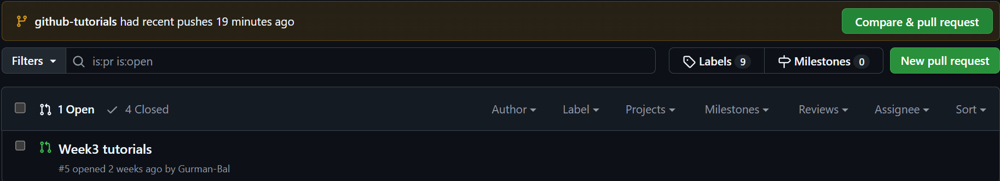
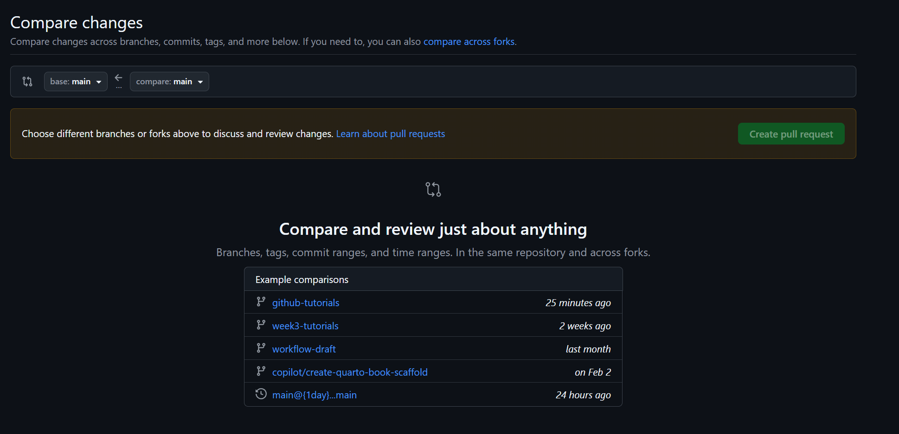
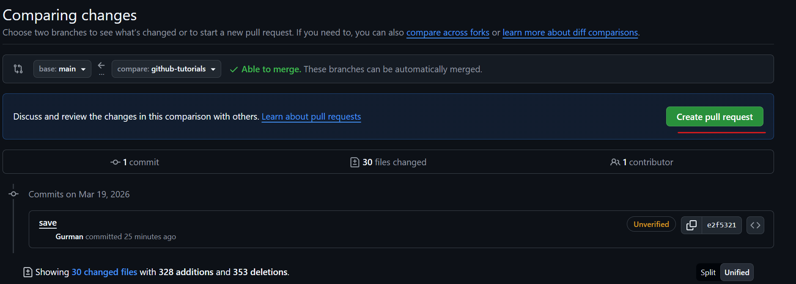
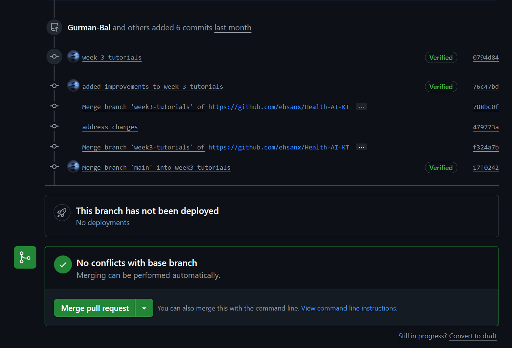

# Pull Requests {.unnumbered}

<!-- AI-EDIT(2026-06-22): WI-022 — fixed typos ("change"→"changed", "trunck"→"trunk"), tidied run-on sentence and added closing period -->
A **Pull Request (PR)** is a GitHub feature that says: *"I have changes on a branch. Please review them before they go into `main`."* PRs are how professional teams and researchers collaborate. You will use them for peer review later in this course. This is also the best way to merge your own changes into `main`: it forces you to see what has changed, so you can check what you are submitting to the `main` branch --- the backbone, or "trunk," of the tree.

1.  **Sync:** Click "Sync Changes" to push your branch to GitHub. This can be blue or green or say publish branch or not. Whichever the case, clicking this button will make everything on your computer update to the online github repo.

    <!-- AI-EDIT(2026-06-22): REVIEW-row125/WI-022 — RA requests clearer screenshot for the Sync step; image git5_1.png exists but RA must supply a replacement (NEEDS-RA-SCREENSHOT) -->
    Commit saves a checkpoint inside your local Codespace. Push or Sync Changes sends that checkpoint back to GitHub so it is visible in the online repository.

    

2.  **PR:** Go to your repo on github online and click "Compare & pull request."

    

    We are then presented with the screen below. Press the big green button "New Pull Request"

    

    <!-- AI-EDIT(2026-06-22): REVIEW-row126/GAP-R345-5 — RA requests clearer screenshots for the Compare & pull request step (git5_3.png, git5_2.png, git5_4.png); images exist but RA must supply replacements (NEEDS-RA-SCREENSHOT) -->
    Note: GitHub does not always show this screen. Sometimes clicking **Compare & pull request** takes you straight to the comparison/create screen. If that happens, nothing is wrong --- skip ahead to choosing your branches and creating the pull request.

    Then you are presented this menu. This shows all the different branches that can be merged into main. Select on the one you want to merge into main.

    

    <!-- AI-EDIT(2026-06-22): REVIEW-row127/WI-023,TF-057 — RA requests clearer screenshot for the branch-selection / base-vs-compare step (git5_5.png); image exists but RA must supply a replacement (NEEDS-RA-SCREENSHOT) -->
    Before creating the Pull Request, check the base repository and base branch carefully. Do not open a PR into the original course repository unless the instructor explicitly asks you to. The **base** is where your changes will land (it should be `main` in *your own* repository); the **compare** (also called *head*) is the branch holding your changes.

    Once you select the one, you can make a pull request! Select this.

    

3.  **Merge:** Review the diff, then click "Merge pull request." If there are merge conflicts, ask AI the best way to resolve them.

    <!-- AI-EDIT(2026-06-22): REVIEW-row128/GAP-R345-13 — RA requests clearer screenshot for the Merge step; image git6_6.png exists (note: filename is git6_6 though this is the git5 sequence) but RA must supply a replacement (NEEDS-RA-SCREENSHOT) -->
    For this week's practice pull requests, merge your own PR right away --- you do not need to wait for a teammate or TA to review it. You will practice reviewing each other's pull requests later, in Milestone 4.

    

<!-- AI-EDIT(2026-09-01): optional course screencast (YouTube ID: TQe3gEKhEDA) — HTML-only so the PDF/DOCX build is unaffected -->
::: {.content-visible when-format="html"}
## Video walkthrough (optional) {.unnumbered}


:::
