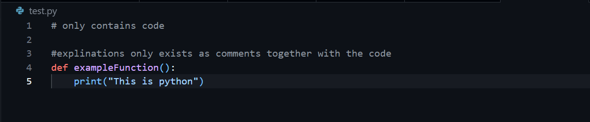

# Tutorial 1: Python vs. R - When and Why?

## Overview

In the health sciences, you don't need to choose one language forever; you are learning when each is the better tool for the job. While R remains your primary language for statistical analysis, Python is essential for machine learning and general-purpose automation.

### Two Languages, One Codespace

Both R and Python are citizens in your GitHub Codespace. You are learning "bilingual fluency" to: 1. Read and adapt Python code found in research papers. 2. Leverage Python-only libraries for deep learning. 3. Automate repetitive tasks with general-purpose scripting.

| Strength              | R                       | Python                      |
|:-----------------------|:-----------------------|:-----------------------|
| **Stats & Wrangling** | Mature (dplyr, ggplot2) | Possible, but still growing |
| **Machine Learning**  | Growing (tidymodels)    | Dominant (scikit-learn)     |
| **Automation**        | Less common             | Very common                 |

### Notebooks vs. Scripts

-   **Notebooks (.ipynb):** Best for exploration and teaching where output appears inline.

    

-   **Scripts (.py):** Best for reusable utilities and automation.

    