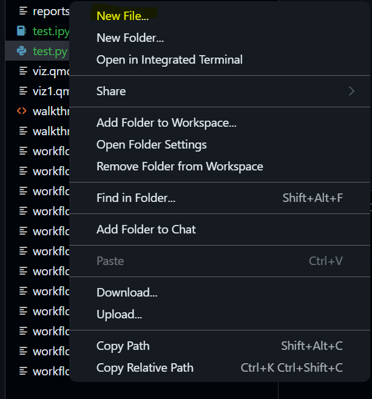
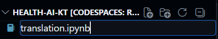
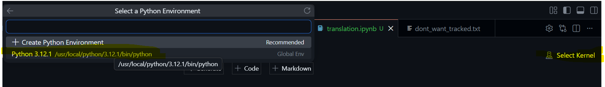
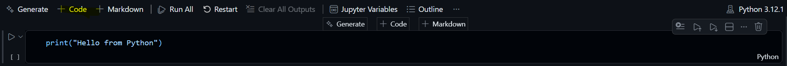
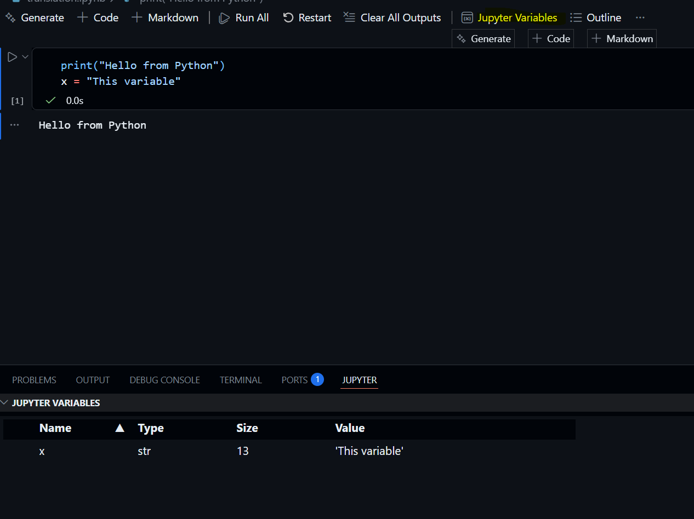

# Tutorial 2: Setting Up Your Python Environment

## Creating Your First Notebook

Follow these steps to set up your environment in your GitHub Codespace:

1.  **New File:** In the VS Code Explorer, click the **New File** icon and name it `translation.ipynb`.

    

    

2.  **Select Kernel:** Look at the notebook toolbar in the top right. Click **Select Kernel** and choose the recommended **Python 3.x** environment.

    

3.  **Run Code:** Build `print("Hello from Python! My workspace is ready.")` Press **Shift + Enter** to run it.

    

## The Variables Pane

Unlike RStudio, which shows variables by default, you must toggle the view in VS Code. 1. Click the **Variables** button in the notebook toolbar. 2. Run a cell that creates a variable (e.g., `age = 25`). 3. Observe `age` appearing in the pane at the bottom.

