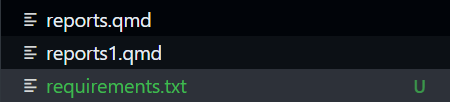
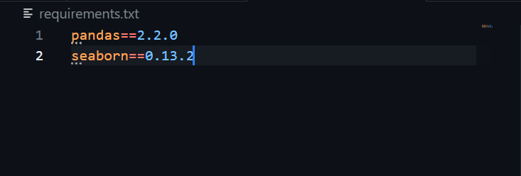

# Tutorial 3: Packages and Reproducibility

## R `library()` vs. Python `import`

In Python, we "import" packages and often give them nicknames (aliases).

| R                  | Python Equivalent       | Purpose        |
|:-------------------|:------------------------|:---------------|
| `library(dplyr)`   | `import pandas as pd`   | Data wrangling |
| `library(ggplot2)` | `import seaborn as sns` | Visualization  |

## Managing `requirements.txt`

Your project must be reproducible. If you use a package, you must record it in a file called `requirements.txt`.

1.  Create a file named `requirements.txt` in your root folder.

    

2.  Add:

    `pandas==2.2.0`

    `seaborn==0.13.2`

    

    Certain versions of these packages behave differently. By explicitly setting your versions, you can make sure you code will have reproducible results regardless of who is running it.

3.  **The Rule:** Never just `pip install` (method on installing packages, which you wouldn't have to deal with in this class but perhaps the future) in the terminal and forget it; always update this file to document your steps.