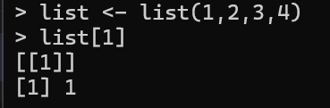
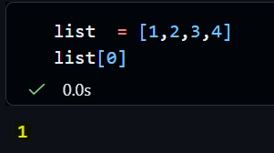
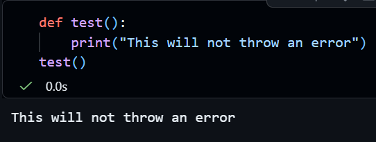
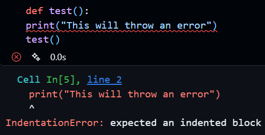

# Tutorial 4: Common Translation Traps

## Trap 1: The Zero-Index

R starts counting at **1**. Python starts counting at **0**.

**R:** `data[1]` is the first item. Note data\[0\] will return nothing

**Python:** `data[0]` is the first item.

**Slicing:** `df.iloc[0:5]` returns rows 0, 1, 2, 3, and 4 (5 rows total).

## Trap 2: Indentation

Python uses **indentation** (spaces) instead of curly braces `{}` to group code. Misaligned spaces will cause an `IndentationError`.

## Trap 3: Assignment

-   **R:** Uses `<-` (or `=`).
-   **Python:** Uses `=` exclusively for assignment.