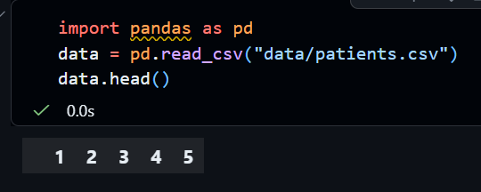

# Tutorial 5: Loading and Inspecting Health Data

## Loading Data with Pandas

In your notebook, use the following code to load your health data:

```{python}
import pandas as pd
data = pd.read_csv("data/patients.csv")
```

The code below allows you to view the dataset

```{python}
data.head()
```

