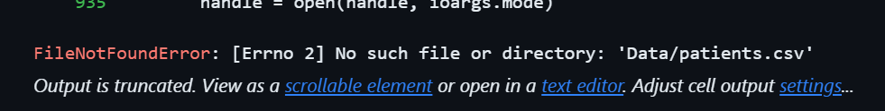
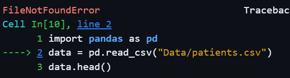

# Reading Tracebacks

## How to Read Errors

Python errors (Tracebacks) display a stack of calls.

### Common Example:

`FileNotFoundError: [Errno 2] No such file or directory: 'Data/patients.csv'`

The first part of the message tells you what the error is, in this case the file was not found

`FileNotFoundError`

The second part of the error tells you what is missing

`No such file or directory: 'Data/patients.csv'`

At the top of the trace, it tells you exactly where in your code the error was found.

The file wasn't found. Because file paths are case-sensitive, `Data/` is different from `data/`.