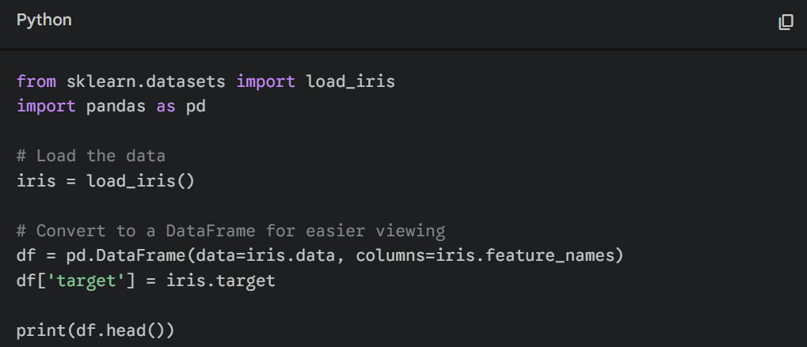
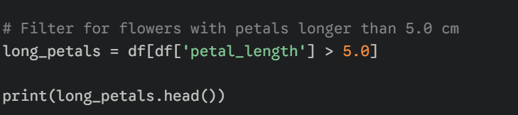
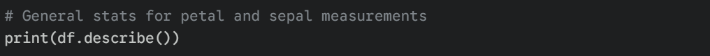

# Tutorial 7: The 'One Step, One Cell' AI Workflow

## Rule 1: One Step, One Cell

Don't ask the AI for a giant analysis script at once. Ask for **one atomic step** (load, then filter, then summarize). Run and verify each cell before moving on.

First ask AI to load

Then ask it to filter by some value

Then ask it to summarize

## Rule 2: Parity Audit

Observe some of the differences between R and python below when it comes to data wrangling.

| Check         | R                 | Python                 |
|:--------------|:------------------|:-----------------------|
| Row count     | `nrow(df)`        | `len(df)`              |
| Column names  | `names(df)`       | `df.columns.tolist()`  |
| Summary stats | `summary(df$col)` | `df['col'].describe()` |