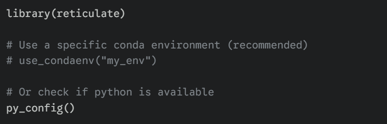
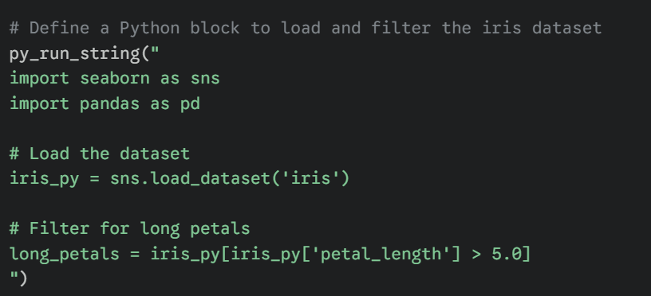
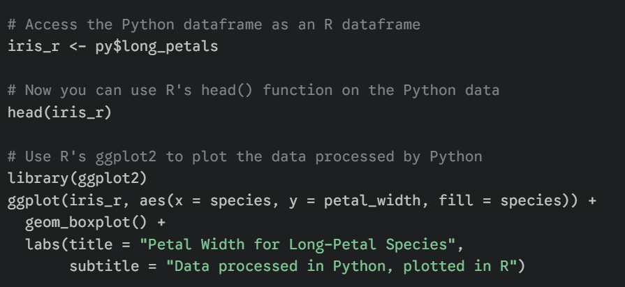

# Tutorial 8: Mixing R and Python"

## Why Interoperability?

The R package `reticulate` lets you call Python from an R session. This is perfect when you need a Python-only package but want to keep your analysis in R.

First define the package as seen below



Then build python code as shown



Then you are able to use the results of that python code in R! Super cool!



### Demo (Run in R)

```{r}
library(reticulate) # Run Python code inside R
py_run_string("import pandas as pd; df = pd.read_csv('data/patients.csv')")
```

Access that Python object as an R object

```{r}
py_df <- py$df head(py_df)
```